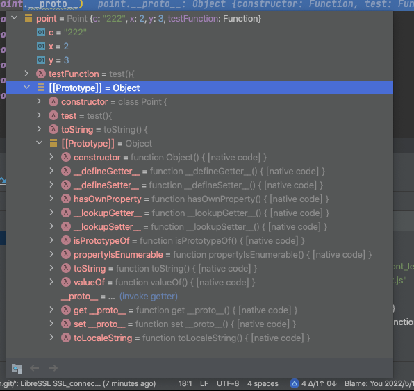

### 1. let仅在作用域有效，而 var 全局作用域，
> 表现上面就是在定义之前打印变量，var 的结果是 undefined  而 let 会报错ReferenceError

```javascript
var a = [];
for (var i = 0; i < 10; i++) {
  a[i] = function () {
    console.log(i);
  };
}
a[6](); // 10
```
暂时性死区
块级作用域类用 let 声明的所有变量的作用域都在代码块范围内。即使外面定义同名 var 变量  ）
```javascript
var a = 100
if (a === 100) {
    typeof a; // ReferenceError
    a = 88 // ReferenceError
    let a; // 此例子中对于 const 也是一样的
}
```

条件判断语句，和 for 循环判断语句里面，判断语句（就是圆括号里面的 a=== 100   i< 100; i++之类的）的变量都是父作用域，函数体里面都是子作用域
且圆括号里面变量默认都是 let 类型   报错：``bar(x = y, y = 2) {}``
eg： 
for 语句里面的变量 i 是父作用域
循环函数体里面i是子作用域

```javascript
for (let i = 0; i < 3; i++) {
  let i = 'abc';
  console.log(i);
}
```

对于函数默认值，函数参数是独立作用域
```javascript
var x = 1;
function f(x, y = x) {
  console.log(y);
}
f(2) // 2


//=====================
var x = 1;
function f(z, y = x) {
    console.log(y);
}
f(2) // 1

//=====================


var x = 1;
function test(x = x) {
   console.log(x)
}
test()// // 会报错 ReferenceError
test(2)// 2
```
### 2. const定义‘常量’，只是引用地址不变，值无法保证，基础类型的不可变，引用类型（数组[]，对象{}）的值可能发生变化
```javascript
// good
const a = 1;
const b = 2;
const c = 3;
// best
const [a, b, c] = [1, 2, 3];
```
### 3. 结构 '='表示默认值   ':'表示重命名。
```javascript
const data = { id: '232323' }
var {id: orderId = '777' } = data || {}; // 如果 data 有值，取orderId也就是 data.id的值， 如果 data 没值取orderId即data.id的值就是默认值'777'
orderId // 3
```
> 数组特殊的对象，字符串也是特殊的数组(数组很多属性字符串都具备)。 所以字符串也能结构，和数组一样一一对应。
```javascript
const [a,b] = '你好';  a// 你， b//好
```

变量值交换可以
```javascript
[x, y] = [y, x];
```

函数参数必传判断
```javascript

function throwIfMissing(paramName) {
  throw new Error(`${paramName} 为必传参数！`);
}
function foo(params = throwIfMissing('params')) { // 同样也可以给默认值设置 undefined， 给调用方说明可以省略
    
}
foo()
// Error: Missing parameter
```

### 4.

isFinite() 和 isNaN() 的区别在于，传统方法先调用 Number () 将非数值的值转为数值，再进行判断，而这两个新方法只对数值有效，Number.isFinite() 对于非数值一律返回 false，Number.isNaN() 只有对于 NaN 才返回 true，非 NaN 一律返回 false


Math.trunc(a)  // 返回一个数的整数部分
Math.sign(a)   // 判断是正数还是负数，还是 0  返回 0 1 -1

### 箭头函数不能使用 yield
不可以使用yield命令，因此箭头函数不能用作 Generator 函数。

Array.from第二个参数类似于 map
Array.from(arrayLike, x => x * x);
// 等同于
Array.from(arrayLike).map(x => x * x);


// 将3号位复制到0号位
[1, 2, 3, 4, 5].copyWithin(0, 3, 4)// 从 0 位开始替换，替换内容为数组的第三位到第四位（含头不含尾）
// [4, 2, 3, 4, 5]

### find 找到数组中第一个满足条件的元素，找到后不再继续，在筛选唯一一个数据的时候可以替换 filter

```javascript
/**
 * @param1 回调函数，参数中 arr 表示原数组
 * @param2 obj 绑定 this 对象
 * */
array.find((item, index, arr) => {}, obj)

const abc = [10, 12, 26, 15].find(
    function f(v){ //箭头函数会改变 this 指向
       return v > this.age;
       } , { age: 10 });    // 26


```

flat() 将二维数组拉平，只会拉平一层
```javascript
[1, 2, [3, [4, 5]]].flat() // [1, 2, 3, [4, 5]]  flat(2)即拉平两层

```

### 链判断运算符 `?.`    ES2020
```javascript
const firstName = (obj
  && obj.body
  && obj.body.user
  && obj.body.user.firstName) || 'default';

等同于
const firstName = obj?.body?.user?.firstName || 'default';


a?.b
// 等同于
a == null ? undefined : a.b
a?.[x]
// 等同于
a == null ? undefined : a[x]
a?.b()
// 等同于
a == null ? undefined : a.b()
a?.()
// 等同于
a == null ? undefined : a()
```

### ?? 福音啊
```javascript
// price 字段 undefined 或者 null 或者''的时候用--代替，假如为 0 呢
const realPrice = obj.price || '--'
const shouldNotReload = obj.shouldNotReload || true
```

> ?? 只有运算符左侧的值为null或undefined时，才会返回右侧的值。

```javascript
const animationDuration = response.obj?.price ?? '--'; //如果response.obj存在，取 obj.price 字段，如果返回undefined 或者 null 则赋值 '--' 否则显示默认值包含 0

obj.shouldNotReload ?? true //判null undefined后给默认值 true

```

### Symbol
- enum 的常量。消除魔法字符串（也就是相同的字符串在项目中多次出现）
- 作为对象的隐藏属性使用
> Symbol作为对象的 key 时候 只能被Object.getOwnPropertySymbols()和Reflect.ownKeys()获取到，其他所有遍历都会跳过 Symbol为 key 的数据


Symbol.for("cat")  保存在全局环境中，先检查key 是否存在，存在返回。可以保证只要参数相同每次返回的都是一样
Symbol("cat")   每次调用返回值都不一样


const sym = Symbol('foo');// sym.description // "foo"
const sym = Symbol.for('foo');// Symbol.keyFor(sym) // "foo"

### Object.create
```javascript
/**
 * @param proto 新创建对象的原型对象
 * @param propertiesObject 添加到新对象的属性（自身属性而不是原型属性）
 */
Object.create(proto,[propertiesObject])

```

使用
- 创建一个纯净的对象
> 该对象不具备 Object 的任何属性，比如 toString方法等等，使用 null 参数创建的对象所有属性都是对象自身属性。for...in 遍历也不会遍历原型链对象
```javascript
const a = Object.create(null)
```

判断对象自身是否重写了 toString 方法，必须用`Object.prototype.hasOwnProperty.call(a,'toString')`检查，而 null 参数创建的直接 `if(a.toString)`判断

### proxy 代理 Reflect

const proxy = new Proxy({}, {})


应用，实现数组索引负数则取 length + index 的索引
```javascript
const negativeArray = (els) => new Proxy(els, {
  get: (target, propKey, receiver) => Reflect.get(target,
    (+propKey < 0) ? String(target.length + +propKey) : propKey, receiver)
});


const unicorn = negativeArray([1,2,3]);

unicorn[-1] // '3'
```


生成各种 dom 节点的函数 dom
```javascript
const dom = new Proxy({}, {
  get(target, property) {
    return function(attrs = {}, ...children) {
      const el = document.createElement(property);
      for (let prop of Object.keys(attrs)) {
        el.setAttribute(prop, attrs[prop]);
      }
      for (let child of children) {
        if (typeof child === 'string') {
          child = document.createTextNode(child);
        }
        el.appendChild(child);
      }
      return el;
    }
  }
});
const el = dom.div({},
  'Hello, my name is ',
  dom.a({href: '//example.com'}, 'Mark'),
  '. I like:',
  dom.ul({},
    dom.li({}, 'The web'),
    dom.li({}, 'Food'),
    dom.li({}, '…actually that\'s it')
  )
);
document.body.appendChild(el);
```


配置接口请求
  地址https://www.bookstack.cn/read/es6-3rd/spilt.5.docs-proxy.md
ReflectReflect Reflect

#### Reflect
> 1.Reflect和Proxy对象方法一一对应。都能找到
> 2.让 Object的操作都变成函数行为 如 比如name in obj和delete obj[name]对应Reflect.has(obj, name)和Reflect.deleteProperty(obj, name)
> 3.Object.defineProperty报错，Reflect.defineProperty(target, property, attributes)会直接返回 false
> 4.为了将语言内部方法和 Object 方法区分开，后面语言内部方法全部从 Reflect 上获取


### Iterator 与 generator
for...in 遍历对象不适合遍历数组,遍历的是键名
for...of 实现了 Iterator 接口就可遍历。通用的，遍历值，普通对象不能直接使用，要Object.keys处理
forEach 不能跳出循环。


for of 可以自动遍历
```javascript
function* bar() {
    yield 'a';
    yield 'b';
}

function* foo() {
  yield 1;
  yield 2;
    for (let i of bar()) {
        console.log(i);
    }
    // 或者用yield* bar()   yield*表达式,用来在一个 Generator 函数里面执行另一个 Generator 函数
  yield 3;
  yield 4;
  yield 5;
  return 6;
}
for (let v of foo()) {
  console.log(v);
}
// 12ab345
```

1. 状态切换。更简洁，更安全，避免篡改。
```javascript
var clock = function* () {
  while (true) {
    console.log('collect!');
    yield;
    console.log('unCollect!');
    yield;
  }
}();
clock()
clock()
clock()
clock()
```


### async await
是 generator 的语法糖。内置执行器，返回的是 promise 对象

原理  https://www.bookstack.cn/read/es6-3rd/spilt.4.docs-async.md


- 顶层 await   https://www.bookstack.cn/read/es6-3rd/spilt.7.docs-async.md
```javascript
// awaiting.js
let output;
async function main() {
  const dynamic = await import(someMission);
  const data = await fetch(url);
  output = someProcess(dynamic.default, data);
}
main();
export { output };

---------------------


// awaiting.js
let output;
(async function1 main() {
    const dynamic = await import(someMission);
    const data = await fetch(url);
    output = someProcess(dynamic.default, data);
})();
export { output };

```


### class
类的数据类型就是函数，类本身就指向构造函数。
typeof Point // "function"
Point === Point.prototype.constructor // true


```javascript
class Point {
  constructor() {
    // ...
  }
  toString() {
    // ...
  }
  toValue() {
    // ...
  }
}
// 等同于
Point.prototype = {
  constructor() {},
  toString() {},
  toValue() {},
};
```


new.target 只有通过 new 关键字或者Reflect.construct()创建的实例  new.target才会返回 className（类名） 否则返回 undefined
子类 new.target 返回子类名称。
所以创建只能继承的类可以
```javascript
class Shape {
  constructor() {
    if (new.target === Shape) {
      throw new Error('本类不能实例化');
    }
  }
}
```

es5和 es6


实例方法都是在原型上的（es5和 es6都一样）
```javascript
class Point {
    constructor(x, y) {
        this.x = x;
        this.y = y;
        this.testFunction = this.test
    }
    c = '222'
    
    static __run() {
        console.log('__run')
    }
    
    test(){
        console.log('333')
    }
    toString() {
        return '( x:' + this.x + ', y:' + this.y+ ', c:' + this.c + ')';
    }
}

// super作为对象时，在普通方法中，指向父类的原型对象；在静态方法中，指向父类。
// super对某个属性赋值，这时super就是this
class Bar extends Point {
    constructor() {
        super();
        // super 
        super.test()
    }
    static classMethod() {
        return super.__run() + ', too';
    }
    draw() {
        super.test()
        // super对某个属性赋值，这时super就是this
        super.x = 3;
        console.log(this.x); // 3
    }
}


// 可以通过实例的__proto__属性为“类”添加方法。
var point = new Point(2, 3);
point.__proto__.functionName = function () {}
```


静态方法在 new 出来的实例上是不存在的，只能用类名直接调用，
子类静态方法可以通过  super.父类静态方法名 来调用父类静态方法
es6 只有静态方法，没有静态属性，静态属性只能通过 className.prop = value来定义
> super()实际上就是调用父类的构造函数  实际相当于也是


2.继承
es5 中
const child = new Child()
Parent.apply(child)

> es6 直接是子类构造方法中调用 `super()` (实际相当于`new Parent()` )，因为在子类构造方法，所以直接加载到了子类 `this` 上了。实际相当于在子类构造方法里面调用了`parent.prototype.constructor.call(this)`
子类实例创建是基于父类实例，所以必须在 super() 后才可以用 this 关键字

Object.getPrototypeOf(Child) === Parent 从子类中获取父类实例。 用来判断继承关系

```javascript
class A {
}
class B extends A {
}
A.__proto__ === Function.prototype // true
A.prototype.__proto__ === Object.prototype // true

B.__proto__ === A // true
B.prototype.__proto__ === A.prototype // true
// 子类B的__proto__属性指向父类A，子类B的prototype属性的__proto__属性指向父类A的prototype属性
```

继承可以实现对原生类的扩展比如 Array。
但是继承 Object 特殊，无法传参给 Object


### 规范

1. 一律使用单引号，反引号
2. 优先使用解构赋值。
 ```javascript
const [first, second] = arr;
```
```javascript
// bad

function getFullName(user) {
    const firstName = user.firstName;
    const lastName = user.lastName;
}
// good
function getFullName(obj) {
  const { firstName, lastName } = obj;
}
// best
function getFullName({ firstName, lastName }) {
}
```
3. 对象尽量静态化，一旦定义，就不得随意添加新的属性。如果添加属性不可避免，要使用Object.assign方法。尽量采用简洁表达。
```javascript
// bad
const a = {};
a.x = 3;
// if reshape unavoidable
const a = {};
Object.assign(a, { x: 3 });
// good
const a = { x: null };
a.x = 3;


// =====================================

// bad
const obj = {
    id: 5,
    name: 'San Francisco',
};
obj[getKey('enabled')] = true;
// good
const obj = {
    id: 5,
    name: 'San Francisco',
    [getKey('enabled')]: true,
};


// =============================================
// bad
const atom = {
    ref: ref,
    value: 1,
    addValue: function (value) {
        return atom.value + value;
    },
};
// good
const atom = {
    ref,
    value: 1,
    addValue(value) {
        return atom.value + value;
    },
};


//==================使用默认值语法设置函数参数的默认值。===============
// bad
function handleThings(opts) {
    opts = opts || {};
}
// good
function handleThings(opts = {}) {
    // ...
}


// ================ 使用 rest 不在函数中使用arguments数组 ===================
function funName(a, b, ...others) {
    
}
funName("1", "2", "3", "4");


```

4. 使用import取代require， 使用export取代module.exports。


### 装饰器

#### 类装饰器
>本质是装饰器本质就是编译时执行的函数。

```javascript
class MyComponent extends React.Component {}
export default connect(mapStateToProps, mapDispatchToProps)(MyComponent);

// 可以改写为
@connect(mapStateToProps, mapDispatchToProps)
export default class MyComponent extends React.Component {}

// 相当于执行了
function connect(mapStateToProps, mapDispatchToProps) {
    return function(target) {
        // ...
    }
}
```
#### 方法装饰器
> 仅限修饰类下面定义的方法，不可修饰单独函数。
```javascript
class AddClass {
  @log
  add(a, b) {
    return a + b;
  }
}

/**
 * 
 * @param target  __proto__ 原型对象,因为没有继承关系target就相当于AddClass.prototype === instance.__proto__
 * @param name   修饰的方法名
 * @param descriptor  方法的描述，实际就是方法本身
 * @returns {*}
 */
function log(target, name, descriptor) {
  var oldValue = descriptor.value;
  // 相当于给add方法重新赋值为自定义的方法，再执行前加上日志
  descriptor.value = function() {
    console.log(`${name}的参数是`, arguments);
    return oldValue.apply(this, arguments);
  };
  return descriptor;
}
const addClass = new AddClass();
console.log(addClass.add(2, 4))
```