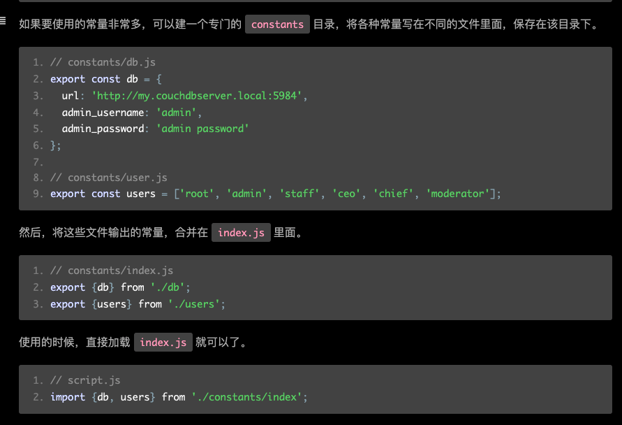

Webpack原理篇

实际调用 
1. compiler对象,webpack类返回
2. 调用 compiler.run()方法
```javascript
let compiler = webpack(options)

compiler.run((err, stats) => {
    console.log(err)
    console.log(stats.toJson({
        entries: true,
        chunks: false,
        modules: false,
        assets: false
    }))
})
```


```javascript
/**
 *  主要目的是获取compiler 对象
 * */
const webpack = (options, callback) => {
    /**
     * webpackOptionsSchema中定义了wepack.config文件配置的各种参数类型,长度等合法性标准.
     * validateSchema 目的是校验参数的合法性
     * */
	const webpackOptionsValidationErrors = validateSchema(
		webpackOptionsSchema,
		options
	);
    // 如果不合法,抛出异常
	if (webpackOptionsValidationErrors.length) {
		throw new WebpackOptionsValidationError(webpackOptionsValidationErrors);
	}
	let compiler;
    /**
     * 如果是数组遍历,返回MultiCompiler对象所有compiler对象存储在MultiCompiler实例的compilers属性中
     * **/
	if (Array.isArray(options)) {
		compiler = new MultiCompiler(
			Array.from(options).map(options => webpack(options))
		);
	} else if (typeof options === "object") { // 通常我们定义的都是object类型
        /**
         *  process方法
         * new WebpackOptionsDefaulter()会返回一个带所有配置默认值的对象.
         * process 方法  /lib/OptionsDefaulter.js文件 图片所示    设置默认值. 
         */
        options = new WebpackOptionsDefaulter().process(options);

        // 新建compiler实例,并且将options赋值给compiler
		compiler = new Compiler(options.context);
		compiler.options = options;
        
        //  apply 方法,将compiler实例添加了 outputFileSystem, inputFileSystem, watchFileSystem方法,
        //  然后在tapable注册了事件
        new NodeEnvironmentPlugin({
			infrastructureLogging: options.infrastructureLogging
		}).apply(compiler);
        
        // 遍历插件,调用插件的apply方法,让compiler具有插件的某种能力.
		if (options.plugins && Array.isArray(options.plugins)) {
			for (const plugin of options.plugins) {
				if (typeof plugin === "function") {
					plugin.call(compiler, compiler);
				} else {
					plugin.apply(compiler);
				}
			}
		}
        // 执行 environment和afterEnvironment 注册的hook方法
		compiler.hooks.environment.call();
		compiler.hooks.afterEnvironment.call();
        /**
         *  ***核心步骤1
         * */
		compiler.options = new WebpackOptionsApply().process(options, compiler);
	} else {
		throw new Error("Invalid argument: options");
	}
    
    // 如果传了回调方法,会直接调 compiler.run方法.
	if (callback) {
		if (typeof callback !== "function") {
			throw new Error("Invalid argument: callback");
		}
		if (
			options.watch === true ||
			(Array.isArray(options) && options.some(o => o.watch))
		) {
			const watchOptions = Array.isArray(options)
				? options.map(o => o.watchOptions || {})
				: options.watchOptions || {};
			return compiler.watch(watchOptions, callback);
		}
		compiler.run(callback);
	}
	return compiler;
};
```

