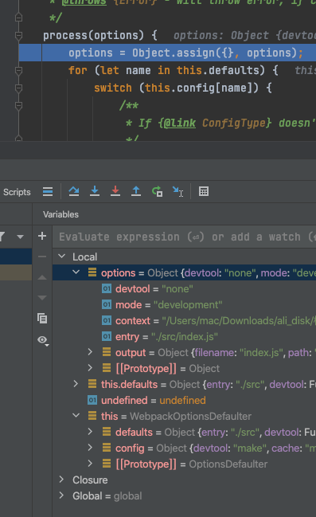
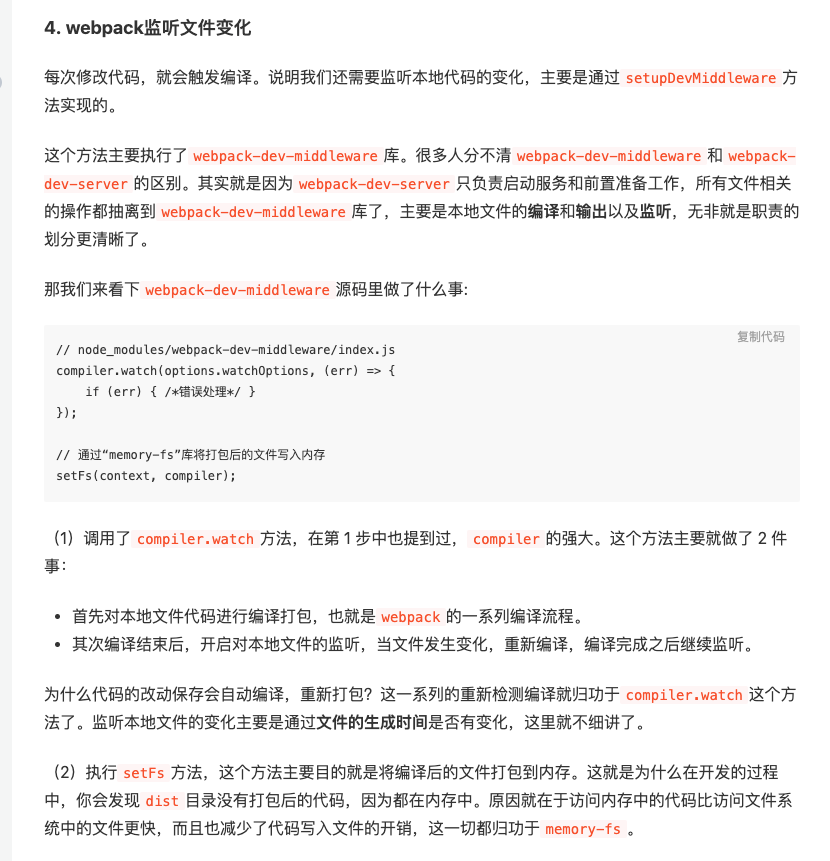

#Webpack 使用篇
> 主要包含entry入口 output出口  plugins插件 和 loader解析器
- entry
- output
- plugins
- loader
> test  匹配规则解析文件的规则
> 
> use 使用到的 loader 数组或者字符串均可
- 其他关键配置
```
mode: 'development', //development 或者 production   通过process.env.NODE_ENV获取对应 mode 的值
devtool：'eval', // 开发环境 最佳： eval-cheap-module-source-map 生产环境 最佳： hidden-source-map
watch: true, // 基本不用。是否开启文件变化监听，开启后，文件变化自动编译，但是得手动刷新浏览器才可以改变
 watchOptions: {    
     ignored: /node_modules/,        
     // 文件变化后多久去执行 
     aggregateTimeout:500,        
     //每秒监听次数1000次       
     poll:1000   
 }

```

模块也就是以es-module 和commonJS形式导入导出的各个文件就是模块


###1. es6,7,8 --> es5  
babel-loader 
@babel/preset-env 
@babel/core
@babel/plugin-transform-runtime
> 相当于将全局引入的一些工具函数，core.js 中的 api，或是Generator/async函数时候默认是注入到使用的类中改为统一引用一处，可节省大量打包代码
> 
@babel/plugin-proposal-decorators // 装饰器

@babel/plugin-proposal-class-properties // 类属性

@babel/plugin-proposal-private-methods

@babel/runtime

@babel/runtime-corejs3
```javascript
{
            test:/\.js$/,
            use:{
              loader:'babel-loader',
              options:{
                presets:['@babel/preset-env']
              }
            },
            exclude:/node_modules/
 }
```
### 2. 解析样式文件 css，less 文件
>style-loader css-loader less less-loader

- 添加浏览器前缀
>postcss-loader autoprefixer


- 拆分，并将所有样式文件合并
>mini-css-extract-plugin

配置如下

```javascript
     rules: [ {
                test: /\.less$/,
                use: [MiniCssExtractPlugin.loader, 'css-loader', {
                    loader: "postcss-loader",
                    options: {plugins: [require('autoprefixer')]}
                }, 'less-loader']
            },
            {
                test: /\.css$/,
                use: [MiniCssExtractPlugin.loader, 'css-loader']
            }]
```

## 3.对文件解析
```javascript
{
                test: /\.(png|jpg|gif)$/i,// i表示不区分大小写
                // test: /\.(jpe?g|png|gif)$/i, //图片文件

                use: [
                    {
                        loader: 'url-loader',
                        options: {
                            limit: 100 * 1024,// 限制100kb以内用 base64加载图片，超过则请求本地图片文件 http://localhost:3000/img/WX.9ad4dbad.png
                            fallback: {
                                loader: "file-loader",
                                options:{
                                    name: 'img/[name].[hash:8].[ext]'
                                }
                            }
                        }
                    }]
            }
```

### 4. 其他一些关键词

#### resolve
> 用来设置通配符等

#### externals
#### DllPlugin  DLLReferencePlugin
> 将一些如 React React-dom  vue 等等不会变动的库打包成动态链接库，下次打包不会再编译
> 在 index.html 中 script 的形式引入进去。 同时防止 clean 插件清除改打包后的链接库

#### optimization.splitChunks
> 用来抽离公共模块


##webpack 优化
###1. SpeedMeasureWebpackPlugin
> 会显示每个 loader 的运行时间，用以找出耗时插件并优化。
```javascript
const SpeedMeasureWebpackPlugin = require('speed-measure-webpack-plugin')
const speedPlugin = new SpeedMeasureWebpackPlugin()
module.exports = speedPlugin.wrap(config)
```

###2. HappyPack 多线程打包  不维护建议改用thread-loader
使用
```javascript
const Happypack = require('happypack');
module.exports = {
    //...
    module: {
        rules: [
            {
                test: /\.js[x]?$/,
                // 使用 plugins 中定义的
                use: 'Happypack/loader?id=jsPack',
                include: [path.resolve(__dirname, 'src')]
            }
        ]
    },
    plugins: [
        new Happypack({
            id: 'jsPack', //和rule中的id=jsPack 名称保持一致
            //js 解析用到的 loader 以参数形式传进 happypack 中去
            use: ['babel-loader'] //就是原本 rules 里面的 use 参数
        })
    ]
}

```
###3. exclude  include
> 解析的时候缩小范围
>
###4. cache-loader 缓存
> 有些 loader 自带缓存，比如 babel-loader 设置 cacheDirectory：true 即可开启缓存模式，
> 对于没有缓存功能 loader 我们可以用 cache-loader

使用
```javascript
rules: [{
                test: /\.jsx?$/,
                use: ['cache-loader','babel-loader']
            }]

```

###5. 压缩代码
optimize-css-assets-webpack-plugin

使用
```javascript
plugins: [
    // 省略...
    new MiniCssExtractPlugin({
      filename: 'css/[name].css',
    }),
    new OptimizeCssPlugin(),
  ]
```

###5. webpack-bundle-analyzer 分析打包后的文件


###6. @babel/plugin-transform-runtime
> 在不配置 @babel/plugin-transform-runtime 时，babel 会使用很小的辅助函数来实现类似 _createClass 等公共方法。默认情况下，它将被注入(inject)到需要它的每个文件中。但是这样的结果就是导致构建出来的JS体积变大。


Webpack原理篇

实际调用 
1. 实例化compiler对象,webpack类返回
2. 调用 compiler.run()方法
```javascript
let compiler = webpack(options)

compiler.run((err, stats) => {
    console.log(err)
    console.log(stats.toJson({
        entries: true,
        chunks: false,
        modules: false,
        assets: false
    }))
})
```

```javascript
/**
 *  主要目的是获取compiler 对象
 * */
const webpack = (options, callback) => {
    /**
     * webpackOptionsSchema中定义了wepack.config文件配置的各种参数类型,长度等合法性标准.
     * validateSchema 目的是校验参数的合法性
     * */
	const webpackOptionsValidationErrors = validateSchema(
		webpackOptionsSchema,
		options
	);
    // 如果不合法,抛出异常
	if (webpackOptionsValidationErrors.length) {
		throw new WebpackOptionsValidationError(webpackOptionsValidationErrors);
	}
	let compiler;
    /**
     * 如果是数组遍历,返回MultiCompiler对象所有compiler对象存储在MultiCompiler实例的compilers属性中
     * **/
	if (Array.isArray(options)) {
		compiler = new MultiCompiler(
			Array.from(options).map(options => webpack(options))
		);
	} else if (typeof options === "object") { // 通常我们定义的都是object类型
        /**
         *  process方法
         * new WebpackOptionsDefaulter()会返回一个带所有配置默认值的对象.
         * process 方法  /lib/OptionsDefaulter.js文件 图片所示    设置默认值. 
         */
        options = new WebpackOptionsDefaulter().process(options);

        // 新建compiler实例,并且将options赋值给compiler
		compiler = new Compiler(options.context);
		compiler.options = options;
        
        //  apply 方法,将compiler实例添加了 outputFileSystem, inputFileSystem, watchFileSystem方法,
        //  然后在tapable注册了事件
        new NodeEnvironmentPlugin({
			infrastructureLogging: options.infrastructureLogging
		}).apply(compiler);
        
        // 遍历插件,调用插件的apply方法,让compiler具有插件的某种能力.
		if (options.plugins && Array.isArray(options.plugins)) {
			for (const plugin of options.plugins) {
				if (typeof plugin === "function") {
					plugin.call(compiler, compiler);
				} else {
					plugin.apply(compiler);
				}
			}
		}
        // 执行 environment和afterEnvironment 注册的hook方法
		compiler.hooks.environment.call();
		compiler.hooks.afterEnvironment.call();
        /**
         *  ***核心步骤1 挂载所有 webpack 内置的插件（入口）
         * */
		compiler.options = new WebpackOptionsApply().process(options, compiler);
	} else {
		throw new Error("Invalid argument: options");
	}
    
    // 如果传了回调方法,会直接调 compiler.run方法.
	if (callback) {
		if (typeof callback !== "function") {
			throw new Error("Invalid argument: callback");
		}
		if (
			options.watch === true ||
			(Array.isArray(options) && options.some(o => o.watch))
		) {
			const watchOptions = Array.isArray(options)
				? options.map(o => o.wat| {})
				: options.watchOptions || {};
			return compiler.watch(watchOptions, callback);
		}
		compiler.run(callback);
	}
	return compiler;
};
```



compiler实例化
1. 定义了一系列钩子
2. 实例化后,compiler实例会贯穿在整个执行过程,会给他赋值很多属性和方法.首先赋予了其文件读写的能力
3. 遍历webpack.config的plugins全部挂载到compiler上面. 
4. 然后new WebpackOptionsApply().process 会将内置的默认插件挂载到compiler上面
5. 其中EntryOptionPlugin处理入口模块id
> EntryOptionPlugin 1个钩子事件  entryOption,在钩子方法里面主要调用了SingleEntryPlugin的apply方法
> SingleEntryPlugin 注册了两个钩子compilation(让compiler具备创建normalModuleFactory工场模块的能力,以加载需要打包的模块) 和 
> make钩子 会在run方法里面call,函数体中会执行addEntry 方法	compilation.addEntry(context, dep, name, callback);


run方法执行流程

1. 基本上钩子都是在这个阶段执行的  beforeRun  run compile
2. 关键步骤触发 `this.compile()` 方法
> beforeCompile(compilation对象实例化)执行 --> compile执行 --> make(将实例化的compilation对象传过去)执行
3. make钩子执行的时候会调用addEntry方法`compilation.addEntry(context, dep, name, callback);`
```javascript
/**
 *  entry   当前打包模块的相对路径
 *  context 当前根目录
 *  name    main
 */
addEntry(context, entry, name, callback)
{
		this.hooks.addEntry.call(entry, name);

		const slot = {
			name: name,
			// TODO webpack 5 remove `request`
			request: null,
			module: null
		};

		if (entry instanceof ModuleDependency) {
			slot.request = entry.request;
		}

		// TODO webpack 5: merge modules instead when multiple entry modules are supported
		const idx = this._preparedEntrypoints.findIndex(slot => slot.name === name);
		if (idx >= 0) {
			// Overwrite existing entrypoint
			this._preparedEntrypoints[idx] = slot;
		} else {
			this._preparedEntrypoints.push(slot);
		}
        
        // 处理依赖
      
		this._addModuleChain(
			context,
			entry,
			module => {
				this.entries.push(module);
			},
			(err, module) => {
				if (err) {
					this.hooks.failedEntry.call(entry, name, err);
					return callback(err);
				}

				if (module) {
					slot.module = module;
				} else {
					const idx = this._preparedEntrypoints.indexOf(slot);
					if (idx >= 0) {
						this._preparedEntrypoints.splice(idx, 1);
					}
				}
				this.hooks.succeedEntry.call(entry, name, module);
				return callback(null, module);
			}
		);
	}
```

doAddEntry  


所有的入口文件都被存放在了 compilation对象的entries数组里面
封装chunk就是找某个入口找到所有依赖,然后将用到的代码全部放在一起
Chunk类 核心就是创建模块,加载已有模块的内容,同时记录模块信息

 seal() 封装chunk文件
 
seal(callback)


步骤
1. webpack init  实例化webpack对象
 - 实例化compiler对象,给默认配置给compiler.options
 - 给compiler赋予读写能力
 - 遍历config文件的所有plugins 调用其apply方法
 - 调用process方法(1.挂载所有内置的插件, 2. 监听make方法,回调会走addEntry方法)
2. run方法步骤,run方法实际就是找到对应文件做各种处理,处理完后回调回来,,走process里面的make监听中去
> compilation实例化后会调用make方法,调用make方法后会走make的监听中去,处理完后会回调给调用make方法的地方,在make.call 回调中我们开始处理chunk文件
> > addEntry处理流程,关键是调用build方法,readFile读取到的内容赋值给_source变量,根据_source生成ast树,根据生成的ast树,获取dependencies信息,以及生成新的code给_source变量.然后根据esm模板生成编译后代码返回
 - 调用 beforeRun, run, compile, make, afterCompile等等


[webpack优化1](https://juejin.cn/post/7083519723484708878)


webpack-dev-serve原理

https://juejin.cn/post/6844904008432222215#heading-2



[webpack loader源码分析](https://blog.csdn.net/qq470603823/article/details/104246801)
面试题
文件指纹，js css 图片文件指纹如何设置  
[10,11，12，14，16](https://juejin.cn/post/6844904094281236487)