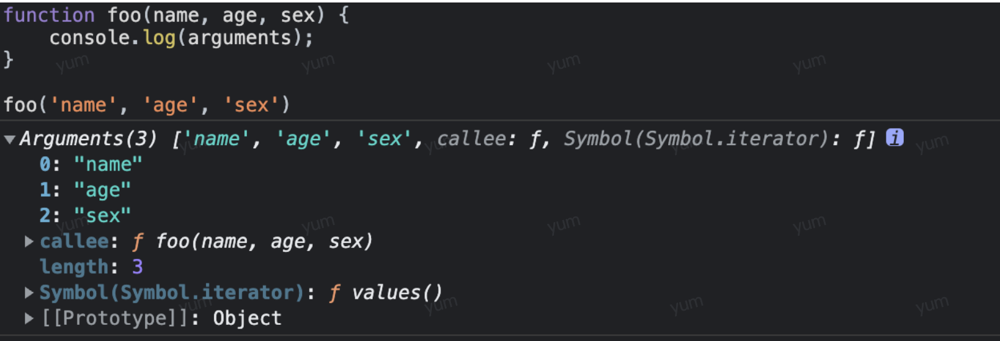
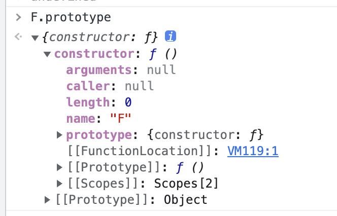
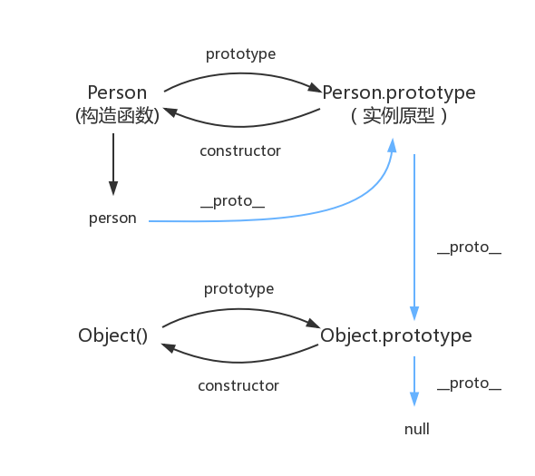

## 1. 字符串

方法

```js
let s = "--java script--";
s.slice(2, s.length); // 等价于 s.substring(2, s.length ) java script--
s.split(" ").join("-"); //   --java-script--
s.slice(-3); // t--

s.indexOf("c", 3); // 从第三个位置开始找c
s.startWith("c");
s.endWith("c");
s.include("c");
```

## symbol

- symbol(key)

```JS
const  a = Symbol('1')
const  b = Symbol('1')

a == b // false

```

- symbol.for(key)

```js
let t = Symbol("1");
let s = Symbol("1"); //
s === t; // true

Symbol.for(t); // 1
```

## 3.值的转换

js 的基本类型，比较按照值来比较的，存储在栈中。
String
Number
Boolean
null
undefined
Symbol

注意 typeof null = 'object' 是 js 的一个遗留问题，被认为为 bug null 并不是对象，被认为是一种特殊的原始值
js 引用类型（数组和对象等）存储在堆内存中，比较是按照引用地址比较的，
所以 key，value 完全相等的两个对象 a,b 永远不可能相等，引用地址不同。但是值为 1 的两个数字 c， d 比较是相等的。

- 基本类型 ---> 数字，字符串，布尔值，对象

转数字实际调用 ToNumber(value)
转字符串实际调用 ToString(value)

这两个方法都是底层规范上实现的未暴露出来，我们实际调用的事 Number() 和 String()方法。

注意的几个转换
Number 转换

```js
Number(null)        0
Number(undefined) Number('a') Number('1  1')  NaN
Number() Number('    ') Number(0)     0

```

String()转换

```js
'undefined' 'null' 'true' 'false' '0' 'Infinity'
```

转对象 原始值通过调用 String()、Number() 或者 Boolean() 构造函数，转换为它们各自的包装对象。

```js
var b = new Number(a);
console.log(typeof b); // object
```

- **对象 ---> 基本类型 数字，字符串 布尔值**

对象转换为其他类型
会先调用 ToPrimitive(input, type) return toType(primValue)值

即：
第二个参数 type 是 String 则 返回 ToString(primValue).如果是基本类型转换则调用 String() 直接返回，如果是对象
会先调用`toString()`方法，然后调用`valueOf()`方法，直到返回基本类型为止，否则报错抛出异常

第二个参数 type 是 Number 则 返回 ToNumber(primValue). 如果基本类型调用 Number() 直接返回。
如果是对象会先调用`valueOf()`方法，然后调用`toString()`方法，直到返回基本类型为止，否则报错抛出异常

注意 valueOf 表示对象的原始值，默认返回对象本身。除日期外，日期会返回毫秒值。

```js
console.log(new Date().valueOf());
1711094465991;
```

需要注意的以下对象转换

```


```

Nan null undefined -0 0 '' 为 false 其他所有基本类型以及引用类型全部为 true

| 值                  | 转换为字符串 | 转为数字 | 转为布尔 |
| ------------------- | ------------ | -------- | -------- |
| undefined           |              |          |          |
| null                |              |          |          |
| true,false          |              |          |          |
| "", "非空字符串"    |              |          |          |
| 1,2,3,0,-0          |              |          |          |
| Infinity, -Infinity |              |          |          |
| NaN                 |              |          |          |
| {}                  |              |          |          |
| []                  |              |          |          |
| [9], ['a']          |              |          |          |
| Function(){}        |              |          |          |

对象会先调用 valueOf 方法，如果 valueOf 返回原始值，则停止，然后调用 toString 方法。

- 转换规则
  - 1. +1 -1 等一元运算符 toNumber
  - 2. 1 + 1 等二元运算符
       有一个是字符串则全转为字符串加减操作，否则全部转为数字
  - == 运算 x==y
    > 类型相同情况下比较值（对象比较引用地址）, 类型不同的话
    > 对象转成基本类型，基本类型优先转化为数字对比，布尔值也一样。

这也就是为什么[] == [] 不能都转成基本类型'' == ''的原型，因为类型相同，但是对象引用地址不同，所以[] == [] 为 false

这个与[] == ![]要区分来看，这个的解释是先算一元运算符![] 这里因为[]是对象所以![]是 false。即[] == false 这种就适用于类型不同的情况，类型不同先将对象转为原始值即
'' == false 然后都为原始值，转为数字。0 == 0 即为 true

    ```js
    4 + [1] == '4' + '1' == '41'
    4 + [1, 2, 3, 4] == '4' + '1, 2, 3, 4' == '41,2,3,4'

    NaN == NaN  // false
    null == undefined   undefined == null// true
     true == '2'  // false 因为true转为1  '2' 转为2  1==2 false
     42 == ['42'] // true
     false == [] // true   0 == ''  => 0 == 0  返回true
     [] == '',false,0 // true
     "" == [null] // 因为[null].toString() = ''

     {} == !{} // 同样的解释，先算!{} 即为false   '[object Object]' == false  即为false
     {} == {} // false

     "a" + +"b" // aNaN
    ```

NaN + **anything** = NaN

```js
Number({})  = NaN

1 + {}  = '1[object Object]'
['1', '2'] + 1 = '1,21'
console.log([] + {});// [object Object]


```

为什么 chrome 的 console 上面`{} + 1 = 1`因为{}被当成了代码块，加上`({} + 1 = 1)`就会正常的输出'[object Object]1'

显示转换

String() Number() Boolean()

## 4. JSON.stringify

，map， set ，Date，

- undefined、任意的函数以及 symbol 值 RegExp 和 Error 对象在序列化过程中会被忽略

```js
JSON.stringify({ x: undefined, y: Object, z: Symbol("") });
// "{}"

JSON.stringify([undefined, Object, Symbol("")]);
// "[null,null,null]"
```

- 第二个参数 replacer，它可以是数组或者函数，用来指定对象序列化过程中哪些属性应该被处理，哪些应该被排除。
  第三个参数是缩进空格数。（基本无用，因为 JSON.parse 方法会忽略空格的，无论第三个参数如何 parse 后的结果都一样）

```js
function replacer(key, value) {
  if (typeof value === "string") {
    return undefined;
  }
  return value;
}

var foo = {
  foundation: "Mozilla",
  model: "box",
  week: 45,
  transport: "car",
  month: 7,
};
var jsonString = JSON.stringify(foo, replacer);

console.log(jsonString);
// {"week":45,"month":7}
```

```js
var foo = {
  foundation: "Mozilla",
  model: "box",
  week: 45,
  transport: "car",
  month: 7,
};
console.log(JSON.stringify(foo, ["week", "month"]));
// {"week":45,"month":7}
```

- 对象重写`toJSON()`方法会覆盖 stringify 默认行为

```js
var obj = {
  foo: 'foo',
  toString: function(){
    return '哈哈哈'
  }
  toJSON: function () {
    return '覆盖默认返回';
  }
};
JSON.stringify(obj);      // '"覆盖默认返回"'
JSON.stringify({x: obj}); // '{"x":"覆盖默认返回"}'
console.log(obj.toString())// ’哈哈哈‘   '[object Object]'

```

### JSON.parse(json string, reiver function )

第二个参数 复活 函数 跟 stringify 第二个参数实际上是类似的。

```js
JSON.parse(text, function (key, value) {
  // 判断key以下划线开头的全部直接返回undefined
  if (key[0] === "_") return undefined;

  return value; // 其他情况不处理
});
```

## 5.操作符

### 1. in

如果左侧的值是右侧的对象的属性 名，则 in 返回 true
数组则是索引。

```js
let point = {x: 1, y: 1}
"x" in  point  // true
"toString" in  point  // true
"z" in  point  // false

let data = [1,3,4]
"3" in data // false
"0" in data  或者 0 in data，  1 in data，2 in data // true
```

### a ?? b 先定义操作符

在第一个 操作数求值为 null 或 undefined 时才会求值第二个操作数
等价于

```js
a!==null && a!==undefined ) ? a : b

```

与||运算符的区别

```js
let options = {timeout: 0 , title: "", verbose: false, n: null}
console.log(
    options.timeout ?? 666,
    options.title ?? 777,
    options.verbose ?? 888,
    options.n ?? 999,
    options.quiet ?? 1000
    )

console.log(
    options.timeout || 1001,
    options.title || 1002,
    options.verbose || 1003,
    options.n || 1004,
    options.quiet || 1005
    )


0 '' false 999 1000
1001 1002 1003 1004 1005
```

### 逗号操作符

特性就是从左到右都会执行，只会返回最后一个表达式的值，前提是加了括号，因为逗号运算符的优先级全局最低的。

```js
var a = 10;
var b = 12;
var c = 15;
var d;
var s;
d = a, b++, c++, 100;

s = (a, b++, c++, 100)

console.log(a, b, c, d, s); // 10 13 16 10 100


唯一使用场景，for循环，要求都得执行。并且无副作用。


```

## 语句

可以使用 in 操作符，或者 hasOwnProperty()、 propertyIsEnumerable()方法测试对象是否含有相应属性，也可以 obj.key !== undefined 来判断。

·Object.keys()返回对象可枚举自有属性名的数组。不包含不 可枚举属性、继承属性或名字是符号的属性
·Object.getOwnPropertyNames()与 Object.keys()类似，但也 会返回不可枚举自有属性名的数组，只要它们的名字是字符串。

·Object.getOwnPropertySymbols()返回名字是符号（Symbols）的自有属性，无论是否可枚举。
·Reflect.ownKeys()返回所有属性名，包括可枚举和不可枚举 属性，以及字符串属性和符号属性(Symbols)。

## 数组

for...of... es6 新增，跟迭代对象 for...in... 一直都有，任何对象

for of

const a = [{s: 1},{s: 2},{s: 3},{s: 4}]
for (item of a){
console.log(item)

}
{s: 1}
{s: 2}
{s: 3}
{s: 4}

如果要索引

const a = [1,2,3,4,5,6]
a.length = 3 // 数组 a 变为[1,2,3]

for ([item, index] of a.entries()){
console.log(item, index)

}

VM1468:2 0 1
VM1468:2 1 2
VM1468:2 2 3

/[123jdjskd]/.test('1')

类似于 include 或者 indexOf('1')！== -1

[1, 2, 3].join('')

`filter()`, `forEach()`, `map()  `
`find()` , `findIndex()`, 返回值或者 undefined，返回索引或者-1
` every(function)` 所有都满足 function 条件 `some() ` 只要有一个满足即可

`reduce()`与`reduceRight()`

`flat`与`flatMap()`

a.flatMap(f)等同 于(但效率远高于)a.map(f).flat():

`concat()`会 flat(1)即打平一层。
push unshift
pop shift 返回删除的元素

slice(), splice(), fill(),copyWithin()

```js
let a = [1, 2, 3, 4, 5, 6];
a.every((item) => item < 10); //true 判断数组中所有值都小于10
a.every((item) => item % 2 === 0); //false 判断数组中所有值是否都为偶数

a.some((item) => item % 2 === 0); //true 数组中包含偶数
```

手写 reduce 方法 reduceRight()从 length 开始，reduce 从 0 开始

```js
Array.prototype.customReduce = function reduce(callback, initValue) {
  let accumulator = initValue;

  for (let i = 0, len = this.length; i < len; i++) {
    if (accumulator) {
      accumulator = callback(accumulator, this[i], i, this);
    } else {
      accumulator = this[i];
    }
  }
  return accumulator;
};
```

a.flat() 参数默认是 1

```js
const a = [1, [2, [3, [4]]]];

a.flat(1); //[1,2,[3,[4]]]
a.flat(2); //[1,2,3,[4]]
a.flat(3); //[1,2,3,4]
a.flat(4); //[1,2,3,4]
```

### 类数组

只要对象有一个数值 属性 length，而且有相应的非负整数属性，那就完全可以视同为数组

类数组对象不继承 Array.prototype，所以无法直接在它们上面调用数组方法。为 此，可以使用 Function.call()方法

```js
const a = { 0: "a", 1: "b", 2: "c", length: 3 };

Array.prototype.join.call(a, "+"); // "a+b+c"
Array.prototype.map.call(a, (item) => item.toUpperCase()); //  ["A", "B", "C"]
Array.prototype.slice.call(a, 0); //  ["a", "b", "c"]
Array.from(a); // 最简单形式得到真正数组  ["a", "b", "c"]
```

## 函数

es2000
`f?.(x)` 等价于`f!==null && f !== undefined) ? f(x) : undefined`

箭头函数可以继承 this 值

- 为什么所有函数的参数都是按值传递

对于基本类型（栈）数据所有函数的参数都是按值传递的，即函数外部的值复制给函数的参数。
引用类型（栈只会存储指向堆中的真实值的指针）的

1. 指针拷贝，拷贝的是地址索引；
2. 常规类型拷贝，拷贝的是值 ；

### 扩展： 类数组对象

```js
var arrayLike = {
    0: 'name',
    1: 'age',
    2: 'sex',
    length: 3
}

// 能访问值
arrayLike[0] = 'new name';
// 能获取length
console.log(arrayLike.length); // 3
// 还能遍历
for(var i = 0, len = arrayLike.length; i < len; i++) {

}

// 但是原生方法不能用
arrayLike.push('habit)
// arrayLike.push is not a function
// 可以用以下方式访问
Array.prototype.push.call(arrayLike,'habit')
// {0: 'name', 1: 'age', 2: 'sex', 3: 'habit', length: 4, callback: null}

// 转数组
Array.from(arrayLike);
Array.prototype.push.concat([],arrayLike)

```

arguments 就是类数组对象。


### 手写 call

指定 this 和 arguments 来调用函数或方法。

```js
let foo = { value: 1 };

function bar() {
  console.log(this.value);
}

bar.call(foo);
```

1. 将 this-->foo
2. 执行 bar 函数

等价于

```js
let foo = {
  value: 1,
  bar: function () {
    console.log(this.value);
  },
};

foo.bar();
```

所以实现 call 方法等同于以下三步

1. 将 bar 设置为 foo 的属性
2. 执行 bar
3. 删除 foo 的 bar

```js
Function.property.call2 = function (context) {
  var context = context || window; // 有可能传null bar.call(null)
  context.somFn = this;
  let args = [...arguments].slice(1); // 第一个参数是context
  const result = context.somFn(...args);
  delete context.someFn;
  return result;
};
```

### 手写 apply

apply 和 call 的区别就是第二个参数是数组

所以

```js

Function.property.apply2 = function(context， arr=[]){
    var context = context || window // 有可能传null bar.call(null)
    context.somFn = this
    const result =  context.somFn(...arr)
    delete context.someFn
    return result
}


```

### 手写 bind

会创建一个新的函数，当新的函数调用的时候第一个参数是 this

1. 返回的是一个函数
2. 能够传入参数

```js
var foo = {
    value: 1
}

function bar(name, age){
    console.log(this.value)
    console.log(name)
    console.log(age)
}

bar.prototype.friend = 'zhang‘

var bindFoo = bar.bind(foo, 'yum')

bindFoo('18)

//注意作为构造函数也可以用
//  var obj = new bindFoo(18)

console.log(obj.habit)
console.log(obj.friend)
```

1.参数可以分开传 2. 可以作为构造函数，作为构造函数的时候 this.value 是访问不到的。

```js
Function.property.bind = function (context) {
  if (typeof this !== "function") {
    throw new Error(
      "Function.prototype.bind - what is trying to be bound is not callable"
    );
  }
  var _this = this; // 谁调用this就是谁， 也就是bar  context 就是绑定的this即foo
  var args = [...arguments].slice(1); // 取出bind函数第二个开始的参数作为函数调用的函数
  var fBound = function () {
    // bindFoo(18)正常调用的时候this是window对象，实际相当于window.bindFoo(18)。此时的apply绑定的this应该是传进来的foo对象即context。
    //当作为构造函数的时候this就不是context了应该就是fBound本身了。new bindFOO(18) new出来的对象实际上就是fBound的实例。
    return _this.apply(this instanceof fBound ? this : context, [
      ...args,
      ...arguments,
    ]); // 这里的arguments是调用bind函数的参数即上面的bindFoo('18')
  };
  // 要把bar上的prototype赋值给fBound函数。

  fBound.prototype = this.prototype;
  return fBound;
};
```

    fBound.prototype = this.prototype;

这里有一个问题就是后面修改 fBound.prototype 的时候 bar 的 prototype 也修改了。所以优化就是用一个空的函数周转后赋值

即

```js
var fTemp = function () {};

fTemp.prototype = this.prototype;

fBound.prototype = new fTemp();
//   fBound.prototype.__proto__ =  fTemp.prototype

return _this.apply(this instanceof fTemp ? this : context, [
  ...args,
  ...arguments,
]); // 这里的arguments是调用bind函数的参数即上面的bindFoo('18')
```

最终代码

```js
Function.property.bind = function (context) {
  if (typeof this !== "function") {
    throw new Error(
      "Function.prototype.bind - what is trying to be bound is not callable"
    );
  }
  var _this = this; // 谁调用this就是谁， 也就是bar  context 就是绑定的this即foo
  var args = [...arguments].slice(1); // 取出bind函数第二个开始的参数作为函数调用的函数
  var fTemp = function () {};
  var fBound = function () {
    // bindFoo(18)正常调用的时候this是window对象，实际相当于window.bindFoo(18)。此时的apply绑定的this应该是传进来的foo对象即context。
    //当作为构造函数的时候this就不是context了应该就是fBound本身了。new bindFOO(18) new出来的对象实际上就是fBound的实例。
    return _this.apply(this instanceof fTemp ? this : context, [
      ...args,
      ...arguments,
    ]); // 这里的arguments是调用bind函数的参数即上面的bindFoo('18')
  };

  fTemp.prototype = this.prototype;

  fBound.prototype = new fTemp();
  return fBound;
};
```

### 手写 new

```js
var person = objectFactory(Person, "Kevin", "18");
```

最终实现

```js
// 最终版的代码
function objectFactory() {
  var obj = new Object(),
    Constructor = [].shift.call(arguments); // Array.prototype.shift.call(arguments) 即取出第一个参数
  obj.__proto__ = Constructor.prototype;
  var ret = Constructor.apply(obj, arguments);
  return typeof ret === "object" ? ret : obj;
}
```

1. 用 new Object() 的方式新建了一个对象 obj；
2. 取出第一个参数，就是我们要传入的构造函数。此外因为 shift 会修改原数组，所以 arguments 会被去除第一个参数；
3. 将 obj 的原型指向构造函数，这样 obj 就可以访问到构造函数原型中的属性；
4. 使用 apply，改变构造函数 this 的指向到新建的对象，这样 obj 就可以访问到构造函数中的属性；
5. 查看构造函数是否又返回值，又返回值返回，没返回值返回对象。

### this 指针，闭包，作用域

词法作用域：静态作用域即函数执行时使用的是定义函数时的作用域
动态作用域: 调用函数的时候确定的作用域
基本类型栈中，对象在堆中。

### 执行上下文

执行上下文是有三部分组成的
变量对象 VO（variable object） 上下文中定义的变量和函数声明
作用域链
this

全局上下文 VO 对应的 window

a = 1 // window.a=1

#### 变量对象

函数上下文中用活动对象来表示变量对象

AO（activiation variable）活动对象

```js
function foo(a) {
  var b = 2;
  function c() {}
  var d = function () {};
  b = 3;
}

foo(1);
```

执行上下文代码的过程

1. 进入执行上下文
   变量对象包含： 函数的声明 ，变量的声明，函数的形式参数，没有实际的传入参数，arguments undefined

```js

AO = {
    arguments:{
        0:1,
        length: 1
    }
    a: 1,
    b: undefined,
    c: reference to function c(){},
    d: undefined

}

```

2. 代码执行

```js

AO = {
    arguments:{
        0:1,
        length: 1
    }
    a: 1,
    b: 2,
    c: reference to function c(){},
    d: reference to FunctionExpression d

}

```

#### 作用域链

先从当前上下文找，找不到再到词法作用域的上一级去找，直到找到全局上下文中的变量为止。

[[scope]]属性

```js
function foo() {
  function bar() {}
}
bar();
```

```js

foo.[[scope]] = [
  globalContext.VO
];

bar.[[scope]] = [
    fooContext.AO,
    globalContext.VO
];


```

当函数激活时，进入函数上下文，创建 VO/AO 后，就会将活动对象添加到作用链的前端。

[bar AO].concat()

完整执行过程

```js
var scope = "global scope";
function checkscope() {
  var scope2 = "local scope";
  return scope2;
}
checkscope();
```

1. 函数创建

```js
checkscope.[[scope]] = [
    globalContext.VO
];
```

2. 函数执行 checkscope()

```js
ECStack = [
    checkscopeContext,
    globalContext
];

checkscopeContext = {
    AO: {
        arguments: {
            length: 0
        },
        scope2: undefined
    }，
    Scope: checkscope.[[scope]],
}
```

3. 将活动对象压入 checkscope 作用域链顶端

```js
checkscopeContext = {
  AO: {
    arguments: {
      length: 0,
    },
    scope2: undefined,
  },
  Scope: [AO, [[Scope]]],
};
```

4. 开始执行函数，随着函数的执行，修改 AO 的属性值

```js
checkscopeContext = {
  AO: {
    arguments: {
      length: 0,
    },
    scope2: "local scope",
  },
  Scope: [AO, [[Scope]]],
};
```

5. 查找到 scope2 的值，返回后函数执行完毕，函数上下文从执行上下文栈中弹出

```js
ECStack = [globalContext];
```

#### this

闭包中的变量存储的位置是堆内存
闭包就是函数内部有用到函数定义的作用域。
我们关注的是定义和调用的作用域不同的闭包。其他所有函数都是定义和调用作用域相同的闭包，无需关注

```js
var a = "---";
function foo() {
  var a = "foo";
  function fo() {
    console.log(a);
  }
  return fo;
}

function f(p) {
  var a = "f";
  p();
}
f(foo());
/* 输出  foo
*   
 * 跟调用作用域无关，js使用的是词法作用域也就是静态作用域，即函数执行使用的是定义作用域

*/

for (var i = 0; i < 10; i++) {
  function hhh(j) {
    setTimeout(function () {
      console.log(j);
    }, 1000);
  }
  i;
}

//结果是 9

for (var i = 0; i < 10; i++) {
  (function (j) {
    setTimeout(function () {
      console.log(j);
    }, 1000);
  })(i);
}
// 0 1 2 3...... 9
```

#### 闭包的原理

js 执行代码是按照一段一段执行的
执行栈来管理执行上下文。

能够访问自由变量的函数就是闭包
自由变量 在函数使用的，但不是函数的参数同时也不是函数内部的局部变量的变量。

闭包是返回函数的时候扫描函数内的标识符引用，把用到的本作用域的变量打成 Closure 包，放到 [[Scopes]] 里。

eval 因为没法分析内容，所以直接调用会把整个作用域打包（所以尽量不要用 eval，容易在闭包保存过多的无用变量），而不直接调用则没有闭包。

闭包是为了解决子函数晚于父函数销毁的问题，我们会在父函数销毁时，把子函数引用到的变量打成 Closure 包放到函数的 [[Scopes]] 上，让它计算父函数销毁了也随时随地能访问外部环境。

```js
var scope = "global scope";
function checkscope() {
  var scope = "local scope";
  function f() {
    return scope;
  }
  return f;
}

var foo = checkscope();
foo();
```

在执行 f 函数的时候 f 函数会复制 checkscope 的作用域到自己的 scopes 中

```js
fContext = {
  Scope: [AO, checkscopeContext.AO, globalContext.VO],
};
```

面试题： 节流，防抖，函数科里化。

### 函数式编程

纯函数 相同输入，想通输出。 可缓存，可移植， 可测试
可以实现可缓存函数。

```js
const memorize = function(f){
    const cache= {}
    return function (){
        const arg_str = JSON.stringify(arguments)
        cache[args_str] = cache[args_str] || f.apply(f, arguments)

        return cache[args_str]
    }
}


const squareNumber = memorize(function(x) return x*x)

squareNumber(1)
squareNumber(2)
squareNumber(2)

```

#### 柯里化

使用多个参数的函数转化为使用单个函数的技巧

面试题

```js
function fn(a, b, c, d, e) {
  console.log(a, b, c, d, e);
}

let fn = curry(fn);

_fn(1, 2, 3, 4, 5);
等价于;
_fn(1, 2)(3, 4)(5);
```

实现函数的柯里化

```js
function curry(fn) {
  return function curryFn() {
    var args = Array.prototype.slice.call(arguments);
    if (args.length < fn.length) {
      return function () {
        var args2 = Array.prototype.slice.call(arguments);
        return curryFn(args.concat(args2));
      };
    }
    return fn.apply(null, args);
  };
}
```

#### 代码组合

高阶函数 接收一个或多个函数作为参数并返回一个新函

下面例子传入两个函数得到一个函数，最终先求和再平方。
call 方法参数都喊分割的 apply 参数是数组。

```js
function compose(f, g) {
  return function (...args) {
    return f.call(this, g.apply(this, args));
  };
}

const sum = (x, y) => x + y;
const square = (x) => x * x;
compose(square, sum)(2, 3);
```

## 对象，原型，原型链

类意味着一组对象从同一个原型对象继承属性。因此，原型对象是类的核心特征。

JavaScript 函数自动拥有一个 prototype 属性。这个属性的值是一个对象，有一个不可枚举的 constructor 属性。而这个 constructor 属性的值就是该函数对象:



```js
let Person = function () {
  console.log("函数调用了");
};
let P = Person.prototype;
P.constructor === Person;

Person(); // 函数调用了
Person.prototype.constructor(); // 函数调用了

let sonF = new Person();
```

每一个 JavaScript 对象(除了 null)都具有的一个属性，叫**proto** 隐藏属性
实例对象（new）的**proto** 指向的是构造函数的原型
与其说是一个属性，不如说是一个 getter/setter，当使用 obj.**proto** 时，可以理解成返回了 Object.getPrototypeOf(obj)。

关系图

```js
sonF.__proto__ = Person.prototype;
Object.getPrototypeOf(sonF) === Person.prototype;
sonF.constructor === Person.prototype.constructor;
sonF.constructor = Person;
Person.prototype.constructor = Person;
sonF.prototype = Person; //为什么，据查找继承关系先从实例上找 prototype 找不到，然后从原型上找找到了即 Person.prototype Person.prototype.constructor = Person

// 实例对象sonF上没有constructor所有会从sonF.__proto__上找，即查找sonF.constructor 在原型上找到了constructor属性即sonF.__proto__.constructor === Person.prototype.constructor = Person回到了起点
```

point.prototype = Point 为什么相等

根



### 2. instanceof

原理本质上就是看
` leftVaule.__proto__ = rightVaule.prototype`

    扩展：判断类型 `typeof`
    ```js
     Object.prototype.toString.call(1) // "[object Number]"不同数据类型的返回
     Object.prototype.toString.call('1') // '[object String]'

    ```

```js
const obj = new Object();
obj instanceof Object; //true
```

`obj`实例对象，`Object`构造函数是 Function 类型的实例
实例对象的`__proto__`指向的事构造函数的原型对象`prototype` 即 `obj.__proto__ === Object.prototype`
实例对象没有 prototype 的只有构造函数才有。
对象的`__proto__`最终指向`null` 即 `Object.prototype.__proto__ === null`

`Object.__proto__ === Function.prototype`

对于上面代码完整的转换过程

```js
const obj = new Object();
// 实例对象的隐式原型指向它的构造函数的原型对象
obj.__proto__ === Object.prototype;
// Object 本身是原生引用类型也就是对象，而对象都拥有隐式原型，同时 Object 又是原生构造函数，而函数都是 Function 的实例，可以简单理解为 Object 是通过构造函数 Function 实例化实现。
Object.__proto__ === Function.prototype;
// 原型对象本质是对象，而对象是通过原生构造函数 Object 实例化实现的
Function.prototype.__proto__ === Object.prototype;
// 宇宙的尽头
Object.prototype.__proto__ === null;
```

```js
const arr = new Array();

arr.__proto__ === Array.prototype;

Array.__proto__ === Function.prototype;

//Array.prototype  Array的构造方法
(Array.prototype.__proto__ === arr.__proto__.__proto__) === Object.prototype;
```

chrome 控制台

```js
Array.__proto__
ƒ () { [native code] }
Function.prototype
ƒ () { [native code] }
Object.__proto__
ƒ () { [native code] }


Function.prototype.__proto__

```

### 创建对象的方式

常用的对象创建方式

```js
function Person(name) {
  this.name = name;
  this.getName = function () {
    console.log(this.name);
  };
}

var person1 = new Person("kevin");
```

缺陷： 每次创建实例时，每个方法都要被创建一次；

可以用组合模式

```js
function Person(name) {
  this.name = name;
  if (typeof this.getName != "function") {
    Person.prototype = {
      constructor: Person,
      getName: function () {
        console.log(this.name);
      },
    };

    return new Person(name);
  }
}

var person1 = new Person("xianzao");
var person2 = new Person("zaoxian");

person1.getName(); // xianzao
person2.getName(); // zaoxian
```

#### 原型链

```js
function Fn() {}
Fn.prototype.info = "value";
const person = new Fn();
person.age = 18;
person; // chrome 控制台查看 Fn {age: 18} 展看查看

console.log(person.info); // 'value'
console.log(person.toString); // ƒ toString() { [native code] }
```

查找顺序，

1. 在 person 上查找 info 找不到
2. 然后 person.**proto**即 Fn.prototype 上查找,找到了 info，返回 value。
   toString 仍旧没找到，
3. 会继续找 Fn.prototype.**proto** 即 Object.prototype 上，找到了返回，
4. 如果仍旧找不到继续向上 Object.prototype.**proto** = null 所以结束查找抛错

所以继承关系的描述实际上实例不停地调用**proto** 找到对应的所有继承对象的原型 prototype

#### 继承

// TODO 继承的几种方式？？？？？

```js
class Obj1 = {
  info: "value",
  run: function () {
    console.log("run");
  },
};
class Obj2 = {
  age: 18,
};
Obj2.__proto__ = Obj1;
//
// Obj2.prototype = new Obj1();
//等价于
const Obj2 = Object.create(Obj1, { age: { value: 18 } });
```

1. 原型链继承
   以下三个都可以
   Obj2.**proto** = Obj1;
   Obj2.prototype = new Obj1();

上面有一个问题 方法 run 每次都会重新创建。

```js
const fn1 = new Obj1();
const fn2 = new Obj1();
fn1.run === fn2.run; // false
```

所以方法一般放在原型对象 prototype 上面定义，避免每个实例都重新创建方法，造成资源浪费。一般创建属性值都放在构造函数内部，而构造函数原型对象上的属性则一般作为公共属性使用，一般是不变的。
即

```js
Obj1.prototype.run = function () {
console.log("run");
},
```

但是这样又会有新的问题，改变

箭头函数没有 prototype 属性，所以构造函数不能是箭头函数。
不能作为构造函数的还有生成器函数和异步函数。

箭头函数中的 this 是从定义它们的上下文继承的，不会根据调用它们的对象来动态设置

`new.target`判断函数是 否作为构造函数被调用了

```js
function Person() {
  if (new.target === undefined) throw new Error("dd");
  if (new.target === undefined) return new Person();
}
```

类的私有化属性,以#开头来私有化。

```js
class Person {
  #size = 0;
  get size() {
    return this.#size;
  }
}
```

2. 寄生式继承

```js
const Obj2 = Object.create(Obj1, { age: { value: 18 } });
```

```js
function createObj(o) {
  var clone = Object.create(o);
  clone.sayName = function () {
    console.log("hi");
  };
  return clone;
}
```

原型链继承有一个问题，就是父类（parent）的属性（names）在实例中（son.names.push('xiaomin')）改变后，所有实例中都变化了

3.  所以目前常用的继承方式

```js
function Parent(name) {
  this.name = name;
  this.colors = ["red", "blue", "green"];
}

Parent.prototype.getName = function () {
  console.log(this.name);
};

function Child(name, age) {
  Parent.call(this, name);

  this.age = age;
}

Child.prototype = new Parent();
Child.prototype.constructor = Child;

var child1 = new Child("kevin", "18");

child1.colors.push("black");

console.log(child1.name); // kevin
console.log(child1.age); // 18
console.log(child1.colors); // ["red", "blue", "green", "black"]

var child2 = new Child("daisy", "20");

console.log(child2.name); // daisy
console.log(child2.age); // 20
console.log(child2.colors); // ["red", "blue", "green"]
```

##### hasOwnProperty 和 instanceOf

让 obj2 继承自 obj1 使得 obj2 拥有 obj1 的所有属性和方法。

这里不得不提到另外一个方法 `hasOwnProperty`

```js
obj2.hasOwnProperty("info"); // false
obj2.hasOwnProperty("age"); // true
```

instanceOf 的源码实现就很容易理解了。

```js
// 手写实现 instanceof 运算符
function myInstanceof(L, R) {
  // 基本数据类型以及 null 直接返回 false
  if (!["function", "object"].includes(typeof L) || L === null) return false;
  // 拿到参数的原型对象
  let proto = L.__proto__;
  while (true) {
    // 查找到尽头，还没找到就返回 false
    if (proto === null) return false;
    // 找到相同的原型对象就返回 true
    if (proto === R.prototype) return true;
    proto = proto.__proto__;
  }
}
```

---

## 重要但却不是基础的 API，把它们看作 JavaScript 的“标准库”

### Set 和 Map

#### Set

> === 来判断元素重复的，1 和'1'是不同的,

```js
const s = new Set("miss");
s.size;
s.add(1);
s.add([1]);

s.delete("s"); // true   成功删除s
s.delete([1]); // false
s.has("m"); // true

s.clear();
```

由于添加的数组[1]和删除的[1]不是同一个对象所以删除失败

可用 for...of...循环

#### Map

```js
const m = new Map([["a", 1]]); // Map(1) {"a" => 1}
m.set("b", 2); // Map(2) {"a" => 1, "b" => 2}
m.get("b"); // 2

// 其他api
// size
// delete
// has
// clear
```

WeakMap 只实现了 get()、set()、has()和 delete()方法
WeakSet 只实现了 add()、has()和 delete()方法

### 正则

/[abc]/ 匹配 中括号中的任何字母(a,b,c)

^ 排除性字符
`/[^abc]/`匹配非 a,b,c 之外的任何字符

`/[a-z]/` 匹配 a 到 z 的所有小写字母

`/\d/` 0-9 等价于 [0-9]

`/\D/ ` 非 0-9 [^0-9]

`/\w/` 等价于[a-zA-Z0-9_]
`/\W/` 等价于[^a-zA-Z0-9_]
`/\s/` 空白字符串 大写 S 非空白

`{n, m}` 前项出现 n 到 m 次之间
`{n,}` n 次以上
`{n}` 恰好 n 次
`?` 等价于{0, 1}0 次或者 1 次
`+` {1,} 1 次或多次
`*` {0,} 0 次或多次

`/\d{2,4}/`
`/\w{3}\d?/` 三个字母或数字，一个可选数字结尾
`/\s*java\s*/` 匹配 java 前后 0 次或多次空格

(?=和)
(?!表示必须不存在断言中指定的字符)

^ 匹配字符串开头
$ 匹配字符串结尾

正则表达式后的吧标志
g 全局
i 不区分大小写
m 多行模式进行匹配

#### 匹配的字符串方法

- search
  返回位置，不存在-1
- replace

```js
"djkdjsdjk javascript----jdkjsdkjkdj. javascript is".replace(
  /javascript/gi,
  "前端"
); // 'djkdjsdjk 前端----jdkjsdkjkdj. 前端 is'

'我看过一本书"从入门到精通"还看过"JAVA语言"'.replace(/"([^"]*)"/g, "<<$1>>");
//"我看过一本书<<从入门到精通>>还看过<<JAVA语言>>"
```

- match

```js
"djkdjsdjk 1----jdk3jsdkjkdj. javasc4ript i5s".match(/\d/gi);
// ['1', '3', '4', '5']

let url = /(\w+):\/\/([\w.]+)\/(\S*)/;
let text = "visit my website at http://www.example.com/file";
let match = text.match(url);
let fullUrl = match(0); // http://www.example.com/file
let protocol = match(1); //http
let host = match(2); // 'www.example.com
let path = match(3); // file

// ['http://www.example.com/file', 'http', 'www.example.com', 'file', index: 20, input: 'visit my website at http://www.example.com/file', groups: undefined]
```

## 迭代器

### 实现可迭代对象

为了让类可迭代，必须实现一个名为 Symbol.iterator 的方法。 这个方法必须返回一个迭代器对象，该对象有一个 next()方法。而 这个 next()方法必须返回一个迭代结果对象，该对象有一个 value 属 性和/或一个布尔值 done 属性。

## ES6 和 ESNext

var 无法形成词法作用域（变量提升），容易篡改

let 块级作用域的局部变量，代码块内部有效

const 块级作用域的只读常量

声明避免修改的对象`Object.freeze`

```js
const user = {
  name: "张三",
  age: 18,
  gender: "男",
};

Object.freeze(user);
user.age = 20;
console.log(user); // { name: "李四", age: 18, gender: "男" }
```
