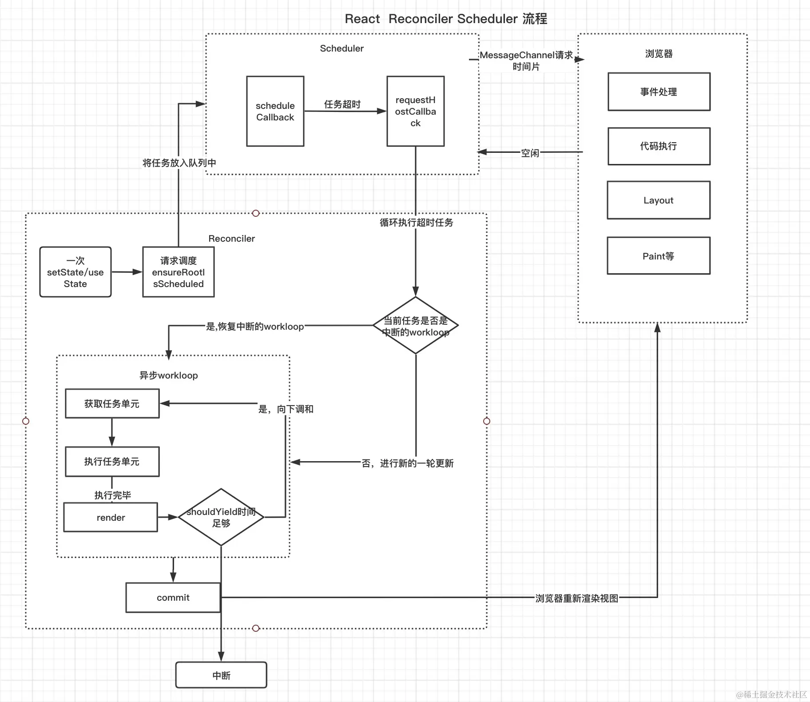

# 事件系统

> React 的事件不是绑定在元素上的，而是统一绑定在顶部容器上，在 v17 之前是绑定在 document 上的，在 v17 改成了 app 容器上。这样更利于一个 html 下存在多个应用（微前端）。
> 绑定事件并不是一次性绑定所有事件，比如发现了 onClick 事件，就会绑定 click 事件，比如发现 onChange 事件，会绑定 [blur，change ，focus ，keydown，keyup] 多个事件。
> React 事件合成的概念：React 应用中，元素绑定的事件并不是原生事件，而是 React 合成的事件，比如 onClick 是由 click 合成，onChange 是由 blur ，change ，focus 等多个事件合成。

registrationNameDependencies

```js
{
    onBlur: ['blur'],
    onClick: ['click'],
    onClickCapture: ['click'],
    onChange: ['blur', 'change', 'click', 'focus', 'input', 'keydown', 'keyup', 'selectionchange'],
    onMouseEnter: ['mouseout', 'mouseover'],
    onMouseLeave: ['mouseout', 'mouseover'],
    ...
}

```

事件是绑定在真实的 dom 上吗？如何不是绑定在哪里？
React 的事件不是绑定在元素上的，而是统一绑定在顶部容器上，在 v17 之前是绑定在 document 上的，在 v17 改成了 app 容器上

react 事件会保存在对应 DOM 元素类型 fiber 对象（ hostComponent ）的 memoizedProps 属性上，大致结构如{onClick: handleClick}

```js
function diffProperties(){
    /* 判断当前的 propKey 是不是 React合成事件 */
    if(registrationNameModules.hasOwnProperty(propKey)){
         /* 这里多个函数简化了，如果是合成事件， 传入成事件名称 onClick ，向document注册事件  */
         legacyListenToEvent(registrationName, document）;
    }
}

function legacyListenToEvent(registrationName，mountAt){
   const dependencies = registrationNameDependencies[registrationName]; // 根据 onClick 获取  onClick 依赖的事件数组 [ 'click' ]。
    for (let i = 0; i < dependencies.length; i++) {
    const dependency = dependencies[i];
    //  addEventListener 绑定事件监听器
    ...
  }
}

```

原生 dom[_reactFiber$ + randomKey] = dom 对应的 fiber
dom 对应的 fiber.stateNode = 原生 dom

如何模拟捕获和冒泡的。

如下代码 从子到父阶段，如果遇到冒泡的就 push 到末尾，捕获的就 unshift 到头部。一直到 root 组件为止
即

`[parentCapture, childCapture, childClick, parentClick]`'

如此也实现了捕获从父到子的冒泡从子到父的执行顺序。

```js
while (instance !== null) {
  const { stateNode, tag } = instance;
  if (tag === HostComponent && stateNode !== null) {
    /* DOM 元素 */
    const currentTarget = stateNode;
    if (captured !== null) {
      /* 事件捕获 */
      /* 在事件捕获阶段,真正的事件处理函数 */
      const captureListener = getListener(instance, captured); // onClickCapture
      if (captureListener != null) {
        /* 对应发生在事件捕获阶段的处理函数，逻辑是将执行函数unshift添加到队列的最前面 */
        dispatchListeners.unshift(captureListener);
      }
    }
    if (bubbled !== null) {
      /* 事件冒泡 */
      /* 事件冒泡阶段，真正的事件处理函数，逻辑是将执行函数push到执行队列的最后面 */
      const bubbleListener = getListener(instance, bubbled); //
      if (bubbleListener != null) {
        dispatchListeners.push(bubbleListener); // onClick
      }
    }
  }
  instance = instance.return;
}
```

`[parentCapture, childCapture, childClick, parentClick]`'

如何实现 stopPropagation

```js
function runEventsInBatch() {
  const dispatchListeners = event._dispatchListeners;
  if (Array.isArray(dispatchListeners)) {
    for (let i = 0; i < dispatchListeners.length; i++) {
      if (event.isPropagationStopped()) {
        /* 判断是否已经阻止事件冒泡 */
        break;
      }
      dispatchListeners[i](event); /* 执行真正的处理函数 及handleClick1... */
    }
  }
}
```

如果 childCapture 调用了 e.stopPropagation 那么数组后面的 childClick, parentClick 将都不会执行，

# 生命周期

beginWork 对于 class 组件会调用 updateClassComponent

```js
/* workloop React 处理类组件的主要功能方法 */
function updateClassComponent() {
  let shouldUpdate;
  const instance = workInProgress.stateNode; // stateNode 是 fiber 指向 类组件实例的指针。
  if (instance === null) {
    // instance 为组件实例,如果组件实例不存在，证明该类组件没有被挂载过，那么会走初始化流程
    constructClassInstance(workInProgress, Component, nextProps); // 组件实例将在这个方法中被new。
    mountClassInstance(
      workInProgress,
      Component,
      nextProps,
      renderExpirationTime
    ); //初始化挂载组件流程
    shouldUpdate = true; // shouldUpdate 标识用来证明 组件是否需要更新。
  } else {
    shouldUpdate = updateClassInstance(
      current,
      workInProgress,
      Component,
      nextProps,
      renderExpirationTime
    ); // 更新组件流程
  }
  if (shouldUpdate) {
    nextChildren = instance.render(); /* 执行render函数 ，得到子节点 */
    reconcileChildren(
      current,
      workInProgress,
      nextChildren,
      renderExpirationTime
    ); /* 继续调和子节点 */
  }
}

function mountClassInstance(
  workInProgress,
  ctor,
  newProps,
  renderExpirationTime
) {
  const instance = workInProgress.stateNode;
  const getDerivedStateFromProps = ctor.getDerivedStateFromProps;
  if (typeof getDerivedStateFromProps === "function") {
    /* ctor 就是我们写的类组件，获取类组件的静态方法 */
    const partialState = getDerivedStateFromProps(
      nextProps,
      prevState
    ); /* 这个时候执行 getDerivedStateFromProps 生命周期 ，得到将合并的state */
    const memoizedState =
      partialState === null || partialState === undefined
        ? prevState
        : Object.assign({}, prevState, partialState); // 合并state
    workInProgress.memoizedState = memoizedState;
    instance.state =
      workInProgress.memoizedState; /* 将state 赋值给我们实例上，instance.state  就是我们在组件中 this.state获取的state*/
  }
  if (
    typeof ctor.getDerivedStateFromProps !== "function" &&
    typeof instance.getSnapshotBeforeUpdate !== "function" &&
    typeof instance.componentWillMount === "function"
  ) {
    instance.componentWillMount(); /* 当 getDerivedStateFromProps 和 getSnapshotBeforeUpdate 不存在的时候 ，执行 componentWillMount*/
  }
}

function updateClassInstance(
  current,
  workInProgress,
  ctor,
  newProps,
  renderExpirationTime
) {
  const instance = workInProgress.stateNode; // 类组件实例
  const hasNewLifecycles = typeof ctor.getDerivedStateFromProps === "function"; // 判断是否具有 getDerivedStateFromProps 生命周期
  if (
    !hasNewLifecycles &&
    typeof instance.componentWillReceiveProps === "function"
  ) {
    if (oldProps !== newProps || oldContext !== nextContext) {
      // 浅比较 props 不相等
      instance.componentWillReceiveProps(newProps, nextContext); // 执行生命周期 componentWillReceiveProps
    }
  }
  let newState = (instance.state = oldState);
  if (typeof getDerivedStateFromProps === "function") {
    ctor.getDerivedStateFromProps(
      nextProps,
      prevState
    ); /* 执行生命周期getDerivedStateFromProps  ，逻辑和mounted类似 ，合并state  */
    newState = workInProgress.memoizedState;
  }
  let shouldUpdate = true;
  if (typeof instance.shouldComponentUpdate === "function") {
    /* 执行生命周期 shouldComponentUpdate 返回值决定是否执行render ，调和子节点 */
    shouldUpdate = instance.shouldComponentUpdate(
      newProps,
      newState,
      nextContext
    );
  }
  if (shouldUpdate) {
    if (typeof instance.componentWillUpdate === "function") {
      instance.componentWillUpdate(); /* 执行生命周期 componentWillUpdate  */
    }
  }
  return shouldUpdate;
}
```

render 初始化阶段： constructor 执行 getDerivedStateFromProps componentWillMount

更新阶段： componentWillReceiveProps getDerivedStateFromProps shouldComponentUpdate componentWillUpdate

执行 render 函数

在 commit 第一阶段 Before mutation 执行生命周期 getSnapshotBeforeUpdate

      commitBeforeMutationEffectOnFiber(current, nextEffect);

```js
//   commitBeforeMutationLifeCycles as commitBeforeMutationEffectOnFiber,

function commitBeforeMutationLifeCycles(current, finishedWork) {
  switch (finishedWork.tag) {
    case ClassComponent: {
      const snapshot = instance.getSnapshotBeforeUpdate(
        prevProps,
        prevState
      ); /* 执行生命周期 getSnapshotBeforeUpdate   */
      instance.__reactInternalSnapshotBeforeUpdate =
        snapshot; /* 返回值将作为 __reactInternalSnapshotBeforeUpdate 传递给 componentDidUpdate 生命周期  */
    }
  }
}
```

在 commit 第三个阶段阶段 commitLayout

```js
  commitLifeCycles as commitLayoutEffectOnFiber,

function commitLifeCycles(finishedRoot,current,finishedWork){
     switch (finishedWork.tag){                             /* fiber tag 在第一节讲了不同fiber类型 */
        case ClassComponent: {                              /* 如果是 类组件 类型 */
             const instance = finishedWork.stateNode        /* 类实例 */
             if(current === null){                          /* 类组件第一次调和渲染 */
                instance.componentDidMount()
             }else{                                         /* 类组件更新 */
                instance.componentDidUpdate(prevProps,prevState，instance.__reactInternalSnapshotBeforeUpdate);
             }
        }
     }
}

```

render ： componentDidMount

update: componentDidUpdate

最后执行 componentWillUnmount

# 调度（ Scheduler ）和调和（ Reconciler ）。

双缓冲树
canvas 绘制动画的时候，如果上一帧计算量比较大，导致清除上一帧画面到绘制当前帧画面之间有较长间隙，就会出现白屏。为了解决这个问题，canvas 在内存中绘制当前动画，绘制完毕后直接用当前帧替换上一帧画面，由于省去了两帧替换间的计算时间，不会出现从白屏到出现画面的闪烁情况。这种在内存中构建并直接替换的技术叫做双缓存。

React 用 workInProgress 树(内存中构建的树) 和 current (渲染树) 来实现更新逻辑。双缓存一个在内存中构建，一个渲染视图，两颗树用 alternate 指针相互指向，在下一次渲染的时候，直接复用缓存树做为下一次渲染树，上一次的渲染树又作为缓存树，这样可以防止只用一颗树更新状态的丢失的情况，又加快了 DOM 节点的替换与更新。

## render 阶段和

```js
function workLoop() {
  while (workInProgress !== null) {
    workInProgress = performUnitOfWork(workInProgress);
  }
}

function performUnitOfWork() {
  //递
  next = beginWork(current, unitOfWork, renderExpirationTime);
  if (next === null) {
    // 归
    next = completeUnitOfWork(unitOfWork);
  }
}
```

```js
function reconcileChildren(current, workInProgress) {
  if (current === null) {
    /* 初始化子代fiber  */
    workInProgress.child = mountChildFibers(
      workInProgress,
      null,
      nextChildren,
      renderExpirationTime
    );
  } else {
    /* 更新流程，diff children将在这里进行。 */
    workInProgress.child = reconcileChildFibers(
      workInProgress,
      current.child,
      nextChildren,
      renderExpirationTime
    );
  }
}
```

```js
export default class Index extends React.Component {
  state = { number: 666 };
  handleClick = () => {
    this.setState({
      number: this.state.number + 1,
    });
  };
  render() {
    return (
      <div>
        hello，world
        <p> 《React 进阶实践指南》 {this.state.number} 👍 </p>
        <button onClick={this.handleClick}>点赞</button>
      </div>
    );
  }
}
```

完整流程

beginWork -> rootFiber
beginWork -> Index fiber
beginWork -> div fiber
beginWork -> hello,world fiber
completeWork -> hello,world fiber (completeWork 返回 sibling)
beginWork -> p fiber
completeWork -> p fiber
beginWork -> button fiber
completeWork -> button fiber (此时没有 sibling，返回 return)
completeWork -> div fiber
completeWork -> Index fiber
completeWork -> rootFiber (完成整个 workLoop)

## commit 阶段

Before mutation 阶段（执行 DOM 操作前）；
mutation 阶段（执行 DOM 操作）；
layout 阶段（执行 DOM 操作后）

### Before mutation

```js
function commitBeforeMutationEffects() {
  while (nextEffect !== null) {
    const effectTag = nextEffect.effectTag;
    if ((effectTag & Snapshot) !== NoEffect) {
      const current = nextEffect.alternate;
      // 调用getSnapshotBeforeUpdates
      commitBeforeMutationEffectOnFiber(current, nextEffect);
    }
    if ((effectTag & Passive) !== NoEffect) {
      scheduleCallback(NormalPriority, () => {
        flushPassiveEffects();
        return null;
      });
    }
    nextEffect = nextEffect.nextEffect;
  }
}
```

执行 getSnapshotBeforeUpdate 生命周期。 异步调用 useEffect

### mutation

```
function commitMutationEffects(){
    while (nextEffect !== null) {
        if (effectTag & Ref) { /* 置空Ref */
            const current = nextEffect.alternate;
            if (current !== null) {
                commitDetachRef(current);
            }
        }
        switch (primaryEffectTag) {
            case Placement: {} //  新增元素
            case Update:{}     //  更新元素
            case Deletion:{}   //  删除元素
        }
    }
}

```

置空 ref, 进行真实的 DOM 操作。

### Layout

```js
function commitLayoutEffects(root) {
  while (nextEffect !== null) {
    const effectTag = nextEffect.effectTag;
    commitLayoutEffectOnFiber(
      root,
      current,
      nextEffect,
      committedExpirationTime
    );
    if (effectTag & Ref) {
      commitAttachRef(nextEffect);
    }
  }
}
```

commitLayoutEffectOnFiber 对于类组件，会执行生命周期，setState 的 callback，对于函数组件会执行 useLayoutEffect 钩子。
如果有 ref ，会重新赋值 ref 。


