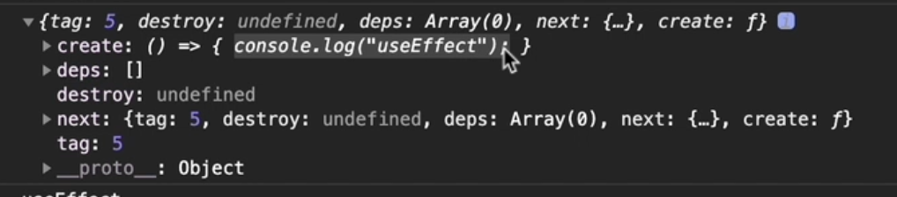

## 配置调试环境

1. npx create-react-app react-test
2. 弹射 create-react-app 脚手架内部配置 npm run eject
3. 克隆 react 官方源码 在项目根目录克隆
   `git clone --branch v16.13.1 --depth=1 https://github.com/facebook/react.git  src/react`

4. 链接本地源码

```js
// 文件位置: react-test/config/webpack.config.js
resolve: {

  alias: {

    "react-native": "react-native-web",
    "react": path.resolve(__dirname, "../src/react/packages/react"),
    "react-dom": path.resolve(__dirname, "../src/react/packages/react-dom"),
    "shared": path.resolve(__dirname, "../src/react/packages/shared"),
    "react-reconciler": path.resolve(__dirname, "../src/react/packages/react-reconciler"),
    "legacy-events": path.resolve(__dirname, "../src/react/packages/legacy-events")
  }
}
```

5. 修改环境变量

```js
修改环境变量;

// 文件位置: react-test/config/env.js
const stringified = {
  "process.env": Object.keys(raw).reduce((env, key) => {
    env[key] = JSON.stringify(raw[key]);
    return env;
  }, {}),
  __DEV__: true,
  SharedArrayBuffer: true,
  spyOnDev: true,
  spyOnDevAndProd: true,
  spyOnProd: true,
  __PROFILE__: true,
  __UMD__: true,
  __EXPERIMENTAL__: true,
  __VARIANT__: true,
  gate: true,
  trustedTypes: true,
};
```

6. 告诉 babel 在转换代码时忽略类型检查
   `npm install @babel/plugin-transform-flow-strip-types -D`

```js
// 文件位置: react-test/config/webpack.config.js [babel-loader]
plugins: [require.resolve("@babel/plugin-transform-flow-strip-types")];
```

7. 导出 HostConfig

```js
// 文件位置: /react/packages/react-reconciler/src/ReactFiberHostConfig.js
+ export * from './forks/ReactFiberHostConfig.dom';
- invariant(false, 'This module must be shimmed by a specific renderer.');

```

8. 修改 ReactSharedInternals.js 文件

```js
// 文件位置: /react/packages/shared/ReactSharedInternals.js
- import * as React from 'react';
- const ReactSharedInternals = React.__SECRET_INTERNALS_DO_NOT_USE_OR_YOU_WILL_BE_FIRED;
+ import ReactSharedInternals from '../react/src/ReactSharedInternals';
```

9. 关闭 eslint 扩展

```js
// 文件位置: react/.eslingrc.js [module.exports]
// 删除 extends
extends: [
  'fbjs',
  'prettier'
]
```

concurrent mode 将同步阻塞转换为异步非阻塞。
`ReactDOM.createRoot`将任务拆分为小任务。
// 通过使用 ReactDOM.unstable_createRoot 开启 Concurrent Mode
// ReactDOM.render(<App/>, rootEl);  
ReactDOM.createRoot(rootEl).render(<App/>);

Suspense 组件
停留时间长：显示 loading，加载完成后隐藏
停留时间短：不显示 loading，用户无感知，不然 loading 闪一下

Suspense 的加载过程：开始加载 -> 过渡 -> 完成后切换 ​。

useDeferredValue 降低执行的优先级，延迟执行提高性能。
通常输入框搜索，大量操作的时候，可以在大量操作显示的部分延迟执行

React 15 不支持用可中断的异步更新代替同步的更新
React16：

- Scheduler（调度器）—— 调度任务的优先级，高优任务优先进入 Reconciler react 自己实现 requestIdleCallback，即有空闲时间的时候执行
- Reconciler（协调器）—— 负责找出变化的组件 打上标记
- Renderer（渲染器）—— 负责将变化的组件渲染到页面上

整个 Scheduler 与 Reconciler 的工作都在内存中进行。只有当所有组件都完成 Reconciler 的工作，才会统一交给 Renderer。 Renderer 根据 Reconciler 为虚拟 DOM 打的标记，同步执行对应的 DOM 操作。

Q：React Fiber 如何更新 DOM？
使用“双缓存”
在内存中绘制当前的 fiber dom，绘制完毕后直接替换上一帧的 fiber dom，由于省去了两帧替换间的计算时间，不会出现从白屏到出现画面的闪烁情况

在 React 中最多会同时存在两棵 Fiber 树。当前屏幕上显示内容对应的 Fiber 树称为 current Fiber，正在内存中构建的 Fiber 树称为 workInProgress Fiber，两者通过 alternate 连接

判断组件是 class 组件还是 function 组件

```js
ClassComponent.prototype.isReactComponent; // {}
FunctionComponent.prototype.isReactComponent; // undefined
```

render 阶段

# render 方法

```js
ReactDom.render(<div>hello</div>, document.getElementById("root)), function(){
console.log(this) // <div>hello</div>
}

```

`render` 方法做了合法性校验后直接调用了 `legacyRenderSubtreeIntoContainer`方法

`render` ---> `legacyRenderSubtreeIntoContainer`

legacyRenderSubtreeIntoContainer 方法

```js
/**
 * 将子树渲染到容器中 (初始化 Fiber 数据结构: 创建 fiberRoot 及 rootFiber)
 * parentComponent: 父组件, 初始渲染传入了 null
 * children: render 方法中的第一个参数, 要渲染的 ReactElement
 * container: 渲染容器
 * forceHydrate: true 为服务端渲染, false 为客户端渲染
 * callback: 组件渲染完成后需要执行的回调函数
 **/
function legacyRenderSubtreeIntoContainer(
  parentComponent: ?React$Component<any, any>,
  children: ReactNodeList,
  container: Container,
  forceHydrate: boolean,
  callback: ?Function
) {
  if (__DEV__) {
    topLevelUpdateWarnings(container);
    warnOnInvalidCallback(callback === undefined ? null : callback, "render");
  }

  /**
   * 检测 container 是否已经是初始化过的渲染容器
   * react 在初始渲染时会为最外层容器添加 _reactRootContainer 属性
   * react 会根据此属性进行不同的渲染方式
   * root 不存在 表示初始渲染   root 存在 表示更新
   *
   */
  // 获取 container 容器对象下是否有 _reactRootContainer 属性
  let root: RootType = (container._reactRootContainer: any);
  // 即将存储根 Fiber 对象
  let fiberRoot;
  if (!root) {
    // 初始渲染
    // 初始化根 Fiber 数据结构
    // 为 container 容器添加 _reactRootContainer 属性
    // 在 _reactRootContainer 对象中有一个属性叫做 _internalRoot
    // _internalRoot 属性值即为 FiberRoot 表示根节点 Fiber 数据结构
    // legacyCreateRootFromDOMContainer
    // createLegacyRoot
    // new ReactDOMBlockingRoot -> this._internalRoot
    // createRootImpl
    root = container._reactRootContainer = legacyCreateRootFromDOMContainer(
      container,
      forceHydrate
    );
    // 获取 Fiber Root 对象
    fiberRoot = root._internalRoot;
    /**
     * 改变 callback 函数中的 this 指向
     * 使其指向 render 方法第一个参数的真实 DOM 对象
     */
    // 如果 callback 参数是函数类型
    if (typeof callback === "function") {
      // 使用 originalCallback 存储 callback 函数
      const originalCallback = callback;
      // 为 callback 参数重新赋值
      callback = function () {
        // 获取 render 方法第一个参数的真实 DOM 对象
        // 实际上就是 id="root" 的 div 的子元素
        // rootFiber.child.stateNode
        // rootFiber 就是 id="root" 的 div
        const instance = getPublicRootInstance(fiberRoot);
        // 调用原始 callback 函数并改变函数内部 this 指向
        originalCallback.call(instance);
      };
    }
    // 初始化渲染不执行批量更新
    // 因为批量更新是异步的是可以被打断的, 但是初始化渲染应该尽快完成不能被打断
    // 所以不执行批量更新
    unbatchedUpdates(() => {
      updateContainer(children, fiberRoot, parentComponent, callback);
    });
  } else {
    // 非初始化渲染 即更新
    fiberRoot = root._internalRoot;
    if (typeof callback === "function") {
      const originalCallback = callback;
      callback = function () {
        const instance = getPublicRootInstance(fiberRoot);
        originalCallback.call(instance);
      };
    }
    // Update
    updateContainer(children, fiberRoot, parentComponent, callback);
  }
  // 返回 render 方法第一个参数的真实 DOM 对象作为 render 方法的返回值
  // 就是说渲染谁 返回谁的真实 DOM 对象
  return getPublicRootInstance(fiberRoot);
}
```

## 1. 通过 `legacyCreateRootFromDOMContainer`调用创建了 FiberRoot 以及绑定了 stateNode 和 current 的关系

```js
FiberRoot.current = rootFiber;
rootFiber.stateNode = FiberRoot;
```

并且在调用链上的`ReactDOMBlockingRoot`方法中将返回的 `FiberRoot`赋值给了`this._internalRoot`

### legacyCreateRootFromDOMContainer 调用

来清空 `container` 容器中的节点
主要是清空占位符，loading 等，在渲染之前必须清空容器中的元素

返回值是 createLegacyRoot 的调用

```js
/**
 * 判断是否为服务器端渲染 如果不是服务器端渲染
 * 清空 container 容器中的节点
 */
function legacyCreateRootFromDOMContainer(
  container: Container,
  forceHydrate: boolean
): RootType {
  // container => <div id="root"></div>
  // 检测是否为服务器端渲染
  const shouldHydrate =
    forceHydrate || shouldHydrateDueToLegacyHeuristic(container);
  // 如果不是服务器端渲染
  if (!shouldHydrate) {
    let warned = false;
    let rootSibling;
    // 开启循环 删除 container 容器中的节点
    while ((rootSibling = container.lastChild)) {
      // 在开发环境中
      if (__DEV__) {
        /**
         * 判断子节点是否为元素节点, 并且元素节点不能有 data-reactroot 属性, 否则报错
         * 通常在服务器端渲染时会遇到这个问题
         *
         * <div id="app">
         *  <%- markup %>
         * </div>
         * ↑ 报错
         *
         * <div id="app"><%- markup %></div>
         * ↑ 不报错 删除了所有空白区域
         */
        if (
          !warned &&
          rootSibling.nodeType === ELEMENT_NODE &&
          // 判断是否是服务端渲染的标志
          (rootSibling: any).hasAttribute(ROOT_ATTRIBUTE_NAME)
        ) {
          warned = true;
          console.error(
            "render(): Target node has markup rendered by React, but there " +
              "are unrelated nodes as well. This is most commonly caused by " +
              "white-space inserted around server-rendered markup."
          );
        }
      }
      // 删除 container 容器中的节点
      container.removeChild(rootSibling);
      /**
       * 为什么要清除 container 中的元素 ?
       * 有时需要在 container 中放置一些占位图或者 loading 图以提高首屏加载用户体验,
       * 就无可避免的要向 container 中加入 html 标记.
       * 在将 ReactElement 渲染到 container 之前, 必然要先清空 container
       * 因为占位图和 ReactElement 不能同时显示
       *
       * 在加入占位代码时, 最好只有一个父级元素, 可以减少内部代码的循环次数以提高性能
       * <div>
       *  <p>placement<p>
       *  <p>placement<p>
       *  <p>placement<p>
       * </div>
       */
    }
  }
  // 在开发环境下
  if (__DEV__) {
    // 如果是服务器端渲染 控制台提示错误
    if (shouldHydrate && !forceHydrate && !warnedAboutHydrateAPI) {
      warnedAboutHydrateAPI = true;
      // 在客户端二次渲染时不要使用 render 方法, 要使用 hydrate 方法替代
      console.warn(
        "render(): Calling ReactDOM.render() to hydrate server-rendered markup " +
          "will stop working in React v17. Replace the ReactDOM.render() call " +
          "with ReactDOM.hydrate() if you want React to attach to the server HTML."
      );
    }
  }
  return createLegacyRoot(
    container,
    shouldHydrate
      ? {
          hydrate: true,
        }
      : undefined
  );
}
```

createLegacyRoot 方法

```js
/**
 * 通过实例化 ReactDOMBlockingRoot 类创建 LegacyRoot
 */
export function createLegacyRoot(
  container: Container,
  options?: RootOptions
): RootType {
  // container => <div id="root"></div>
  // LegacyRoot 常量, 值为 0,
  // 通过 render 方法创建的 container 就是 LegacyRoot
  return new ReactDOMBlockingRoot(container, LegacyRoot, options);
}

/**
 * 创建 ReactDOMBlockingRoot 的类
 * 通过它可以创建 LegacyRoot 的 Fiber 数据结构
 */
function ReactDOMBlockingRoot(
  container: Container,
  tag: RootTag,
  options: void | RootOptions
) {
  // tag => 0 => legacyRoot
  // container => <div id="root"></div>
  // container._reactRootContainer = {_internalRoot: {}}
  this._internalRoot = createRootImpl(container, tag, options);
}

function createRootImpl(
  container: Container,
  tag: RootTag,
  options: void | RootOptions
) {
  // container => <div id="root"></div>
  // tag => 0
  // options => undefined
  // 检测是否为服务器端渲染 false
  const hydrate = options != null && options.hydrate === true;
  // 服务器端渲染相关 null
  const hydrationCallbacks =
    (options != null && options.hydrationOptions) || null;
  const root = createContainer(container, tag, hydrate, hydrationCallbacks);
  markContainerAsRoot(root.current, container);
  // 服务器端渲染相关
  if (hydrate && tag !== LegacyRoot) {
    const doc =
      container.nodeType === DOCUMENT_NODE
        ? container
        : container.ownerDocument;
    eagerlyTrapReplayableEvents(container, doc);
  }
  return root;
}
```

`createRootImpl`方法返回`root = createContainer(...);` `createContainer`返回的是`FiberRoot`

也就是 `this._internalRoot = FiberRoot`

` this._internalRoot =  createRootImpl(container, tag, options);`

#### createContainer

```js
export function createContainer(
  containerInfo: Container,
  tag: RootTag,
  hydrate: boolean,
  hydrationCallbacks: null | SuspenseHydrationCallbacks
): OpaqueRoot {
  // containerInfo => <div id="root"></div>
  // tag: 0
  // hydrate: false
  // hydrationCallbacks: null
  return createFiberRoot(containerInfo, tag, hydrate, hydrationCallbacks);
}
```

```js
function FiberRootNode(containerInfo, tag, hydrate) {
  this.tag = tag;
  this.current = null;
  this.containerInfo = containerInfo;
  this.pendingChildren = null;
  this.pingCache = null;
  this.finishedExpirationTime = NoWork;
  this.finishedWork = null;
  this.timeoutHandle = noTimeout;
  this.context = null;
  this.pendingContext = null;
  this.hydrate = hydrate;
  this.callbackNode = null;
  this.callbackPriority = NoPriority;
  this.firstPendingTime = NoWork;
  this.firstSuspendedTime = NoWork;
  this.lastSuspendedTime = NoWork;
  this.nextKnownPendingLevel = NoWork;
  this.lastPingedTime = NoWork;
  this.lastExpiredTime = NoWork;
  if (enableSchedulerTracing) {
    this.interactionThreadID = unstable_getThreadID();
    this.memoizedInteractions = new Set();
    this.pendingInteractionMap = new Map();
  }
  if (enableSuspenseCallback) {
    this.hydrationCallbacks = null;
  }
}

// containerInfo => <div id="root"></div>
// tag: 0
// hydrate: false
// hydrationCallbacks: null
// 创建根节点对应的 fiber 对象
export function createFiberRoot(
  containerInfo: any,
  tag: RootTag,
  hydrate: boolean,
  hydrationCallbacks: null | SuspenseHydrationCallbacks
): FiberRoot {
  // 创建 FiberRoot
  const root: FiberRoot = (new FiberRootNode(containerInfo, tag, hydrate): any);
  // false
  if (enableSuspenseCallback) {
    root.hydrationCallbacks = hydrationCallbacks;
  }

  // 创建根节点对应的 rootFiber
  const uninitializedFiber = createHostRootFiber(tag);
  // 为 fiberRoot 添加 current 属性 值为 rootFiber
  root.current = uninitializedFiber;
  // 为 rootFiber 添加 stateNode 属性 值为 fiberRoot
  uninitializedFiber.stateNode = root;

  // 为 rootFiber 对象添加 updateQueue 对象, 并且初始化 updateQueue 对象
  // updateQueue 用于存放 Update 对象，  Update 对象用于记录组件状态的改变
  initializeUpdateQueue(uninitializedFiber);
  // 返回 root
  return root;
}

export function initializeUpdateQueue<State>(fiber: Fiber): void {
  const queue: UpdateQueue<State> = {
    baseState: fiber.memoizedState,
    baseQueue: null,
    shared: {
      pending: null,
    },
    effects: null,
  };
  fiber.updateQueue = queue;
}
```

`initializeUpdateQueue(uninitializedFiber);`

创建 FiberRoot 对象`new FiberRootNode` 赋值给 root `createHostRootFiber`创建 `rootFiber` 对象赋值给`uninitializedFiber`

两者对应关系

```js
// 为 fiberRoot 添加 current 属性 值为 rootFiber
root.current = uninitializedFiber;
// 为 rootFiber 添加 stateNode 属性 值为 fiberRoot
uninitializedFiber.stateNode = root;
```

最后将 `FiberRoot` 返回

##### createHostRootFiber

创建根节点对应的 rootFiber

```js
export function createHostRootFiber(tag: RootTag): Fiber {
  // 根据 tag 值设置 mode
  let mode;
  if (tag === ConcurrentRoot) {
    mode = ConcurrentMode | BlockingMode | StrictMode;
  } else if (tag === BlockingRoot) {
    mode = BlockingMode | StrictMode;
  } else {
    mode = NoMode;
  }

  if (enableProfilerTimer && isDevToolsPresent) {
    // Always collect profile timings when DevTools are present.
    // This enables DevTools to start capturing timing at any point–
    // Without some nodes in the tree having empty base times.
    mode |= ProfileMode;
  }

  return createFiber(HostRoot, null, null, mode);
}

// This is a constructor function, rather than a POJO constructor, still
// please ensure we do the following:
// 1) Nobody should add any instance methods on this. Instance methods can be
//    more difficult to predict when they get optimized and they are almost
//    never inlined properly in static compilers.
// 2) Nobody should rely on `instanceof Fiber` for type testing. We should
//    always know when it is a fiber.
// 3) We might want to experiment with using numeric keys since they are easier
//    to optimize in a non-JIT environment.
// 4) We can easily go from a constructor to a createFiber object literal if that
//    is faster.
// 5) It should be easy to port this to a C struct and keep a C implementation
//    compatible.
const createFiber = function (
  tag: WorkTag,
  pendingProps: mixed,
  key: null | string,
  mode: TypeOfMode
): Fiber {
  // $FlowFixMe: the shapes are exact here but Flow doesn't like constructors
  return new FiberNode(tag, pendingProps, key, mode);
};

function FiberNode(
  tag: WorkTag,
  pendingProps: mixed,
  key: null | string,
  mode: TypeOfMode
) {
  // Instance
  this.tag = tag;
  this.key = key;
  this.elementType = null;
  this.type = null;
  this.stateNode = null;

  // Fiber
  this.return = null;
  this.child = null;
  this.sibling = null;
  this.index = 0;

  this.ref = null;

  this.pendingProps = pendingProps;
  this.memoizedProps = null;
  this.updateQueue = null;
  this.memoizedState = null;
  this.dependencies = null;

  this.mode = mode;

  // Effects
  this.effectTag = NoEffect;
  this.nextEffect = null;

  this.firstEffect = null;
  this.lastEffect = null;

  this.expirationTime = NoWork;
  this.childExpirationTime = NoWork;

  this.alternate = null;

  if (enableProfilerTimer) {
    // Note: The following is done to avoid a v8 performance cliff.
    //
    // Initializing the fields below to smis and later updating them with
    // double values will cause Fibers to end up having separate shapes.
    // This behavior/bug has something to do with Object.preventExtension().
    // Fortunately this only impacts DEV builds.
    // Unfortunately it makes React unusably slow for some applications.
    // To work around this, initialize the fields below with doubles.
    //
    // Learn more about this here:
    // https://github.com/facebook/react/issues/14365
    // https://bugs.chromium.org/p/v8/issues/detail?id=8538
    this.actualDuration = Number.NaN;
    this.actualStartTime = Number.NaN;
    this.selfBaseDuration = Number.NaN;
    this.treeBaseDuration = Number.NaN;

    // It's okay to replace the initial doubles with smis after initialization.
    // This won't trigger the performance cliff mentioned above,
    // and it simplifies other profiler code (including DevTools).
    this.actualDuration = 0;
    this.actualStartTime = -1;
    this.selfBaseDuration = 0;
    this.treeBaseDuration = 0;
  }

  // This is normally DEV-only except www when it adds listeners.
  // TODO: remove the User Timing integration in favor of Root Events.
  if (enableUserTimingAPI) {
    this._debugID = debugCounter++;
    this._debugIsCurrentlyTiming = false;
  }

  if (__DEV__) {
    this._debugSource = null;
    this._debugOwner = null;
    this._debugNeedsRemount = false;
    this._debugHookTypes = null;
    if (!hasBadMapPolyfill && typeof Object.preventExtensions === "function") {
      Object.preventExtensions(this);
    }
  }
}
```

### 总结

```js
root = container._reactRootContainer = legacyCreateRootFromDOMContainer(
  container,
  forceHydrate
);
```

至此调用`legacyCreateRootFromDOMContainer`方法最终得到的是

```js
// FiberRoot是根据<div id="root"></div>创建的FiberRoot对象
container._reactRootContainer = { _internalRoot: FiberRoot };
```

同时创建了 rootFiber 然后让二者链接在一起。然后给 rootFiber 添加了 updateQueue 对象。

```js
// 创建根节点对应的 rootFiber
const uninitializedFiber = createHostRootFiber(tag);
// 为 fiberRoot 添加 current 属性 值为 rootFiber
root.current = uninitializedFiber;
// 为 rootFiber 添加 stateNode 属性 值为 fiberRoot
uninitializedFiber.stateNode = root;

// queue在这里初始化后的UpdateQueue类型的对象
uninitializedFiber.updateQueue = queue;
```

通过上述方法创建了 `FiberRoot` 以及对应的 `rootFiber` 同时将二者关联起来

## 2. callback render 方法的第三个参数回调。

回调函数中的 this 指向是哪里

```js
ReactDom.render(<div>hello</div>, document.getElementById("root)), function(){
console.log(this) // <div>hello</div>
}
```

```js
/**
 * 改变 callback 函数中的 this 指向
 * 使其指向 render 方法第一个参数的真实 DOM 对象
 */
// 如果 callback 参数是函数类型
if (typeof callback === "function") {
  // 使用 originalCallback 存储 callback 函数
  const originalCallback = callback;
  // 为 callback 参数重新赋值
  callback = function () {
    // 获取 render 方法第一个参数的真实 DOM 对象
    // 实际上就是 id="root" 的 div 的子元素
    // rootFiber.child.stateNode
    // rootFiber 就是 id="root" 的 div
    const instance = getPublicRootInstance(fiberRoot);
    // 调用原始 callback 函数并改变函数内部 this 指向
    originalCallback.call(instance);
  };
}
```

### getPublicRootInstance

```js
/**
 * 获取 container 的第一个子元素的实例对象
 */
export function getPublicRootInstance(
  // FiberRoot
  container: OpaqueRoot
): React$Component<any, any> | PublicInstance | null {
  // 获取 rootFiber
  const containerFiber = container.current;
  // 如果 rootFiber 没有子元素
  // 指的就是 id="root" 的 div 没有子元素
  if (!containerFiber.child) {
    // 返回 null
    return null;
  }
  // 匹配子元素的类型
  switch (containerFiber.child.tag) {
    // 普通
    case HostComponent:
      // getPublicInstance方法接收什么返回什么
      return getPublicInstance(containerFiber.child.stateNode);
    default:
      // 返回子元素的真实 DOM 对象
      return containerFiber.child.stateNode;
  }
}
```

可以看到如果 root 对应的标签没有子元素，直接返回 null， 如果有子元素则返回 containerFiber.child.stateNode 即 this 就是 id 为 root 的第一个子元素，即 render 方法的第一个参数。

## 3. updateContainer 非批量更新

````js
unbatchedUpdates(() => {
  updateContainer(children, fiberRoot, parentComponent, callback);
});
```
````

```js
/**
 * @element : render 方法中的第一个参数, 要渲染的 ReactElement 比如App组件
 * @container : 根据  <div id="root"></div>创建的FiberRoot对象
 * @parentComponent : 父组件, 初始渲染传入了 null
 * @callback : 组件渲染完成后需要执行的回调函数
 *
 * 计算任务的过期时间
 * 再根据任务过期时间创建 Update 任务
 * 通过任务的过期时间还可以计算出任务的优先级
 */
export function updateContainer(
  // element 要渲染的 ReactElement
  element: ReactNodeList,
  // container Fiber Root 对象
  container: OpaqueRoot,
  // parentComponent 父组件 初始渲染为 null
  parentComponent: ?React$Component<any, any>,
  // ReactElement 渲染完成执行的回调函数
  callback: ?Function
): ExpirationTime {
  if (__DEV__) {
    onScheduleRoot(container, element);
  }
  // container 获取 rootFiber
  const current = container.current;
  // 获取当前距离 react 应用初始化的时间 1073741805
  const currentTime = requestCurrentTimeForUpdate();

  if (__DEV__) {
    // $FlowExpectedError - jest isn't a global, and isn't recognized outside of tests
    if ("undefined" !== typeof jest) {
      warnIfUnmockedScheduler(current);
      warnIfNotScopedWithMatchingAct(current);
    }
  }
  // 异步加载设置
  const suspenseConfig = requestCurrentSuspenseConfig();

  // 计算过期时间
  // 为防止任务因为优先级的原因一直被打断而未能执行
  // react 会设置一个过期时间, 当时间到了过期时间的时候
  // 如果任务还未执行的话, react 将会强制执行该任务
  // 初始化渲染时, 任务同步执行不涉及被打断的问题
  // 过期时间被设置成了 1073741823, 这个数值表示当前任务为同步任务
  const expirationTime = computeExpirationForFiber(
    currentTime,
    current,
    suspenseConfig
  );
  // 设置FiberRoot.context, 首次执行返回一个emptyContext, 是一个 {}
  const context = getContextForSubtree(parentComponent);
  // 初始渲染时 Fiber Root 对象中的 context 属性值为 null
  // 所以会进入到 if 中
  if (container.context === null) {
    // 初始渲染时将 context 属性值设置为 {}
    container.context = context;
  } else {
    container.pendingContext = context;
  }

  // 初始化一个update对象，即待执行的任务
  const update = createUpdate(expirationTime, suspenseConfig);
  // 将要更新的内容挂载到更新对象中的 payload 中
  // 将要更新的组件存储在 payload 对象中, 方便后期获取
  update.payload = { element };
  // 判断 callback 是否存在
  callback = callback === undefined ? null : callback;
  // 如果 callback 存在
  if (callback !== null) {
    if (__DEV__) {
      if (typeof callback !== "function") {
        console.error(
          "render(...): Expected the last optional `callback` argument to be a " +
            "function. Instead received: %s.",
          callback
        );
      }
    }
    // 将 callback 挂载到 update 对象中
    // 其实就是一层层传递 方便 ReactElement 元素渲染完成调用
    // 回调函数执行完成后会被清除 可以在代码的后面加上 return 进行验证
    update.callback = callback;
  }
  // current = container.current;  rootFiber
  // 将 update 对象加入到当前 Fiber 的更新队列当中 (updateQueue)
  // 待执行的任务都会被存储在 fiber.updateQueue.shared.pending 中
  enqueueUpdate(current, update);
  // 调度和更新 current 对象
  scheduleWork(current, expirationTime);
  // 返回过期时间
  return expirationTime;
}

export function createUpdate(
  expirationTime: ExpirationTime,
  suspenseConfig: null | SuspenseConfig
): Update<*> {
  let update: Update<*> = {
    expirationTime,
    suspenseConfig,

    tag: UpdateState,
    payload: null,
    callback: null,

    next: (null: any),
  };
  update.next = update;
  if (__DEV__) {
    update.priority = getCurrentPriorityLevel();
  }
  return update;
}
```

设置 FiberRoot.context = {}

update.payload = { element };
update.callback = callback;

### enqueueUpdate(current, update);

```js
// 将任务(Update)存放于任务队列(updateQueue)中
// 创建单向链表结构存放 update, next 用来串联 update
/**
 * @const current = container.current;  即id为root的FiberRoot对应的rootFiber
 * @Update   创建的update对象，赋值了
 *
 *  update.payload = { element };（element就是render的第一个参数）   update.callback = callback;
 * */
export function enqueueUpdate<State>(fiber: Fiber, update: Update<State>) {
  // 获取当前 rootFiber 的 更新队列，在初始化rootFiber和fiberRoot后为rootFiber添加的并初始化的updateQueue对象
  const updateQueue = fiber.updateQueue;
  // 如果更新队列不存在 就返回 null
  if (updateQueue === null) {
    // 仅发生在 fiber 已经被卸载
    return;
  }
  // 获取待执行的 Update 任务
  // 初始渲染时没有待执行的任务
  const sharedQueue = updateQueue.shared;
  const pending = sharedQueue.pending;
  // 如果没有待执行的 Update 任务
  if (pending === null) {
    // 这是第一次更新, 创建一个循环列表.
    update.next = update;
  } else {
    update.next = pending.next;
    pending.next = update;
  }
  // 将 Update 任务存储在 pending 属性中
  sharedQueue.pending = update;
  if (__DEV__) {
    if (
      currentlyProcessingQueue === sharedQueue &&
      !didWarnUpdateInsideUpdate
    ) {
      console.error(
        "An update (setState, replaceState, or forceUpdate) was scheduled " +
          "from inside an update function. Update functions should be pure, " +
          "with zero side-effects. Consider using componentDidUpdate or a " +
          "callback."
      );
      didWarnUpdateInsideUpdate = true;
    }
  }
}
```

#### 总结

在上面第一步的时候调用创建了 `rootFiber`，同时调用了 `initializeUpdateQueue` 方法，给 `rootFiber` 赋值了一个初始化后的 `queue` 对象

```js
const queue: UpdateQueue<State> = {
  baseState: fiber.memoizedState,
  baseQueue: null,
  shared: {
    pending: null,
  },
  effects: null,
};

fiber.updateQueue = queue;
```

相当于给之前初始化的 `updateQueue` 中的 `shared.pending` 赋值前面赋值后的 `update` 对象

```js
update.next = update;
fiber.updateQueue.shared.pending = update;
```

所以 enqueueUpdate 最终执行后

创建单向链表结构存放 update, next 用来串联 update

### scheduleWork 调度和更新 performSyncWorkOnRoot

```js
export const scheduleWork = scheduleUpdateOnFiber;

/**
 * 判断任务是否为同步 调用同步任务入口
 * rootFiber
 */
export function scheduleUpdateOnFiber(
  fiber: Fiber,
  expirationTime: ExpirationTime
) {
  /**
   * fiber: 初始化渲染时为 rootFiber, 即 <div id="root"></div> 对应的 Fiber 对象
   * expirationTime: 任务过期时间 => 1073741823
   */
  /**
   * 判断是否是无限循环的 update 如果是就报错
   * 在 componentWillUpdate 或者 componentDidUpdate 生命周期函数中重复调用
   * setState 方法时, 可能会发生这种情况, React 限制了嵌套更新的数量以防止无限循环
   * 限制的嵌套更新数量为 50, 可通过 NESTED_UPDATE_LIMIT 全局变量获取
   */
  checkForNestedUpdates();
  // 开发环境下执行的代码 忽略
  warnAboutRenderPhaseUpdatesInDEV(fiber);
  // 遍历更新子节点的过期时间 返回 FiberRoot
  //   let node = fiber.return;
  //   if (node === null && fiber.tag === HostRoot) {
  //    root = fiber.stateNode;
  //   }
  const root = markUpdateTimeFromFiberToRoot(fiber, expirationTime);
  if (root === null) {
    // 开发环境下执行 忽略
    warnAboutUpdateOnUnmountedFiberInDEV(fiber);
    return;
  }
  // 判断是否有高优先级任务打断当前正在执行的任务
  // 内部判断条件不成立 内部代码没有得到执行
  checkForInterruption(fiber, expirationTime);

  // 报告调度更新, 测试环境执行, 忽略
  recordScheduleUpdate();

  // 获取当前调度任务的优先级 数值类型 从90开始 数值越大 优先级越高
  // 97 普通优先级任务    99 立即执行的任务   98 用户交互任务
  const priorityLevel = getCurrentPriorityLevel();
  // 判断任务是否是同步任务 Sync的值为: 1073741823
  if (expirationTime === Sync) {
    if (
      // 检查是否处于非批量更新模式
      (executionContext & LegacyUnbatchedContext) !== NoContext &&
      // 检查是否没有处于正在进行渲染的任务
      (executionContext & (RenderContext | CommitContext)) === NoContext
    ) {
      // 在根上注册待处理的交互, 以避免丢失跟踪的交互数据
      // 初始渲染时内部条件判断不成立, 内部代码没有得到执行
      schedulePendingInteractions(root, expirationTime);
      // 同步任务入口点
      performSyncWorkOnRoot(root);
    } else {
      ensureRootIsScheduled(root);
      schedulePendingInteractions(root, expirationTime);
      if (executionContext === NoContext) {
        // Flush the synchronous work now, unless we're already working or inside
        // a batch. This is intentionally inside scheduleUpdateOnFiber instead of
        // scheduleCallbackForFiber to preserve the ability to schedule a callback
        // without immediately flushing it. We only do this for user-initiated
        // updates, to preserve historical behavior of legacy mode.
        flushSyncCallbackQueue();
      }
    }
  } else {
    ensureRootIsScheduled(root);
    schedulePendingInteractions(root, expirationTime);
  }
  // 初始渲染不执行
  if (
    (executionContext & DiscreteEventContext) !== NoContext &&
    // Only updates at user-blocking priority or greater are considered
    // discrete, even inside a discrete event.
    (priorityLevel === UserBlockingPriority ||
      priorityLevel === ImmediatePriority)
  ) {
    // This is the result of a discrete event. Track the lowest priority
    // discrete update per root so we can flush them early, if needed.
    if (rootsWithPendingDiscreteUpdates === null) {
      rootsWithPendingDiscreteUpdates = new Map([[root, expirationTime]]);
    } else {
      const lastDiscreteTime = rootsWithPendingDiscreteUpdates.get(root);
      if (lastDiscreteTime === undefined || lastDiscreteTime > expirationTime) {
        rootsWithPendingDiscreteUpdates.set(root, expirationTime);
      }
    }
  }
}
```

该方法 1.判断优先级 2. 判断任务是同步还是异步，同步调用更新方法 `performSyncWorkOnRoot`

```js
// 进入 render 阶段, 构建 workInProgress Fiber 树
function performSyncWorkOnRoot(root) {
  // 参数 root 为 fiberRoot 对象

  // 检查是否有过期的任务
  // 如果没有过期的任务 值为 0
  // 初始化渲染没有过期的任务待执行
  const lastExpiredTime = root.lastExpiredTime;
  // NoWork 值为 0
  // 如果有过期的任务 将过期时间设置为 lastExpiredTime 否则将过期时间设置为 Sync
  // 初始渲染过期时间被设置成了 Sync
  const expirationTime = lastExpiredTime !== NoWork ? lastExpiredTime : Sync;

  invariant(
    (executionContext & (RenderContext | CommitContext)) === NoContext,
    "Should not already be working."
  );

  // 处理 useEffect
  flushPassiveEffects();

  // 如果 root 和 workInProgressRoot 不相等
  // 说明 workInProgressRoot 不存在, 说明还没有构建 workInProgress Fiber 树
  // workInProgressRoot 为全局变量 默认值为 null, 初始渲染时值为 null
  // expirationTime => 1073741823
  // renderExpirationTime => 0
  // true
  if (root !== workInProgressRoot || expirationTime !== renderExpirationTime) {
    // 构建 workInProgressFiber 树及 rootFiber
    prepareFreshStack(root, expirationTime);
    // 初始渲染不执行 内部条件判断不成立
    startWorkOnPendingInteractions(root, expirationTime);
  }
  // workInProgress 如果不为 null
  if (workInProgress !== null) {
    const prevExecutionContext = executionContext;
    executionContext |= RenderContext;
    const prevDispatcher = pushDispatcher(root);
    const prevInteractions = pushInteractions(root);
    startWorkLoopTimer(workInProgress);
    do {
      try {
        // 以同步的方式开始构建 Fiber 对象
        workLoopSync();
        break;
      } catch (thrownValue) {
        handleError(root, thrownValue);
      }
    } while (true);

    resetContextDependencies();
    executionContext = prevExecutionContext;
    popDispatcher(prevDispatcher);
    if (enableSchedulerTracing) {
      popInteractions(((prevInteractions: any): Set<Interaction>));
    }
    // 初始渲染 不执行
    if (workInProgressRootExitStatus === RootFatalErrored) {
      const fatalError = workInProgressRootFatalError;
      stopInterruptedWorkLoopTimer();
      prepareFreshStack(root, expirationTime);
      markRootSuspendedAtTime(root, expirationTime);
      ensureRootIsScheduled(root);
      throw fatalError;
    }

    if (workInProgress !== null) {
      // 这是一个同步渲染, 所以我们应该完成整棵树
      // 无法提交不完整的 root, 此错误可能是由于React中的错误所致. 请提出问题.
      invariant(
        false,
        "Cannot commit an incomplete root. This error is likely caused by a " +
          "bug in React. Please file an issue."
      );
    } else {
      // We now have a consistent tree. Because this is a sync render, we
      // will commit it even if something suspended.
      stopFinishedWorkLoopTimer();
      // 将构建好的新 Fiber 对象存储在 finishedWork 属性中存储workInProgress的fiber树
      // 提交阶段使用
      root.finishedWork = (root.current.alternate: any);
      root.finishedExpirationTime = expirationTime;
      // 结束 render 阶段
      // 进入 commit 阶段
      finishSyncRender(root);
    }

    // Before exiting, make sure there's a callback scheduled for the next
    // pending level.
    ensureRootIsScheduled(root);
  }

  return null;
}
```

### prepareFreshStack

`prepareFreshStack(root, expirationTime);`构建 `workInProgressFiber` 树及 `rootFiber`

```js
/**
 * root 为FiberRoot对象
 * 构建 workInProgressFiber 树及 rootFiber
 */
function prepareFreshStack(root, expirationTime) {
  // 为 FiberRoot 对象添加 finishedWork 属性
  // finishedWork 表示 render 阶段执行完成后构建的待提交的 Fiber 对象
  root.finishedWork = null;
  // 初始化 finishedExpirationTime 值为 0
  root.finishedExpirationTime = NoWork;

  const timeoutHandle = root.timeoutHandle;
  // 初始化渲染不执行 timeoutHandle => -1 noTimeout => -1
  if (timeoutHandle !== noTimeout) {
    // The root previous suspended and scheduled a timeout to commit a fallback
    // state. Now that we have additional work, cancel the timeout.
    root.timeoutHandle = noTimeout;
    // $FlowFixMe Complains noTimeout is not a TimeoutID, despite the check above
    cancelTimeout(timeoutHandle);
  }

  // workInProgress全局的变量，初始化渲染不执行 workInProgress 全局变量 初始化为 null
  // false
  if (workInProgress !== null) {
    let interruptedWork = workInProgress.return;
    while (interruptedWork !== null) {
      unwindInterruptedWork(interruptedWork);
      interruptedWork = interruptedWork.return;
    }
  }
  // 建构 workInProgress Fiber 树的 fiberRoot 对象
  workInProgressRoot = root;
  // 构建 workInProgress Fiber 树中的 rootFiber
  workInProgress = createWorkInProgress(root.current, null);
  renderExpirationTime = expirationTime;
  workInProgressRootExitStatus = RootIncomplete;
  workInProgressRootFatalError = null;
  workInProgressRootLatestProcessedExpirationTime = Sync;
  workInProgressRootLatestSuspenseTimeout = Sync;
  workInProgressRootCanSuspendUsingConfig = null;
  workInProgressRootNextUnprocessedUpdateTime = NoWork;
  workInProgressRootHasPendingPing = false;
  // true
  if (enableSchedulerTracing) {
    spawnedWorkDuringRender = null;
  }

  if (__DEV__) {
    ReactStrictModeWarnings.discardPendingWarnings();
  }
}
```

`createWorkInProgress(root.current, null);`

传入参数是`rootFiber`(FiberRoot.current = rootFiber;)
`createWorkInProgress`方法的 主要代码

#### createWorkInProgress

```js

export function createWorkInProgress(current: Fiber, pendingProps: any): Fiber {
workInProgress = createFiber(
  current.tag,
  pendingProps,
  current.key,
  current.mode
);

// 使用 alternate 存储 current
workInProgress.alternate = current;
// 使用 alternate 存储 workInProgress
current.alternate = workInProgress;


    workInProgress.stateNode = current.stateNode;

......
// 复用current中的属性值给workInProgress
......
  return workInProgress;

}
```

就是创建 workInProgress 并且将 workInProgress 和 current 即为 id 为 root 的 FiberRoot 创建的 rootFiber 相关联

### `workLoopSync();` `performUnitOfWork`

```js
// 同步执行
function workLoopSync() {
  // workInProgress 是一个 fiber 对象
  // 它的值不为 null 意味着该 fiber 对象上仍然有更新要执行
  // while 方法支撑 render 阶段 所有 fiber 节点的构建
  while (workInProgress !== null) {
    workInProgress = performUnitOfWork(workInProgress);
  }
}

/**异步执行 */
function workLoopConcurrent() {
  // Perform work until Scheduler asks us to yield
  while (workInProgress !== null && !shouldYield()) {
    workInProgress = performUnitOfWork(workInProgress);
  }
}
```

```js
// 构建 Fiber 对象
//  unitOfWork   workInProgress
function performUnitOfWork(unitOfWork: Fiber): Fiber | null {
  // unitOfWork => workInProgress Fiber 树中的 rootFiber
  const current = unitOfWork.alternate;
  startWorkTimer(unitOfWork);
  // 开发环境执行 忽略
  setCurrentDebugFiberInDEV(unitOfWork);
  // 存储下一个要构建的子级 Fiber 对象
  let next;
  // 初始渲染 不执行
  // false
  if (enableProfilerTimer && (unitOfWork.mode & ProfileMode) !== NoMode) {
    startProfilerTimer(unitOfWork);
    next = beginWork(current, unitOfWork, renderExpirationTime);
    stopProfilerTimerIfRunningAndRecordDelta(unitOfWork, true);
  } else {
    // beginWork: 从父到子, 构建 Fiber 节点对象
    // 返回值 next 为当前节点的子节点
    next = beginWork(current, unitOfWork, renderExpirationTime);
  }
  // 开发环境执行 忽略
  resetCurrentDebugFiberInDEV();
  // 为旧的 props 属性赋值
  // 此次更新后 pendingProps 变为 memoizedProps
  unitOfWork.memoizedProps = unitOfWork.pendingProps;
  // 如果子节点不存在说明当前节点向下遍历子节点已经到底了
  // 继续向上返回 遇到兄弟节点 构建兄弟节点的子 Fiber 对象 直到返回到根 Fiber 对象
  if (next === null) {
    // 从子到父, 构建其余节点 Fiber 对象
    next = completeUnitOfWork(unitOfWork);
  }

  ReactCurrentOwner.current = null;
  return next;
}
```

#### beginWork

```js

// 第一个参数 rootFiber
// 第二个参数 就是前面构建的workInProgress
// 从父到子, 构建 Fiber 节点对象
function beginWork(
  current: Fiber | null,
  workInProgress: Fiber,
  renderExpirationTime: ExpirationTime
): Fiber | null {
  // 1073741823
  const updateExpirationTime = workInProgress.expirationTime;

  ...
  // 判断是否有旧的 Fiber 对象
  // 初始渲染时 只有 rootFiber 节点存在 current
  if (current !== null) {
    // 获取旧的 props 对象 rootFiber创建的时候调用createFiber   memoizedProps的初始值null
    const oldProps = current.memoizedProps;
    // 获取新的 props 对象   workInProgress创建的时候传进去的是null
    const newProps = workInProgress.pendingProps;
    // 初始渲染时 false
    if (
      oldProps !== newProps ||
      hasLegacyContextChanged() ||
      // Force a re-render if the implementation changed due to hot reload:
      (__DEV__ ? workInProgress.type !== current.type : false)
    ) {
      // If props or context changed, mark the fiber as having performed work.
      // This may be unset if the props are determined to be equal later (memo).
      didReceiveUpdate = true;
      // 初始渲染时 false 两个值相同
    } else if (updateExpirationTime < renderExpirationTime) {
      // 初始渲染时 false
      // 可以直接复用前一次更新的子Fiber, 不需要新建子Fiber
      didReceiveUpdate = false;
      // This fiber does not have any pending work. Bailout without entering
      // the begin phase. There's still some bookkeeping we that needs to be done
      // in this optimized path, mostly pushing stuff onto the stack.
      switch (workInProgress.tag) {

        case HostComponent: ...
        case ClassComponent:  ...
        case HostPortal: ...
        case ContextProvider:  ...
        case Profiler: ...
        case SuspenseComponent:  ...
        case SuspenseListComponent:  ...
      }
      // 复用 current
      return bailoutOnAlreadyFinishedWork(
        current,
        workInProgress,
        renderExpirationTime
      );
    } else {
      // An update was scheduled on this fiber, but there are no new props
      // nor legacy context. Set this to false. If an update queue or context
      // consumer produces a changed value, it will set this to true. Otherwise,
      // the component will assume the children have not changed and bail out.
      didReceiveUpdate = false;
    }
  } else {
    didReceiveUpdate = false;
  }


// didReceiveUpdate ：这个变量主要证明当前更新是否来源于父级的更新，那么自身并没有更新。比如更新 B 组件，那么 C组件(父组件是B)也会跟着更新，这个情况下 didReceiveUpdate = true。


  // NoWork 常量 值为0 清空过期时间
  workInProgress.expirationTime = NoWork;
  // 根据当前 Fiber 的类型决定如何构建起子级 Fiber 对象
  // 文件位置: shared/ReactWorkTags.js
  switch (workInProgress.tag) {
    // 2
    // 函数组件在第一次被渲染时使用
    case IndeterminateComponent: {
      return mountIndeterminateComponent(
        // 旧 Fiber
        current,
        // 新 Fiber
        workInProgress,
        // 新 Fiber 的 type 值 初始渲染时是App组件函数
        workInProgress.type,
        // 同步 整数最大值 1073741823
        renderExpirationTime
      );
    }
    // 16
    case LazyComponent: {
      const elementType = workInProgress.elementType;
      return mountLazyComponent(
        current,
        workInProgress,
        elementType,
        updateExpirationTime,
        renderExpirationTime
      );
    }
    // 0
    case FunctionComponent: {
      const Component = workInProgress.type;
      const unresolvedProps = workInProgress.pendingProps;
      const resolvedProps =
        workInProgress.elementType === Component
          ? unresolvedProps
          : resolveDefaultProps(Component, unresolvedProps);
      return updateFunctionComponent(
        current,
        workInProgress,
        Component,
        resolvedProps,
        renderExpirationTime
      );
    }
    // 1
    case ClassComponent: {
      const Component = workInProgress.type;
      const unresolvedProps = workInProgress.pendingProps;
      const resolvedProps =
        workInProgress.elementType === Component
          ? unresolvedProps
          : resolveDefaultProps(Component, unresolvedProps);
      return updateClassComponent(
        current,
        workInProgress,
        Component,
        resolvedProps,
        renderExpirationTime
      );
    }
    // 3
    case HostRoot:
      return updateHostRoot(current, workInProgress, renderExpirationTime);
    // 5
    case HostComponent:
      return updateHostComponent(current, workInProgress, renderExpirationTime);
    // 6
    case HostText:
      return updateHostText(current, workInProgress);
    // 13
    case SuspenseComponent:
      return updateSuspenseComponent(
        current,
        workInProgress,
        renderExpirationTime
      );
    // 4
    case HostPortal:
      return updatePortalComponent(
        current,
        workInProgress,
        renderExpirationTime
      );
    // 11
    case ForwardRef: {
      const type = workInProgress.type;
      const unresolvedProps = workInProgress.pendingProps;
      const resolvedProps =
        workInProgress.elementType === type
          ? unresolvedProps
          : resolveDefaultProps(type, unresolvedProps);
      return updateForwardRef(
        current,
        workInProgress,
        type,
        resolvedProps,
        renderExpirationTime
      );
    }
    // 7
    case Fragment:
      return updateFragment(current, workInProgress, renderExpirationTime);
    // 8
    case Mode:
      return updateMode(current, workInProgress, renderExpirationTime);
    // 12
    case Profiler:
      return updateProfiler(current, workInProgress, renderExpirationTime);
    // 10
    case ContextProvider:
      return updateContextProvider(
        current,
        workInProgress,
        renderExpirationTime
      );
    // 9
    case ContextConsumer:
      return updateContextConsumer(
        current,
        workInProgress,
        renderExpirationTime
      );
    // 14
    case MemoComponent: {
      const type = workInProgress.type;
      const unresolvedProps = workInProgress.pendingProps;
      // Resolve outer props first, then resolve inner props.
      let resolvedProps = resolveDefaultProps(type, unresolvedProps);
      if (__DEV__) {
        if (workInProgress.type !== workInProgress.elementType) {
          const outerPropTypes = type.propTypes;
          if (outerPropTypes) {
            checkPropTypes(
              outerPropTypes,
              resolvedProps, // Resolved for outer only
              "prop",
              getComponentName(type),
              getCurrentFiberStackInDev
            );
          }
        }
      }
      resolvedProps = resolveDefaultProps(type.type, resolvedProps);
      return updateMemoComponent(
        current,
        workInProgress,
        type,
        resolvedProps,
        updateExpirationTime,
        renderExpirationTime
      );
    }
    // 15
    case SimpleMemoComponent: {
      return updateSimpleMemoComponent(
        current,
        workInProgress,
        workInProgress.type,
        workInProgress.pendingProps,
        updateExpirationTime,
        renderExpirationTime
      );
    }
    // 17
    case IncompleteClassComponent: {
      const Component = workInProgress.type;
      const unresolvedProps = workInProgress.pendingProps;
      const resolvedProps =
        workInProgress.elementType === Component
          ? unresolvedProps
          : resolveDefaultProps(Component, unresolvedProps);
      return mountIncompleteClassComponent(
        current,
        workInProgress,
        Component,
        resolvedProps,
        renderExpirationTime
      );
    }
    // 19
    case SuspenseListComponent: {
      return updateSuspenseListComponent(
        current,
        workInProgress,
        renderExpirationTime
      );
    }
    // 20
    case FundamentalComponent: {
      if (enableFundamentalAPI) {
        return updateFundamentalComponent(
          current,
          workInProgress,
          renderExpirationTime
        );
      }
      break;
    }
    // 21
    case ScopeComponent: {
      if (enableScopeAPI) {
        return updateScopeComponent(
          current,
          workInProgress,
          renderExpirationTime
        );
      }
      break;
    }
    // 22
    case Block: {
      if (enableBlocksAPI) {
        const block = workInProgress.type;
        const props = workInProgress.pendingProps;
        return updateBlock(
          current,
          workInProgress,
          block,
          props,
          renderExpirationTime
        );
      }
      break;
    }
  }
  invariant(
    false,
    "Unknown unit of work tag (%s). This error is likely caused by a bug in " +
      "React. Please file an issue.",
    workInProgress.tag
  );
}
```

tag 对应的值

```js
export const FunctionComponent = 0;
export const ClassComponent = 1;
export const IndeterminateComponent = 2; // Before we know whether it is function or class
export const HostRoot = 3; // Root of a host tree. Could be nested inside another node.
export const HostPortal = 4; // A subtree. Could be an entry point to a different renderer.
export const HostComponent = 5;
export const HostText = 6;
export const Fragment = 7;
export const Mode = 8;
export const ContextConsumer = 9;
export const ContextProvider = 10;
export const ForwardRef = 11;
export const Profiler = 12;
export const SuspenseComponent = 13;
export const MemoComponent = 14;
export const SimpleMemoComponent = 15;
export const LazyComponent = 16;
export const IncompleteClassComponent = 17;
export const DehydratedFragment = 18;
export const SuspenseListComponent = 19;
export const FundamentalComponent = 20;
export const ScopeComponent = 21;
export const Block = 22;
```

以 `updateHostRoot` 为例，最终 `switch (workInProgress.tag) case` 方法都会调用 `reconcileChildren` 方法

```js
// 更新 hostRoot
// <div id="root"></div> 对应的 Fiber 对象

// 主要做的是获取 nextState.element;然后调用 reconcileChildren方法
function updateHostRoot(current, workInProgress, renderExpirationTime) {
  pushHostRootContext(workInProgress);
  // 获取更新队列
  const updateQueue = workInProgress.updateQueue;

  // 获取新的 props 对象 null
  const nextProps = workInProgress.pendingProps;
  // 获取上一次渲染使用的 state null
  const prevState = workInProgress.memoizedState;
  // 获取上一次渲染使用的 children null
  const prevChildren = prevState !== null ? prevState.element : null;
  // 浅复制更新队列, 防止引用属性互相影响
  // workInProgress.updateQueue 浅拷贝 current.updateQueue
  cloneUpdateQueue(current, workInProgress);
  // 获取 updateQueue.payload 并赋值到 workInProgress.memoizedState
  // 要更新的内容就是 element 就是 rootFiber 的子元素
  processUpdateQueue(workInProgress, nextProps, null, renderExpirationTime);
  // 获取 element 所在对象
  const nextState = workInProgress.memoizedState;
  // 从对象中获取 element
  const nextChildren = nextState.element;

  // 客户端渲染走 else
  // 构建子节点 fiber 对象
  reconcileChildren(
    current,
    workInProgress,
    nextChildren,
    renderExpirationTime
  );
  resetHydrationState();

  // 返回子节点 fiber 对象
  return workInProgress.child;
}
```

##### reconcileChildren ---> ChildReconciler

```js
// 构建子级 Fiber 对象
export function reconcileChildren(
  // 旧 Fiber
  current: Fiber | null,
  // 父级 Fiber
  workInProgress: Fiber,
  // 子级 vdom 对象
  nextChildren: any,
  // 初始渲染 整型最大值 代表同步任务
  renderExpirationTime: ExpirationTime
) {
  /**
   * 为什么要传递 current ?
   * 如果不是初始渲染的情况, 要进行新旧 Fiber 对比
   * 初始渲染时则用不到 current
   */
  // 如果就 Fiber 为 null 表示初始渲染
  if (current === null) {
    workInProgress.child = mountChildFibers(
      workInProgress,
      null,
      nextChildren,
      renderExpirationTime
    );
  } else {
    // 否则就是更新
    // If the current child is the same as the work in progress, it means that
    // we haven't yet started any work on these children. Therefore, we use
    // the clone algorithm to create a copy of all the current children.

    // If we had any progressed work already, that is invalid at this point so
    // let's throw it out.
    workInProgress.child = reconcileChildFibers(
      workInProgress,
      current.child,
      nextChildren,
      renderExpirationTime
    );
  }
}
```

实际上无论是初始渲染还是更新操作最终调得方法都是`ChildReconciler`

```js
/**
 * shouldTrackSideEffects 标识, 是否为 Fiber 对象添加 effectTag
 * true 添加 false 不添加
 * 对于初始渲染来说, 只有根组件需要添加, 其他元素不需要添加, 防止过多的 DOM 操作
 */
// 用于更新
export const reconcileChildFibers = ChildReconciler(true);
// 用于初始渲染
export const mountChildFibers = ChildReconciler(false);
```

```js
function ChildReconciler(shouldTrackSideEffects) {
  function deleteChild(returnFiber: Fiber, childToDelete: Fiber): void {
    ...
  }

  // 处理子元素是单个对象的情况
  function reconcileSingleElement(
    // 父 Fiber 对象
    returnFiber: Fiber,
    // 备份子 fiber
    currentFirstChild: Fiber | null,
    // 子 vdom 对象
    element: ReactElement,
    expirationTime: ExpirationTime,
  ): Fiber {
    const key = element.key;
    let child = currentFirstChild;
    // 初始渲染 currentFirstChild 为 null
    // false
    while (child !== null) {
      // TODO: If key === null and child.key === null, then this only applies to
      // the first item in the list.
      if (child.key === key) {
        switch (child.tag) {
          case Fragment: {
            if (element.type === REACT_FRAGMENT_TYPE) {
              deleteRemainingChildren(returnFiber, child.sibling);
              const existing = useFiber(child, element.props.children);
              existing.return = returnFiber;
              if (__DEV__) {
                existing._debugSource = element._source;
                existing._debugOwner = element._owner;
              }
              return existing;
            }
            break;
          }
          case Block:
            if (enableBlocksAPI) {
              if (
                element.type.$$typeof === REACT_BLOCK_TYPE &&
                element.type.render === child.type.render
              ) {
                deleteRemainingChildren(returnFiber, child.sibling);
                const existing = useFiber(child, element.props);
                existing.type = element.type;
                existing.return = returnFiber;
                if (__DEV__) {
                  existing._debugSource = element._source;
                  existing._debugOwner = element._owner;
                }
                return existing;
              }
            }
          // We intentionally fallthrough here if enableBlocksAPI is not on.
          // eslint-disable-next-lined no-fallthrough
          default: {
            if (
              child.elementType === element.type ||
              // Keep this check inline so it only runs on the false path:
              (__DEV__
                ? isCompatibleFamilyForHotReloading(child, element)
                : false)
            ) {
              deleteRemainingChildren(returnFiber, child.sibling);
              const existing = useFiber(child, element.props);
              existing.ref = coerceRef(returnFiber, child, element);
              existing.return = returnFiber;
              if (__DEV__) {
                existing._debugSource = element._source;
                existing._debugOwner = element._owner;
              }
              return existing;
            }
            break;
          }
        }
        // Didn't match.
        deleteRemainingChildren(returnFiber, child);
        break;
      } else {
        deleteChild(returnFiber, child);
      }
      child = child.sibling;
    }
    // 查看子 vdom 对象是否表示 fragment
    // false
    if (element.type === REACT_FRAGMENT_TYPE) {
      const created = createFiberFromFragment(
        element.props.children,
        returnFiber.mode,
        expirationTime,
        element.key,
      );
      created.return = returnFiber;
      return created;
    } else {
      // 根据 React Element 创建 Fiber 对象
      // 返回创建好的 Fiber 对象
      const created = createFiberFromElement(
        element,
        // 用来表示当前组件下的所有子组件要用处于何种渲染模式
        // 文件位置: ./ReactTypeOfMode.js
        // 0    同步渲染模式
        // 100  异步渲染模式
        returnFiber.mode,
        expirationTime,
      );
      // 添加 ref 属性 { current: DOM }
      created.ref = coerceRef(returnFiber, currentFirstChild, element);
      // 添加父级 Fiber 对象
      created.return = returnFiber;
      // 返回创建好的子 Fiber
      return created;
    }
  }

  ...省略一批类似deleteChild  reconcileSingleElement的方法...


 /**
  *
  *   returnFiber： workInProgress,
      currentFirstChild： current.child,初始渲染的时候是null
      nextChildren,  ： newChild
      renderExpirationTime  ： expirationTime
  * */
  function reconcileChildFibers(
    // 父 Fiber 对象
    returnFiber: Fiber,
    // 旧的第一个子 Fiber 初始渲染 null
    currentFirstChild: Fiber | null,
    // 新的子 vdom 对象
    newChild: any,
    // 初始渲染 整型最大值 代表同步任务
    expirationTime: ExpirationTime,
  ): Fiber | null {
    // 这是入口方法, 根据 newChild 类型进行对应处理

    // 判断新的子 vdom 是否为占位组件 比如 <></>
    // false
    const isUnkeyedTopLevelFragment =
      typeof newChild === 'object' &&
      newChild !== null &&
      newChild.type === REACT_FRAGMENT_TYPE &&
      newChild.key === null;

    // 如果 newChild 为占位符, 使用 占位符组件的子元素作为 newChild
    if (isUnkeyedTopLevelFragment) {
      newChild = newChild.props.children;
    }

    // 检测 newChild 是否为对象类型
    const isObject = typeof newChild === 'object' && newChild !== null;

    // newChild 是单个对象的情况
    if (isObject) {
      // 匹配子元素的类型
      switch (newChild.$$typeof) {
        // 子元素为 ReactElement
        case REACT_ELEMENT_TYPE:
          // 为 Fiber 对象设置 effectTag 属性
          // 返回创建好的子 Fiber
          return placeSingleChild(
            // 处理单个 React Element 的情况
            // 内部会调用其他方法创建对应的 Fiber 对象
            reconcileSingleElement(
              returnFiber,
              currentFirstChild,
              newChild,
              expirationTime,
            ),
          );
        case REACT_PORTAL_TYPE:
          return placeSingleChild(
            reconcileSinglePortal(
              returnFiber,
              currentFirstChild,
              newChild,
              expirationTime,
            ),
          );
      }
    }
    // 处理 children 为文本和数值的情况 return "App works"
    if (typeof newChild === 'string' || typeof newChild === 'number') {
      return placeSingleChild(
        reconcileSingleTextNode(
          returnFiber,
          currentFirstChild,
          // 如果 newChild 是数值, 转换为字符串
          '' + newChild,
          expirationTime,
        ),
      );
    }

    // children 是数组的情况
    if (isArray(newChild)) {
      // 返回创建好的子 Fiber
      return reconcileChildrenArray(
        returnFiber,
        currentFirstChild,
        newChild,
        expirationTime,
      );
    }


    if (isObject) {
      throwOnInvalidObjectType(returnFiber, newChild);
    }


  return reconcileChildFibers;
}
```

```js
function updateClassComponent(
  current: Fiber | null,
  workInProgress: Fiber,
  Component: any,
  nextProps,
  renderExpirationTime: ExpirationTime
) {
  if (__DEV__) {
    if (workInProgress.type !== workInProgress.elementType) {
      // Lazy component props can't be validated in createElement
      // because they're only guaranteed to be resolved here.
      const innerPropTypes = Component.propTypes;
      if (innerPropTypes) {
        checkPropTypes(
          innerPropTypes,
          nextProps, // Resolved props
          "prop",
          getComponentName(Component),
          getCurrentFiberStackInDev
        );
      }
    }
  }

  // Push context providers early to prevent context stack mismatches.
  // During mounting we don't know the child context yet as the instance doesn't exist.
  // We will invalidate the child context in finishClassComponent() right after rendering.
  let hasContext;
  if (isLegacyContextProvider(Component)) {
    hasContext = true;
    pushLegacyContextProvider(workInProgress);
  } else {
    hasContext = false;
  }
  prepareToReadContext(workInProgress, renderExpirationTime);

  const instance = workInProgress.stateNode;
  let shouldUpdate;
  if (instance === null) {
    if (current !== null) {
      // A class component without an instance only mounts if it suspended
      // inside a non-concurrent tree, in an inconsistent state. We want to
      // treat it like a new mount, even though an empty version of it already
      // committed. Disconnect the alternate pointers.
      current.alternate = null;
      workInProgress.alternate = null;
      // Since this is conceptually a new fiber, schedule a Placement effect
      workInProgress.effectTag |= Placement;
    }
    // In the initial pass we might need to construct the instance.
    constructClassInstance(workInProgress, Component, nextProps);
    mountClassInstance(
      workInProgress,
      Component,
      nextProps,
      renderExpirationTime
    );
    shouldUpdate = true;
  } else if (current === null) {
    // In a resume, we'll already have an instance we can reuse.
    shouldUpdate = resumeMountClassInstance(
      workInProgress,
      Component,
      nextProps,
      renderExpirationTime
    );
  } else {
    shouldUpdate = updateClassInstance(
      current,
      workInProgress,
      Component,
      nextProps,
      renderExpirationTime
    );
  }
  const nextUnitOfWork = finishClassComponent(
    current,
    workInProgress,
    Component,
    shouldUpdate,
    hasContext,
    renderExpirationTime
  );
  if (__DEV__) {
    let inst = workInProgress.stateNode;
    if (inst.props !== nextProps) {
      if (!didWarnAboutReassigningProps) {
        console.error(
          "It looks like %s is reassigning its own `this.props` while rendering. " +
            "This is not supported and can lead to confusing bugs.",
          getComponentName(workInProgress.type) || "a component"
        );
      }
      didWarnAboutReassigningProps = true;
    }
  }
  return nextUnitOfWork;
}
```

```js
function finishClassComponent(
  current: Fiber | null,
  workInProgress: Fiber,
  Component: any,
  shouldUpdate: boolean,
  hasContext: boolean,
  renderExpirationTime: ExpirationTime
) {
  // Refs should update even if shouldComponentUpdate returns false
  markRef(current, workInProgress);

  const didCaptureError = (workInProgress.effectTag & DidCapture) !== NoEffect;

  if (!shouldUpdate && !didCaptureError) {
    // Context providers should defer to sCU for rendering
    if (hasContext) {
      invalidateContextProvider(workInProgress, Component, false);
    }

    return bailoutOnAlreadyFinishedWork(
      current,
      workInProgress,
      renderExpirationTime
    );
  }

  const instance = workInProgress.stateNode;

  // Rerender
  ReactCurrentOwner.current = workInProgress;
  let nextChildren;
  if (
    didCaptureError &&
    typeof Component.getDerivedStateFromError !== "function"
  ) {
    // If we captured an error, but getDerivedStateFromError is not defined,
    // unmount all the children. componentDidCatch will schedule an update to
    // re-render a fallback. This is temporary until we migrate everyone to
    // the new API.
    // TODO: Warn in a future release.
    nextChildren = null;

    if (enableProfilerTimer) {
      stopProfilerTimerIfRunning(workInProgress);
    }
  } else {
    if (__DEV__) {
      setIsRendering(true);
      nextChildren = instance.render();
      if (
        debugRenderPhaseSideEffectsForStrictMode &&
        workInProgress.mode & StrictMode
      ) {
        instance.render();
      }
      setIsRendering(false);
    } else {
      nextChildren = instance.render();
    }
  }

  // React DevTools reads this flag.
  workInProgress.effectTag |= PerformedWork;
  if (current !== null && didCaptureError) {
    // If we're recovering from an error, reconcile without reusing any of
    // the existing children. Conceptually, the normal children and the children
    // that are shown on error are two different sets, so we shouldn't reuse
    // normal children even if their identities match.
    forceUnmountCurrentAndReconcile(
      current,
      workInProgress,
      nextChildren,
      renderExpirationTime
    );
  } else {
    reconcileChildren(
      current,
      workInProgress,
      nextChildren,
      renderExpirationTime
    );
  }

  // Memoize state using the values we just used to render.
  // TODO: Restructure so we never read values from the instance.
  workInProgress.memoizedState = instance.state;

  // The context might have changed so we need to recalculate it.
  if (hasContext) {
    invalidateContextProvider(workInProgress, Component, true);
  }

  return workInProgress.child;
}
```

##### 总结

主要两个方法 updateHostComponent 和 updateClassComponent

updateClassComponent 最终会将 nextChildren 赋值为`nextChildren = instance.render()`
以满足继续循环构建子 fiber
updateClassComponent 普通标签 最终会根据类型判断 `nextChildren`是`returnFiber`还是`sibling`

1. 首先是构建 root 标签，传进去的是 root 标签的 fiber，构建完后返回 child 即 render 的第一个参数 App 组件的 fiber，
2. 传进去 app 组件的 fiber，通过` nextChildren = instance.render();`构建 reconcileChildren 传入 nextChildren 构建 App 组件的 render 方法。里面的 div 组件

3. 传进来的是普通的 div 标签 于是在 beginWork 会调用 updateHostComponent 5 来构建 通过 `nextProps.children;`获取子元素。

```js
const nextProps = workInProgress.pendingProps;
const prevProps = current !== null ? current.memoizedProps : null;

let nextChildren = nextProps.children;
```

#### completeUnitOfWork

```JS
/**
 * 1. 创建 Fiber 对象
 * 2. 创建每一个节点的真实 DOM 对象并将其添加到 stateNode 属性中
 * 3. 收集要执行 DOM 操作的 Fiber 节点, 组建 effect 链表结构
 */
function completeUnitOfWork(unitOfWork: Fiber): Fiber | null {
  // 为 workInProgress 全局变量重新赋值
  workInProgress = unitOfWork;
  do {
    // 获取备份节点
    // 初始化渲染 非根 Fiber 对象没有备份节点 所以 current 为 null
    const current = workInProgress.alternate;
    // 父级 Fiber 对象, 非根 Fiber 对象都有父级
    const returnFiber = workInProgress.return;
    // 判断传入的 Fiber 对象是否构建完成, 任务调度相关
    // & 是表示位的与运算, 把左右两边的数字转化为二进制
    // 然后每一位分别进行比较, 如果相等就为1, 不相等即为0
    // 此处应用"位与"运算符的目的是"清零"
    // true
    if ((workInProgress.effectTag & Incomplete) === NoEffect) {
      // 开发环境代码 忽略
      setCurrentDebugFiberInDEV(workInProgress);
      let next;
      // 如果不能使用分析器的 timer, 直接执行 completeWork
      // enableProfilerTimer => true
      // 但此处无论条件是否成立都会执行 completeWork
      if (
        !enableProfilerTimer ||
        (workInProgress.mode & ProfileMode) === NoMode
      ) {
        // 重点代码(二)
        // 创建节点真实 DOM 对象并将其添加到 stateNode 属性中
        next = completeWork(current, workInProgress, renderExpirationTime);
      } else {
        // 否则执行分析器timer, 并执行 completeWork
        startProfilerTimer(workInProgress);
        // 创建节点真实 DOM 对象并将其添加到 stateNode 属性中
        next = completeWork(current, workInProgress, renderExpirationTime);
        // Update render duration assuming we didn't error.
        stopProfilerTimerIfRunningAndRecordDelta(workInProgress, false);
      }
      stopWorkTimer(workInProgress);
      resetCurrentDebugFiberInDEV();
      resetChildExpirationTime(workInProgress);
      // 重点代码(一)
      // 如果子级存在
      if (next !== null) {
        // 返回子级 一直返回到 workLoopSync
        // 再重新执行 performUnitOfWork 构建子级 Fiber 节点对象
        return next;
      }

      // 构建 effect 链表结构
      // 如果不是根 Fiber 就是 true 否则就是 false
      // 将子树和此 Fiber 的所有 effect 附加到父级的 effect 列表中
      if (
        // 如果父 Fiber 存在 并且
        returnFiber !== null &&
        // 父 Fiber 对象中的 effectTag 为 0
        (returnFiber.effectTag & Incomplete) === NoEffect
      ) {
        // 将子树和此 Fiber 的所有副作用附加到父级的 effect 列表上

        // 以下两个判断的作用是搜集子 Fiber的 effect 到父 Fiber
        if (returnFiber.firstEffect === null) {
          // first
          returnFiber.firstEffect = workInProgress.firstEffect;
        }

        if (workInProgress.lastEffect !== null) {
          if (returnFiber.lastEffect !== null) {
            // next
            returnFiber.lastEffect.nextEffect = workInProgress.firstEffect;
          }
          // last
          returnFiber.lastEffect = workInProgress.lastEffect;
        }

        // 获取副作用标记
        // 初始渲染时除[根组件]以外的 Fiber, effectTag 值都为 0, 即不需要执行任何真实DOM操作
        // 根组件的 effectTag 值为 3, 即需要将此节点对应的真实DOM对象添加到页面中
        const effectTag = workInProgress.effectTag;

        // 创建 effect 列表时跳过 NoWork(0) 和 PerformedWork(1) 标记
        // PerformedWork 由 React DevTools 读取, 不提交
        // 初始渲染时 只有遍历到了根组件 判断条件才能成立, 将 effect 链表添加到 rootFiber
        // 初始渲染 FiberRoot 对象中的 firstEffect 和 lastEffect 都是 App 组件
        // 因为当所有节点在内存中构建完成后, 只需要一次将所有 DOM 添加到页面中
        if (effectTag > PerformedWork) {
          // false
          if (returnFiber.lastEffect !== null) {
            returnFiber.lastEffect.nextEffect = workInProgress;
          } else {
            // 为 fiberRoot 添加 firstEffect
            returnFiber.firstEffect = workInProgress;
          }
          // 为 fiberRoot 添加 lastEffect
          returnFiber.lastEffect = workInProgress;
        }
      }
    } else {
      // 初始渲染不执行
      // This fiber did not complete because something threw. Pop values off
      // the stack without entering the complete phase. If this is a boundary,
      // capture values if possible.
      const next = unwindWork(workInProgress, renderExpirationTime);

      // Because this fiber did not complete, don't reset its expiration time.

      if (
        enableProfilerTimer &&
        (workInProgress.mode & ProfileMode) !== NoMode
      ) {
        // Record the render duration for the fiber that errored.
        stopProfilerTimerIfRunningAndRecordDelta(workInProgress, false);

        // Include the time spent working on failed children before continuing.
        let actualDuration = workInProgress.actualDuration;
        let child = workInProgress.child;
        while (child !== null) {
          actualDuration += child.actualDuration;
          child = child.sibling;
        }
        workInProgress.actualDuration = actualDuration;
      }

      if (next !== null) {
        // If completing this work spawned new work, do that next. We'll come
        // back here again.
        // Since we're restarting, remove anything that is not a host effect
        // from the effect tag.
        // TODO: The name stopFailedWorkTimer is misleading because Suspense
        // also captures and restarts.
        stopFailedWorkTimer(workInProgress);
        next.effectTag &= HostEffectMask;
        return next;
      }
      stopWorkTimer(workInProgress);

      if (returnFiber !== null) {
        // Mark the parent fiber as incomplete and clear its effect list.
        returnFiber.firstEffect = returnFiber.lastEffect = null;
        returnFiber.effectTag |= Incomplete;
      }
    }
    // 获取下一个同级 Fiber 对象
    const siblingFiber = workInProgress.sibling;
    // 如果下一个同级 Fiber 对象存在
    if (siblingFiber !== null) {
      // 返回下一个同级 Fiber 对象
      return siblingFiber;
    }
    // 否则退回父级
    workInProgress = returnFiber;
  } while (workInProgress !== null);

  // 当执行到这里的时候, 说明遍历到了 root 节点, 已完成遍历
  // 更新 workInProgressRootExitStatus 的状态为 已完成
  if (workInProgressRootExitStatus === RootIncomplete) {
    workInProgressRootExitStatus = RootCompleted;
  }
  return null;
}
```

##### completeWork

```js
function completeWork(
  current: Fiber | null,
  workInProgress: Fiber,
  renderExpirationTime: ExpirationTime
): Fiber | null {
  // 获取待更新 props
  const newProps = workInProgress.pendingProps;
  switch (workInProgress.tag) {
    case IndeterminateComponent:
    case LazyComponent:
    case SimpleMemoComponent:
    // 0
    case FunctionComponent:
    case ForwardRef:
    case Fragment:
    case Mode:
    case Profiler:
    case ContextConsumer:
    case MemoComponent:
      return null;
    case ClassComponent: {
      const Component = workInProgress.type;
      if (isLegacyContextProvider(Component)) {
        popLegacyContext(workInProgress);
      }
      return null;
    }
    // 3
    case HostRoot: {
      popHostContainer(workInProgress);
      popTopLevelLegacyContextObject(workInProgress);
      const fiberRoot = (workInProgress.stateNode: FiberRoot);
      if (fiberRoot.pendingContext) {
        fiberRoot.context = fiberRoot.pendingContext;
        fiberRoot.pendingContext = null;
      }
      if (current === null || current.child === null) {
        // If we hydrated, pop so that we can delete any remaining children
        // that weren't hydrated.
        let wasHydrated = popHydrationState(workInProgress);
        if (wasHydrated) {
          // If we hydrated, then we'll need to schedule an update for
          // the commit side-effects on the root.
          markUpdate(workInProgress);
        }
      }
      updateHostContainer(workInProgress);
      return null;
    }
    // 5
    case HostComponent: {
      popHostContext(workInProgress);
      // 获取 rootDOM 节点 <div id="root"></div>
      const rootContainerInstance = getRootHostContainer();
      // 节点的具体的类型 div span ...
      const type = workInProgress.type;
      // 初始渲染不执行 current = null
      if (current !== null && workInProgress.stateNode != null) {
        updateHostComponent(
          current,
          workInProgress,
          type,
          newProps,
          rootContainerInstance
        );
        if (enableDeprecatedFlareAPI) {
          const prevListeners = current.memoizedProps.DEPRECATED_flareListeners;
          const nextListeners = newProps.DEPRECATED_flareListeners;
          if (prevListeners !== nextListeners) {
            markUpdate(workInProgress);
          }
        }

        if (current.ref !== workInProgress.ref) {
          markRef(workInProgress);
        }
      } else {
        if (!newProps) {
          invariant(
            workInProgress.stateNode !== null,
            "We must have new props for new mounts. This error is likely " +
              "caused by a bug in React. Please file an issue."
          );
          // This can happen when we abort work.
          return null;
        }

        const currentHostContext = getHostContext();
        // TODO: Move createInstance to beginWork and keep it on a context
        // "stack" as the parent. Then append children as we go in beginWork
        // or completeWork depending on whether we want to add them top->down or
        // bottom->up. Top->down is faster in IE11.
        let wasHydrated = popHydrationState(workInProgress);
        // 服务器渲染相关 初始渲染为不执行
        // false
        if (wasHydrated) {
          // TODO: Move this and createInstance step into the beginPhase
          // to consolidate.
          if (
            prepareToHydrateHostInstance(
              workInProgress,
              rootContainerInstance,
              currentHostContext
            )
          ) {
            // If changes to the hydrated node need to be applied at the
            // commit-phase we mark this as such.
            markUpdate(workInProgress);
          }
          if (enableDeprecatedFlareAPI) {
            const listeners = newProps.DEPRECATED_flareListeners;
            if (listeners != null) {
              updateDeprecatedEventListeners(
                listeners,
                workInProgress,
                rootContainerInstance
              );
            }
          }
        } else {
          // 创建节点实例对象 <div></div> <span></span>
          let instance = createInstance(
            type,
            newProps,
            rootContainerInstance,
            currentHostContext,
            workInProgress
          );
          /**
           * 将所有的子级追加到父级中
           * instance 为父级
           * workInProgress.child 为子级
           */
          appendAllChildren(instance, workInProgress, false, false);

          // 为 Fiber 对象添加 stateNode 属性
          workInProgress.stateNode = instance;
          // 初始渲染不执行
          // false
          if (enableDeprecatedFlareAPI) {
            const listeners = newProps.DEPRECATED_flareListeners;
            if (listeners != null) {
              updateDeprecatedEventListeners(
                listeners,
                workInProgress,
                rootContainerInstance
              );
            }
          }

          // Certain renderers require commit-time effects for initial mount.
          // (eg DOM renderer supports auto-focus for certain elements).
          // Make sure such renderers get scheduled for later work.
          // 初始渲染不执行
          if (
            finalizeInitialChildren(
              instance,
              type,
              newProps,
              rootContainerInstance,
              currentHostContext
            )
          ) {
            markUpdate(workInProgress);
          }
        }
        // 处理 ref DOM 引用
        if (workInProgress.ref !== null) {
          // If there is a ref on a host node we need to schedule a callback
          markRef(workInProgress);
        }
      }
      return null;
    }
    // 6
    case HostText: {
      let newText = newProps;
      if (current && workInProgress.stateNode != null) {
        const oldText = current.memoizedProps;
        // If we have an alternate, that means this is an update and we need
        // to schedule a side-effect to do the updates.
        updateHostText(current, workInProgress, oldText, newText);
      } else {
        if (typeof newText !== "string") {
          invariant(
            workInProgress.stateNode !== null,
            "We must have new props for new mounts. This error is likely " +
              "caused by a bug in React. Please file an issue."
          );
          // This can happen when we abort work.
        }
        const rootContainerInstance = getRootHostContainer();
        const currentHostContext = getHostContext();
        let wasHydrated = popHydrationState(workInProgress);
        if (wasHydrated) {
          if (prepareToHydrateHostTextInstance(workInProgress)) {
            markUpdate(workInProgress);
          }
        } else {
          workInProgress.stateNode = createTextInstance(
            newText,
            rootContainerInstance,
            currentHostContext,
            workInProgress
          );
        }
      }
      return null;
    }
    // .........省略其他组件判断......
    case Block:
      if (enableBlocksAPI) {
        return null;
      }
      break;
  }
  invariant(
    false,
    "Unknown unit of work tag (%s). This error is likely caused by a bug in " +
      "React. Please file an issue.",
    workInProgress.tag
  );
}
```

// 创建节点实例对象 <div></div> <span></span>
createInstance(

# commit 阶段

finishSyncRender

```js
function finishSyncRender(root) {
  // 销毁 workInProgress Fiber 树
  // 因为待提交 Fiber 对象已经被存储在了 root.finishedWork 中
  workInProgressRoot = null;
  // 进入 commit 阶段
  commitRoot(root);
}

// 真正要执行的方法是commitRootImpl
function commitRoot(root) {
  // 获取任务优先级 97 => 普通优先级
  const renderPriorityLevel = getCurrentPriorityLevel();
  // 使用最高优先级执行当前任务, 因为 commit 阶段不可以被打断
  // ImmediatePriority, 优先级为 99, 最高优先级
  runWithPriority(
    ImmediatePriority,
    commitRootImpl.bind(null, root, renderPriorityLevel)
  );
  return null;
}
```

## commitRootImpl

commit 阶段可以分为三个子阶段

- before mutation 阶段 (执行 DOM 操作前)
- mutation 阶段 (执行 DOM 操作)
- layout 阶段 (执往 DOM 操作后)

```js
function commitRootImpl(root, renderPriorityLevel) {
  do {
    // 触发useEffect回调与其他同步任务
    // 由于这些任务可能触发新的渲染
    // 所以这里要一直遍历执行直到没有任务
    flushPassiveEffects();
  } while (rootWithPendingPassiveEffects !== null);
  // 开发环境执行 忽略
  flushRenderPhaseStrictModeWarningsInDEV();

  // 获取待提交 Fiber 对象 rootFiber
  const finishedWork = root.finishedWork;

  // 1073741823
  const expirationTime = root.finishedExpirationTime;

  // 如果没有任务要执行
  if (finishedWork === null) {
    // 阻止程序继续向下执行
    return null;
  }
  // 重置为默认值
  root.finishedWork = null;
  root.finishedExpirationTime = NoWork;
  // commitRoot 是最后阶段, 不会再被异步调用了
  // 所以清除 callback 相关的属性
  root.callbackNode = null;
  root.callbackExpirationTime = NoWork;
  root.callbackPriority = NoPriority;
  root.nextKnownPendingLevel = NoWork;

  // 根节点没有 effectTag
  // 获取要执行 DOM 操作的副作用列表
  let firstEffect = finishedWork.firstEffect;

  // 以上代码为 commit 之前所做的准备工作
  // firstEffect 会在 commit 的三个子阶段会用到

  // true
  if (firstEffect !== null) {
    nextEffect = firstEffect;

    // commit 第一个子阶段
    // 处理类组件的 getSnapShotBeforeUpdate 生命周期函数
    do {
      invokeGuardedCallback(null, commitBeforeMutationEffects, null);
    } while (nextEffect !== null);
    stopCommitSnapshotEffectsTimer();

    // commit 第二个子阶段
    nextEffect = firstEffect;
    do {
      invokeGuardedCallback(
        null,
        commitMutationEffects,
        null,
        root,
        renderPriorityLevel
      );
    } while (nextEffect !== null);

    root.current = finishedWork;
    // commit 第三个子阶段
    nextEffect = firstEffect;
    do {
      invokeGuardedCallback(
        null,
        commitLayoutEffects,
        null,
        root,
        expirationTime
      );
    } while (nextEffect !== null);
    stopCommitLifeCyclesTimer();

    // 重置 nextEffect
    nextEffect = null;
  }
}
```

### 第一个阶段 commitBeforeMutationEffects

```js
// commit 阶段的第一个子阶段
// 调用类组件的 getSnapshotBeforeUpdate 生命周期函数
function commitBeforeMutationEffects() {
  // 循环 effect 链
  while (nextEffect !== null) {
    // nextEffect 是 effect 链上从 firstEffect 到 lastEffect
    // 的每一个需要commit的 fiber 对象

    // 初始化渲染第一个 nextEffect 为 App 组件
    // effectTag => 3
    const effectTag = nextEffect.effectTag;
    // console.log(effectTag);
    // nextEffect = null;
    // return;

    // 如果 fiber 对象中里有 Snapshot 这个 effectTag 的话
    // Snapshot 和更新有关系 初始化渲染 不执行
    if ((effectTag & Snapshot) !== NoEffect) {
      // 开发环境执行 忽略
      setCurrentDebugFiberInDEV(nextEffect);
      // 计 effect 的数
      recordEffect();
      // 获取当前 fiber 节点
      const current = nextEffect.alternate;
      // 当 nextEffect 上有 Snapshot 这个 effectTag 时
      // 执行以下方法, 主要是类组件调用 getSnapshotBeforeUpdate 生命周期函数
      commitBeforeMutationEffectOnFiber(current, nextEffect);
      // 开发环境执行 忽略
      resetCurrentDebugFiberInDEV();
    }
    // 调度 useEffect
    // 初始化渲染 目前没有 不执行
    // false
    if ((effectTag & Passive) !== NoEffect) {
      // If there are passive effects, schedule a callback to flush at
      // the earliest opportunity.
      if (!rootDoesHavePassiveEffects) {
        rootDoesHavePassiveEffects = true;
        scheduleCallback(NormalPriority, () => {
          // 触发useEffect
          flushPassiveEffects();
          return null;
        });
      }
    }
    nextEffect = nextEffect.nextEffect;
  }
}
```

### 第二个阶段 commitMutationEffects

```js
// commit 阶段的第二个子阶段
// 根据 effectTag 执行 DOM 操作
function commitMutationEffects(root: FiberRoot, renderPriorityLevel) {
  // 循环 effect 链
  while (nextEffect !== null) {
    // 开发环境执行 忽略
    setCurrentDebugFiberInDEV(nextEffect);
    // 获取 effectTag
    // 初始渲染第一次循环为 App 组件
    // 即将根组件及内部所有内容一次性添加到页面中
    const effectTag = nextEffect.effectTag;

    // 如果有文本节点, 将 value 置为''
    if (effectTag & ContentReset) {
      commitResetTextContent(nextEffect);
    }
    // 更新 ref
    if (effectTag & Ref) {
      const current = nextEffect.alternate;
      if (current !== null) {
        commitDetachRef(current);
      }
    }

    // 根据 effectTag 分别处理
    let primaryEffectTag =
      effectTag & (Placement | Update | Deletion | Hydrating);
    // 匹配 effectTag
    // 初始渲染 primaryEffectTag 为 2 匹配到 Placement
    switch (primaryEffectTag) {
      // 针对该节点及子节点进行插入操作
      case Placement: {
        commitPlacement(nextEffect);
        // effectTag 从 3 变为 1
        // 从 effect 标签中清除 "placement" 重置 effectTag 值
        // 以便我们知道在调用诸如componentDidMount之类的任何生命周期之前已将其插入。
        nextEffect.effectTag &= ~Placement;
        break;
      }
      // 插入并更新 DOM
      case PlacementAndUpdate: {
        // 插入
        commitPlacement(nextEffect);
        // Clear the "placement" from effect tag so that we know that this is
        // inserted, before any life-cycles like componentDidMount gets called.
        nextEffect.effectTag &= ~Placement;

        // 更新
        const current = nextEffect.alternate;
        commitWork(current, nextEffect);
        break;
      }
      // 服务器端渲染
      case Hydrating: {
        nextEffect.effectTag &= ~Hydrating;
        break;
      }
      // 服务器端渲染
      case HydratingAndUpdate: {
        nextEffect.effectTag &= ~Hydrating;

        // Update
        const current = nextEffect.alternate;
        commitWork(current, nextEffect);
        break;
      }
      // 更新 DOM
      case Update: {
        const current = nextEffect.alternate;
        commitWork(current, nextEffect);
        break;
      }
      // 删除 DOM
      case Deletion: {
        commitDeletion(root, nextEffect, renderPriorityLevel);
        break;
      }
    }

    // TODO: Only record a mutation effect if primaryEffectTag is non-zero.
    recordEffect();

    resetCurrentDebugFiberInDEV();
    nextEffect = nextEffect.nextEffect;
  }
}

// 挂载 DOM 元素
function commitPlacement(finishedWork: Fiber): void {
  // finishedWork 初始化渲染时为根组件 Fiber 对象

  if (!supportsMutation) {
    return;
  }
  // 获取非组件父级 Fiber 对象
  // 初始渲染时为 <div id="root"></div>
  const parentFiber = getHostParentFiber(finishedWork);

  // 存储真正的父级 DOM 节点对象
  let parent;
  // 是否为渲染容器
  // 渲染容器和普通react元素的主要区别在于是否需要特殊处理注释节点
  let isContainer;
  // 获取父级 DOM 节点对象
  // 但是初始渲染时 rootFiber 对象中的 stateNode 存储的是 FiberRoot
  const parentStateNode = parentFiber.stateNode;
  // 判断父节点的类型
  // 初始渲染时是 hostRoot 3
  switch (parentFiber.tag) {
    case HostComponent:
      parent = parentStateNode;
      isContainer = false;
      break;
    case HostRoot:
      // 获取真正的 DOM 节点对象
      // <div id="root"></div>
      parent = parentStateNode.containerInfo;
      // 是 container 容器
      isContainer = true;
      break;
    case HostPortal:
      parent = parentStateNode.containerInfo;
      isContainer = true;
      break;
    case FundamentalComponent:
      if (enableFundamentalAPI) {
        parent = parentStateNode.instance;
        isContainer = false;
      }
    // eslint-disable-next-line-no-fallthrough
    default:
      invariant(
        false,
        "Invalid host parent fiber. This error is likely caused by a bug " +
          "in React. Please file an issue."
      );
  }
  // 如果父节点是文本节点的话
  if (parentFiber.effectTag & ContentReset) {
    // 在进行任何插入操作前, 需要先将 value 置为 ''
    resetTextContent(parent);
    // 清除 ContentReset 这个 effectTag
    parentFiber.effectTag &= ~ContentReset;
  }

  // 查看当前节点是否有下一个兄弟节点
  // 有, 执行 insertBefore
  // 没有, 执行 appendChild
  const before = getHostSibling(finishedWork);
  // 渲染容器
  if (isContainer) {
    // 向父节点中追加节点 或者 将子节点插入到 before 节点的前面
    insertOrAppendPlacementNodeIntoContainer(finishedWork, before, parent);
  } else {
    // 非渲染容器
    // 向父节点中追加节点 或者 将子节点插入到 before 节点的前面
    insertOrAppendPlacementNode(finishedWork, before, parent);
  }
}

// 向容器中追加 | 插入到某一个节点的前面
function insertOrAppendPlacementNodeIntoContainer(
  node: Fiber,
  before: ?Instance,
  parent: Container
): void {
  const { tag } = node;
  // 如果待插入的节点是一个 DOM 元素或者文本的话
  // 比如 组件fiber => false div => true
  const isHost = tag === HostComponent || tag === HostText;

  if (isHost || (enableFundamentalAPI && tag === FundamentalComponent)) {
    // 获取 DOM 节点
    const stateNode = isHost ? node.stateNode : node.stateNode.instance;
    // 如果 before 存在
    if (before) {
      // 插入到 before 前面    直接插入了
      // container.insertBefore(child, beforeChild);
      insertInContainerBefore(parent, stateNode, before);
    } else {
      // 追加到父容器中
      // 根据判断执行b  parentNode.insertBefore(child, container);
      //  或者 parentNode.appendChild(child);
      appendChildToContainer(parent, stateNode);
    }
  } else if (tag === HostPortal) {
    // If the insertion itself is a portal, then we don't want to traverse
    // down its children. Instead, we'll get insertions from each child in
    // the portal directly.
  } else {
    // 如果是组件节点, 比如 ClassComponent, 则找它的第一个子节点(DOM 元素)
    // 进行插入操作
    const child = node.child;
    if (child !== null) {
      // 向父级中追加子节点或者将子节点插入到 before 的前面
      insertOrAppendPlacementNodeIntoContainer(child, before, parent);
      // 获取下一个兄弟节点
      let sibling = child.sibling;
      // 如果兄弟节点存在
      while (sibling !== null) {
        // 向父级中追加子节点或者将子节点插入到 before 的前面
        insertOrAppendPlacementNodeIntoContainer(sibling, before, parent);
        // 同步兄弟节点
        sibling = sibling.sibling;
      }
    }
  }
}

function insertOrAppendPlacementNode(
  node: Fiber,
  before: ?Instance,
  parent: Instance
): void {
  const { tag } = node;
  const isHost = tag === HostComponent || tag === HostText;
  if (isHost || (enableFundamentalAPI && tag === FundamentalComponent)) {
    const stateNode = isHost ? node.stateNode : node.stateNode.instance;
    if (before) {
      insertBefore(parent, stateNode, before);
    } else {
      appendChild(parent, stateNode);
    }
  } else if (tag === HostPortal) {
    // If the insertion itself is a portal, then we don't want to traverse
    // down its children. Instead, we'll get insertions from each child in
    // the portal directly.
  } else {
    const child = node.child;
    if (child !== null) {
      insertOrAppendPlacementNode(child, before, parent);
      let sibling = child.sibling;
      while (sibling !== null) {
        insertOrAppendPlacementNode(sibling, before, parent);
        sibling = sibling.sibling;
      }
    }
  }
}
```

### 第三个阶段 commitLayoutEffects

```js
// commit 阶段的第三个子阶段
function commitLayoutEffects(
  root: FiberRoot,
  committedExpirationTime: ExpirationTime
) {
  while (nextEffect !== null) {
    setCurrentDebugFiberInDEV(nextEffect);
    // 此时 effectTag 已经被重置为 1, 表示 DOM 操作已经完成
    const effectTag = nextEffect.effectTag;
    // 调用生命周期函数和钩子函数
    // 前提是类组件中调用了生命周期函数
    // 或者函数组件中调用了 useEffect
    if (effectTag & (Update | Callback)) {
      recordEffect();
      const current = nextEffect.alternate;
      // 类组件处理生命周期函数
      // 函数组件处理钩子函数
      // commitLayoutEffectOnFiber 就是commitLifeCycles
      commitLayoutEffectOnFiber(
        root,
        current,
        nextEffect,
        committedExpirationTime
      );
    }
    // 赋值ref
    // false
    if (effectTag & Ref) {
      recordEffect();
      commitAttachRef(nextEffect);
    }

    resetCurrentDebugFiberInDEV();
    // 更新循环条件
    nextEffect = nextEffect.nextEffect;
  }
}
```

commitLayoutEffectOnFiber 就是 commitLifeCycles

```js
function commitLifeCycles(
  finishedRoot: FiberRoot,
  current: Fiber | null,
  finishedWork: Fiber,
  committedExpirationTime: ExpirationTime
): void {
  switch (finishedWork.tag) {
    case FunctionComponent:
    case ForwardRef:
    case SimpleMemoComponent:
    case Block: {
      // 函数组件调用
      commitHookEffectListMount(HookLayout | HookHasEffect, finishedWork);
      if (runAllPassiveEffectDestroysBeforeCreates) {
        schedulePassiveEffects(finishedWork);
      }
      return;
    }
    case ClassComponent: {
      // 获取类组件实例对象
      const instance = finishedWork.stateNode;
      // 如果在类组件中存在生命周期函数判断条件就会成立
      if (finishedWork.effectTag & Update) {
        // 初始渲染阶段
        if (current === null) {
          startPhaseTimer(finishedWork, "componentDidMount");
          // 调用 componentDidMount 生命周期函数
          instance.componentDidMount();
          stopPhaseTimer();
        } else {
          // 更新阶段
          // 获取旧的 props
          const prevProps =
            finishedWork.elementType === finishedWork.type
              ? current.memoizedProps
              : resolveDefaultProps(finishedWork.type, current.memoizedProps);
          // 获取旧的 state
          const prevState = current.memoizedState;
          startPhaseTimer(finishedWork, "componentDidUpdate");

          // 调用 componentDidUpdate 生命周期函数
          // instance.__reactInternalSnapshotBeforeUpdate 快照
          // getSnapShotBeforeUpdate 方法的返回值
          instance.componentDidUpdate(
            prevProps,
            prevState,
            instance.__reactInternalSnapshotBeforeUpdate
          );
          stopPhaseTimer();
        }
      }
      // 获取任务队列
      const updateQueue = finishedWork.updateQueue;
      // 如果任务队列存在
      if (updateQueue !== null) {
        /**
         * 调用 ReactElement 渲染完成之后的回调函数
         * 即 render 方法的第三个参数
         */
        commitUpdateQueue(finishedWork, updateQueue, instance);
      }
      return;
    }
  }
  invariant(
    false,
    "This unit of work tag should not have side-effects. This error is " +
      "likely caused by a bug in React. Please file an issue."
  );
}
```

如果是函数组件调用 useEffect

```js
/**
 * useEffect 回调函数调用
 */
function commitHookEffectListMount(tag: number, finishedWork: Fiber) {
  // 获取任务队列
  const updateQueue: FunctionComponentUpdateQueue | null =
    (finishedWork.updateQueue: any);
  // 获取 lastEffect
  let lastEffect = updateQueue !== null ? updateQueue.lastEffect : null;
  // 如果 lastEffect 不为 null
  if (lastEffect !== null) {
    // 获取要执行的副作用
    const firstEffect = lastEffect.next;
    let effect = firstEffect;
    // 通过遍历的方式调用 useEffect 中的回调函数
    // 在组件中定义了调用了几次 useEffect 遍历就会执行几次
    do {
      if ((effect.tag & tag) === tag) {
        // Mount
        const create = effect.create;
        // create 就是 useEffect 方法的第一个参数
        // 返回值就是清理函数
        effect.destroy = create();
      }
      // 更新循环条件
      effect = effect.next;
    } while (effect !== firstEffect);
  }
}
```

effect 的值如下

