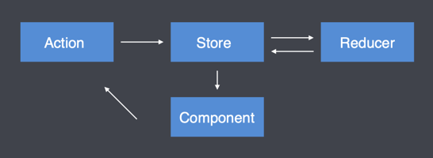

# Redux 核心概念

view --> action --> reducer --> store --> view



我们以加减count为例，接受使用方法
```javascript
// 2. 创建reducer
/**
 * @params state : 对象{} store 里面的所有变量 此例子里面只有一个变量count { count: 0 } 所以要给state一个默认值
 * @params action： { type : '', payload: {}} action 有两个参数，type 和传参payload
 * 
 * */
function reducer(state = { count: 0 }, action){
    switch (action) {
        case 'increment':
            return {...state, count: count + action.payload.tick};
        default:
            return state
    }
    
}
// 1. 首先创建store
const store = Redux.createStore(reducer)

// 3. 创建action,
const inscrement5 = {type: 'increment', payload: { tick: 5}}
const decrement5 = {type: 'increment', payload: { tick: -5}} // 传参 -5相当于减去（decrement）tick的功能

// 4. dispatch 发送action
document.getElementById('plus').onclick = function () {
    store.dispatch(inscrement5);
}

document.getElementById('mimus').onclick = function () {
    store.dispatch(decrement5);
}

// 5. 订阅 store
store.subscribe(() => {
    // 获取store对象中存储的状态
    const{ count } =  store.getState()
    document.getElementById('count').innerHTML = count;
})

```
1. component组件dispatch
```javascript
// 创建 store 传参数reducer
var store = Redux.createStore(reducer);
store.dispatch(action)
```
2. Store 接收 Action 并将 Action 分发给 Reducer
3. reducer根据action的type写逻辑代码,然后将更改后的state返回给store
4. 组件订阅变量的状态，走订阅方法


## 2. react-redux
使用

```js
import React from'react';
import { connect } from'react-redux';

const CounterComponent = ({ count, increment, decrement }) => (
  <div>
    <p>Count: {count}</p>
    <button onClick={increment}>Increment</button>
    <button onClick={decrement}>Decrement</button>
  </div>
);

const mapStateToProps = state => ({
  count: state.count
});

const mapDispatchToProps = dispatch => ({
  increment: () => dispatch({ type: 'INCREMENT' }),
  decrement: () => dispatch({ type: 'DECREMENT' })
});

export default connect(
  mapStateToProps,
  mapDispatchToProps
)(CounterComponent);

```


## 3. redux-thunk

```js

import { getTodoByIdType } from "../types";

// 请求API
const getTodoById = async (payload) => {
  const res = await fetch(
    `https://jsonplaceholder.typicode.com/todos/${payload}`
  );
  const response = await res.json();
  return response;
};

// 同步action，设置state
export const getTodoByIdAction = (payload) => {
  return {
    type: getTodoByIdType,
    payload,
  };
};

// 异步请求，有了结果再触发同步action设置state
export const getTodoByIdThunkAction = (payload) => {
  return async (dispatch) => {
    const response = await getTodoById(payload);
    dispatch(getTodoByIdAction(response));
  };
};

```

使用
```js
dispatch(getTodoByIdThunkAction(1))
```


### redux-promise


```js

import { getTodoByIdType } from "../types";

// 请求API
const getTodoById = async (payload) => {
  const res = await fetch(
    `https://jsonplaceholder.typicode.com/todos/${payload}`
  );
  const response = await res.json();
  return response;
};

// 直接将异步请求设置成payload
// 当异步有了结果会自动触发该action，然后进入到reducer更新state
export const getTodoByIdPromiseAction = (payload) => {
  return {
    type: getTodoByIdType,
    payload: getTodoById(payload),
  };
};

```
调用
```js
dispatch(getTodoByIdPromiseAction(1))
```


### redux-saga

```js
import { takeEvery, put, call } from'redux-saga';
import axios from 'axios';

// 定义异步获取数据的saga
function* fetchDataSaga() {
    try {
        // 等待FETCH_DATA_REQUEST类型的action被触发
        const action = yield takeEvery('FETCH_DATA_REQUEST', () => true);

        // 调用异步函数获取数据
        const response = yield call(axios.get, 'https://example.com/api/data');

        // 触发FETCH_DATA_SUCCESS类型的action，并传递数据
        yield put({ type: 'FETCH_DATA_SUCCESS', payload: response.data });
    } catch (error) {
        // 触发FETCH_DATA_FAIL类型的action，并传递错误信息
        yield put({ type: 'FETCH_DATA_FAIL', payload: error });
    }
}
```