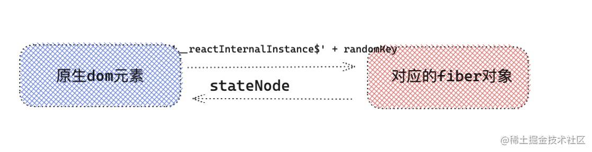
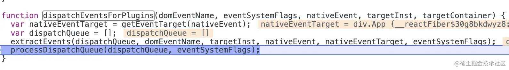
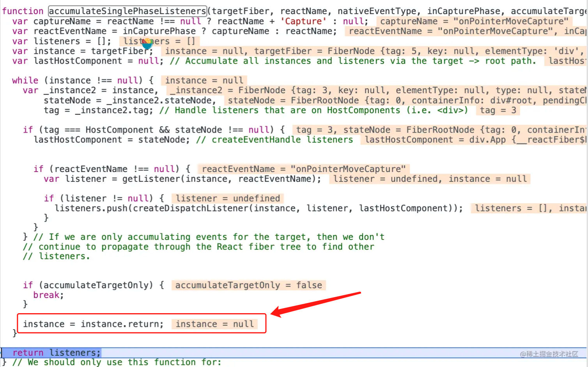
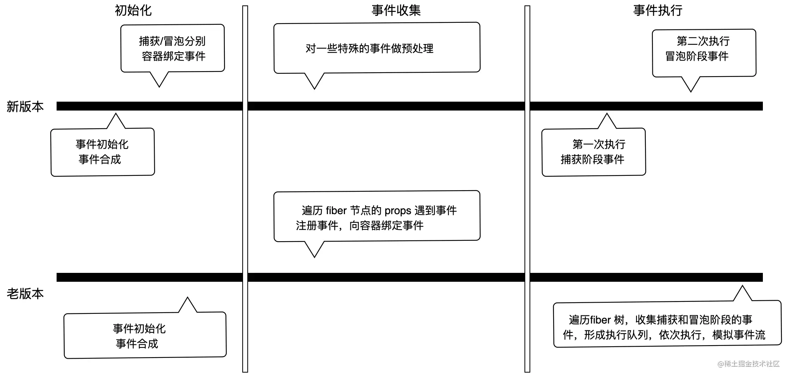

## js 的事件处理

```js
/**
 *  @param {string} type  事件类型比如click， mouseover等
 *  @param {function} listener  事件监听的回调方法
 *  @param {boolean} useCapture  监听捕获事件还是冒泡事件
 */
addEventListener(type, listener, useCapture);
```

### 冒泡与捕获

- 冒泡
  事件会从点击的 dom 元素 --> ...父元素 --> document --> window
- 捕获
  window --> document --> ...子元素 --> 事件产生的 dom 元素上

### preventDefault 和 stopPropagation

`e.preventDefault` 阻止事件的默认行为
比如 a 标签的跳转到 href 页面，input 的 checkbox 点击选中事件，都被阻止。

`e.stopPropagation` 阻止事件冒泡行为

```js


<input id='checkbox' type='checkbox'/>
<a id='linkRef' href='https://www.baidu.com/'>点击到百度</a>

<script>
 document.getElementById('checkbox').addEventListener('click',function(e) {
    e.preventDefault
    {/* 执行其他操作 */}
 });
</script>


```

## React 的事件循环

# V16 的事件循环

1. 事件都被绑定在到 document 上来统一管理执行的。
2. 事件不是原生的事件，而是 React 处理后的事件
3. 事件会被 React 处理成为多个事件的组合。eg `onChange: ['blur', 'change', 'click', 'focus', 'input', 'keydown', 'keyup', 'selectionchange'],`

registrationNameModules

```js
{
    onBlur: SimpleEventPlugin,
    onClick: SimpleEventPlugin,
    onClickCapture: SimpleEventPlugin,
    onChange: ChangeEventPlugin,
    onChangeCapture: ChangeEventPlugin,
    onMouseEnter: EnterLeaveEventPlugin,
    onMouseLeave: EnterLeaveEventPlugin,
    ...
}

```

registrationNameDependencies

```js
{
    onBlur: ['blur'],
    onClick: ['click'],
    onClickCapture: ['click'],
    onChange: ['blur', 'change', 'click', 'focus', 'input', 'keydown', 'keyup', 'selectionchange'],
    onMouseEnter: ['mouseout', 'mouseover'],
    onMouseLeave: ['mouseout', 'mouseover'],
    ...
}
```

## 完整的事件注册流程

completeWork（Fiber 节点的基础上创建当前类型的真实 DOM，然后挂载到 fiber.statenode 上）阶段如果是 hostComponent 类型 的 fiber 的时候，都会先走 diffProperties 方法

```js
function diffProperties(){
    /* 判断当前的 propKey 是不是 React合成事件 */
    if(registrationNameModules.hasOwnProperty(propKey)){
         /* 这里多个函数简化了，如果是合成事件， 传入成事件名称 onClick ，向document注册事件  */
         legacyListenToEvent(registrationName, document）;
    }
}
```

```js
//  registrationName -> onClick 事件
//  mountAt -> document or container
function legacyListenToEvent(registrationName，mountAt){
   const dependencies = registrationNameDependencies[registrationName]; // 根据 onClick 获取  onClick 依赖的事件数组 [ 'click' ]。
    for (let i = 0; i < dependencies.length; i++) {
    const dependency = dependencies[i];
    //这个经过多个函数简化，如果是 click 基础事件，会走 legacyTrapBubbledEvent ,而且都是按照冒泡处理
     legacyTrapBubbledEvent(dependency, mountAt);
  }
}


function legacyTrapBubbledEvent(topLevelType,element){
   addTrappedEventListener(element,topLevelType,PLUGIN_EVENT_SYSTEM,false)
}


/*
  targetContainer -> document
  topLevelType ->  click
  capture = false
*/
function addTrappedEventListener(targetContainer,topLevelType,eventSystemFlags,capture){
   const listener = dispatchEvent.bind(null,topLevelType,eventSystemFlags,targetContainer)
   if(capture){
       // 事件捕获阶段处理函数。
   }else{
       /* TODO: 重要, 这里进行真正的事件绑定。*/
      targetContainer.addEventListener(topLevelType,listener,false) // document.addEventListener('click',listener,false)
   }
}
```

`addTrappedEventListener`是真正的事件绑定,添加事件监听器`addEventListener`。 事件绑定阶段完毕。同样注意的是`dispatchEvent`方法绑定也是在这里做的。点击事件的回调就是`dispatchEvent`

## 事件执行流程

点击按钮之后，会执行原生的事件回调方法也就是`dispatchEvent`函数，`dispatchEvent`前三个参数已经被`bind`，所以原生方法的`event`会绑定在第四个参数上

```js
function dispatchEvent(
  topLevelType,
  eventSystemFlags,
  targetContainer,
  nativeEvent
) {
  /* 尝试调度事件 */
  const blockedOn = attemptToDispatchEvent(
    topLevelType,
    eventSystemFlags,
    targetContainer,
    nativeEvent
  );
}

/*
topLevelType -> click
eventSystemFlags -> 1
targetContainer -> document
nativeEvent -> 原生事件的 event 对象
*/
function attemptToDispatchEvent(
  topLevelType,
  eventSystemFlags,
  targetContainer,
  nativeEvent
) {
  /* 获取原生事件 e.target 找到真实的dom对象*/
  const nativeEventTarget = getEventTarget(nativeEvent);
  /* 获取dom对象对应的fiber对象 ，我们 demo中 button 按钮对应的 fiber */
  let targetInst = getClosestInstanceFromNode(nativeEventTarget);
  /* 进入legacy模式的事件处理系统 */
  dispatchEventForLegacyPluginEventSystem(
    topLevelType,
    eventSystemFlags,
    nativeEvent,
    targetInst
  );
  return null;
}
```



获取 dom 对应的 fiber 对象

```jsx
// 声明随机key
var internalInstanceKey = "__reactInternalInstance$" + randomKey;

// 使用随机key
function getClosestInstanceFromNode(targetNode) {
  // targetNode -dom  targetInst -> 与之对应的fiber对象
  var targetInst = targetNode[internalInstanceKey];
}
```

### 事件处理与批量更新

```js
/* topLevelType - click事件 ｜ eventSystemFlags = 1 ｜ nativeEvent = 事件源对象  ｜ targetInst = 元素对应的fiber对象  */
function dispatchEventForLegacyPluginEventSystem(
  topLevelType,
  eventSystemFlags,
  nativeEvent,
  targetInst
) {
  /* 从React 事件池中取出一个，将 topLevelType ，targetInst 等属性赋予给事件  */
  const bookKeeping = getTopLevelCallbackBookKeeping(
    topLevelType,
    nativeEvent,
    targetInst,
    eventSystemFlags
  );
  try {
    /* 执行批量更新 handleTopLevel 为事件处理的主要函数 */
    batchedEventUpdates(handleTopLevel, bookKeeping);
  } finally {
    /* 释放事件池 */
    releaseTopLevelCallbackBookKeeping(bookKeeping);
  }
}

export function batchedEventUpdates(fn, a) {
  isBatchingEventUpdates = true;
  try {
    fn(a); // handleTopLevel(bookKeeping)
  } finally {
    isBatchingEventUpdates = false;
  }
}

// 流程简化后
// topLevelType - click
// targetInst - button Fiber
// nativeEvent
function handleTopLevel(bookKeeping) {
  const {
    topLevelType,
    targetInst,
    nativeEvent,
    eventTarget,
    eventSystemFlags,
  } = bookKeeping;
  for (let i = 0; i < plugins.length; i++) {
    const possiblePlugin = plugins[i];
    /* 找到对应的事件插件，形成对应的合成event，形成事件执行队列   即执行 SimpleEventPlugin*/
    const extractedEvents = possiblePlugin.extractEvents(
      topLevelType,
      targetInst,
      nativeEvent,
      eventTarget,
      eventSystemFlags
    );
  }
  if (extractedEvents) {
    events = accumulateInto(events, extractedEvents);
  }
  /* 执行事件处理函数 */
  runEventsInBatch(events);
}

const SimpleEventPlugin = {
  extractEvents: function (
    topLevelType,
    targetInst,
    nativeEvent,
    nativeEventTarget
  ) {
    // ...... 省略
    while (instance !== null) {
      const { stateNode, tag } = instance;
      if (tag === HostComponent && stateNode !== null) {
        /* DOM 元素 */
        const currentTarget = stateNode;
        if (captured !== null) {
          /* 事件捕获 */
          /* 在事件捕获阶段,真正的事件处理函数 */
          const captureListener = getListener(instance, captured); // onClickCapture
          if (captureListener != null) {
            /* 对应发生在事件捕获阶段的处理函数，逻辑是将执行函数unshift添加到队列的最前面 */
            dispatchListeners.unshift(captureListener);
          }
        }
        if (bubbled !== null) {
          /* 事件冒泡 */
          /* 事件冒泡阶段，真正的事件处理函数，逻辑是将执行函数push到执行队列的最后面 */
          const bubbleListener = getListener(instance, bubbled); //
          if (bubbleListener != null) {
            dispatchListeners.push(bubbleListener); // onClick
          }
        }
      }
      instance = instance.return;
    }
  },
};
```

```js

function runEventsInBatch(){
    const dispatchListeners = event._dispatchListeners;
    const dispatchInstances = event._dispatchInstances;
    if (Array.isArray(dispatchListeners)) {
    for (let i = 0; i < dispatchListeners.length; i++) {
      if (event.isPropagationStopped()) { /* 判断是否已经阻止事件冒泡 */
        break;
      }

      dispatchListeners[i](event)
    }
  }
  /* 执行完函数，置空两字段 */
  event._dispatchListeners = null;
  event._dispatchInstances = null;
}


handerClick(e){
    e.preventDefault()
}
```

调用 e.stopPropagation()，就会赋值给 isPropagationStopped=()=>true，当再执行 e.isPropagationStopped()就会返回 true

```
   <div onClick={this.clicked2}>
           <button onClick={this.clicked1}>111111111111111111</button>
   </div>
```

# V18 事件

1. 事件统一绑定 container 上，ReactDOM.render(app， container);而不是 document 上，这样好处是有利于微前端的，微前端一个前端系统中可能有多个应用，如果继续采取全部绑定在 document 上，那么可能多应用下会出现问题。

2. 对齐原生浏览器事件

React 17 中终于支持了原生捕获事件的支持， 对齐了浏览器原生标准。同时 onScroll 事件不再进行事件冒泡。onFocus 和 onBlur 使用原生 focusin， focusout 合成。

3. 取消事件池 React 17 取消事件池复用，也就解决了上述在 setTimeout 打印，找不到 e.target 的问题。

## v18 的事件绑定

```js
function createRoot(container, options) {
  /* 省去和事件无关的代码，通过如下方法注册事件 */
  listenToAllSupportedEvents(rootContainerElement);
}

function listenToAllSupportedEvents(rootContainerElement) {
  /* allNativeEvents 是一个 set 集合，保存了大多数的浏览器事件   ，保存了 81 个浏览器常用事件*/
  allNativeEvents.forEach(function (domEventName) {
    if (domEventName !== "selectionchange") {
      /* nonDelegatedEvents 保存了 js 中，不冒泡的事件   保存了浏览器中不会冒泡的事件，一般指的是媒体事件，比如 pause，play，playing 等.还有一些特殊事件，比如 cancel ，close，invalid，load，scroll 。，*/
      if (!nonDelegatedEvents.has(domEventName)) {
        /* 在冒泡阶段绑定事件 */
        listenToNativeEvent(domEventName, false, rootContainerElement);
      }
      /* 在捕获阶段绑定事件 */
      listenToNativeEvent(domEventName, true, rootContainerElement);
    }
  });
}
```

精简化，listenToNativeEvent 方法

```js
//
var listener = dispatchEvent.bind(null,domEventName,...)
// isCapturePhaseListener 就是listenToNativeEvent的第二个参数
if(isCapturePhaseListener){
    target.addEventListener(eventType, listener, true);
}else{
    target.addEventListener(eventType, listener, false);
}
```

## 事件触发



```js
batchedUpdates(function () {
  return dispatchEventsForPlugins(
    domEventName,
    eventSystemFlags,
    nativeEvent,
    ancestorInst
  );
});

function dispatchEventsForPlugins(
  domEventName,
  eventSystemFlags,
  nativeEvent,
  targetInst,
  targetContainer
) {
  /* 找到发生事件的元素——事件源 */
  var nativeEventTarget = getEventTarget(nativeEvent);
  /* 待更新队列 */
  var dispatchQueue = [];
  /* 找到待执行的事件 */
  extractEvents(
    dispatchQueue,
    domEventName,
    targetInst,
    nativeEvent,
    nativeEventTarget,
    eventSystemFlags
  );
  /* 执行事件 */
  processDispatchQueue(dispatchQueue, eventSystemFlags);
}
```

extractEvents 找到待执行事件，并且合成新的 event 对象

```js
 var SyntheticEventCtor = SyntheticEvent;
 /* 针对不同的事件，处理不同的事件源 */
 switch (domEventName) {
    case 'keydown':
    case 'keyup':
      SyntheticEventCtor = SyntheticKeyboardEvent;
      break;
    case 'focusin':
      reactEventType = 'focus';
      SyntheticEventCtor = SyntheticFocusEvent;
      break;
    ....
 }
/* 找到事件监听者，也就是我们 onClick 绑定的事件处理函数 */
var _listeners = accumulateSinglePhaseListeners(targetInst, reactName, nativeEvent.type, inCapturePhase, accumulateTargetOnly);
/* 向 dispatchQueue 添加 event 和 listeners  */
if(_listeners.length > 0){
    var _event = new SyntheticEventCtor(reactName, reactEventType, null, nativeEvent, nativeEventTarget);
    dispatchQueue.push({
        event: _event,
        listeners: _listeners
    });
}
```

`accumulateSinglePhaseListeners`这个函数会获取存储在 Fiber 上的 Props 的对应事件，然后通过`createDispatchListener`返回的对象加入到监听集合上，如果是不会冒泡的函数则会停止（比如：scroll）,反之会向上递归


processDispatchQueue 执行事件

```js
/* 如果在捕获阶段执行。 */
if (inCapturePhase) {
  for (var i = dispatchListeners.length - 1; i >= 0; i--) {
    var _dispatchListeners$i = dispatchListeners[i],
      instance = _dispatchListeners$i.instance,
      currentTarget = _dispatchListeners$i.currentTarget,
      listener = _dispatchListeners$i.listener;

    if (instance !== previousInstance && event.isPropagationStopped()) {
      return;
    }

    /* 执行事件 */
    executeDispatch(event, listener, currentTarget);
    previousInstance = instance;
  }
} else {
  for (var _i = 0; _i < dispatchListeners.length; _i++) {
    var _dispatchListeners$_i = dispatchListeners[_i],
      _instance = _dispatchListeners$_i.instance,
      _currentTarget = _dispatchListeners$_i.currentTarget,
      _listener = _dispatchListeners$_i.listener;

    if (_instance !== previousInstance && event.isPropagationStopped()) {
      return;
    }
    /* 执行事件 */
    executeDispatch(event, _listener, _currentTarget);
    previousInstance = _instance;
  }
}
```

handleParentClick 等。这个有一个区别就是，如果是捕获阶段执行的函数，那么 listener 数组中函数，会从后往前执行，如果是冒泡阶段执行的函数，会从前往后执行，用这个模拟出冒泡阶段先子后父，捕获阶段先父后子。

还有一个细节就是如果触发了阻止冒泡事件，上述讲到事件源是 React 内部自己创建的，所以如果一个事件中执行了 e.stopPropagation ，那么事件源中就能感知得到，接下来就可以通过 event.isPropagationStopped 来判断是否阻止冒泡，如果组织，那么就会退出，这样就模拟了事件流的执行过程，以及阻止事件冒泡。


