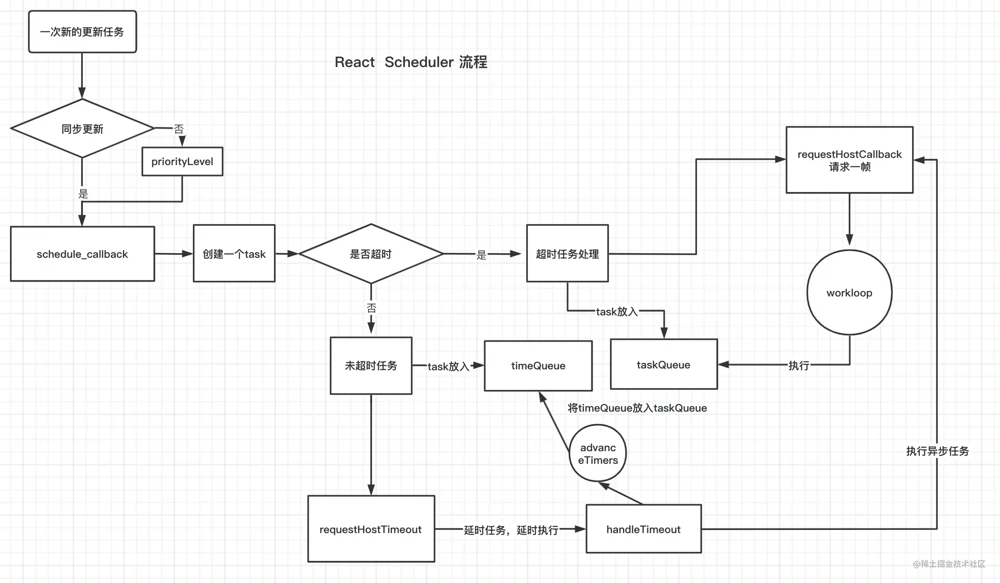
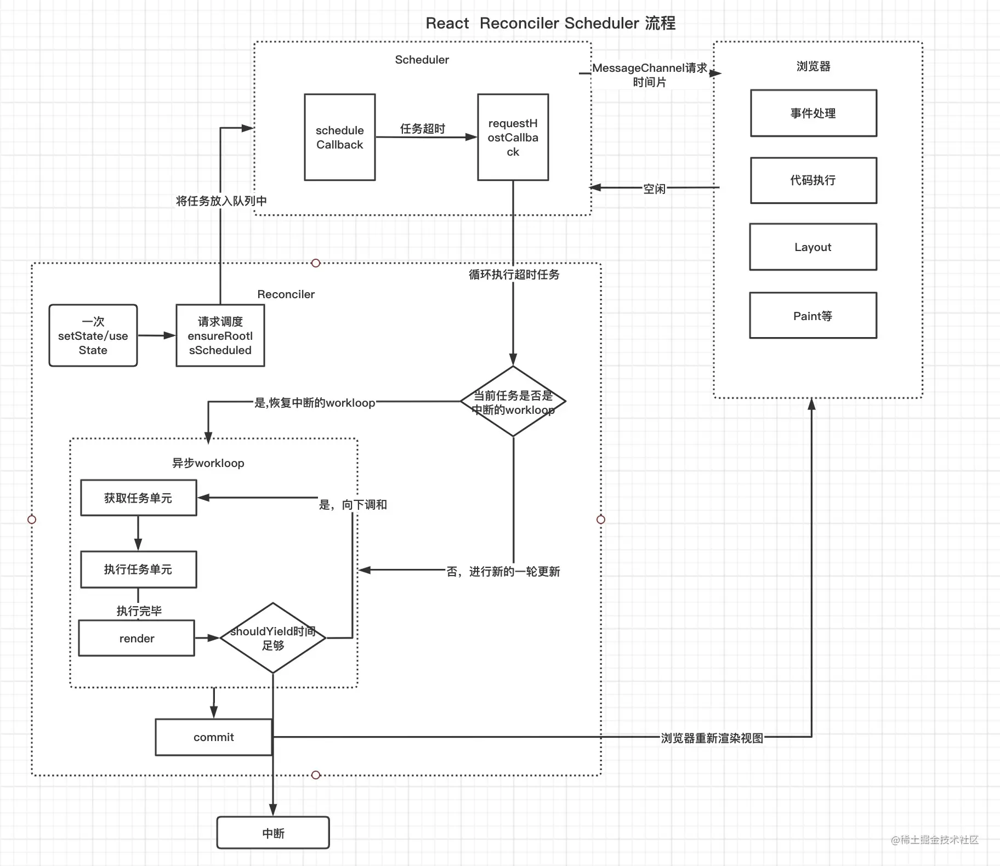
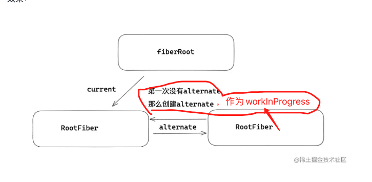
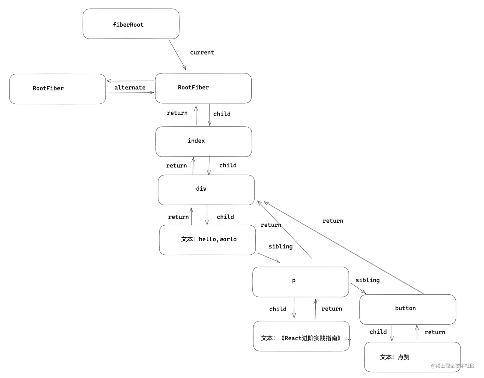

调度（ Scheduler ）和调和（ Reconciler ）

React 异步调度的原理，以及 React 调度流程
- 异步调度原理？
- 说一说React 的时间分片？
- 简述一下调度流程？∏

递归遍历大量的虚拟 DOM ，造成占用 js 线程，使得浏览器没有时间去做一些动画效果，伴随项目越来越大，项目会越来越卡。


首先浏览器每次执行一次事件循环（一帧）都会做如下事情：处理事件，执行 js ，调用 requestAnimation ，布局 Layout ，绘制 Paint ，在一帧执行后，如果没有其他事件，那么浏览器会进入休息时间，那么有的一些不是特别紧急 React 更新，就可以执行了。


@params: callback 浏览器空闲的回调
@params: timeout  超时时间，如果超过timeout时间浏览器还在工作，那么callback回调将不会执行
```js
requestIdleCallback(callback,{ timeout })

```

##  requestIdleCallback只有chrome支持，如何模拟requestIdleCallback？
 
 - 需要让出主线程，让浏览器渲染视图
 - 一次事件循环只执行一次，因为执行一个以后，还会请求下一次的时间片
 
 满足两个条件的只有**宏任务**我们首先想到的是`setTimeout(fn, 0)`但实际上`timeout`设为0也是延时了大概`4ms`左右的

 ```js
let time = 0
let timer
let now = Date.now()
let poll = function() {
    timer = setTimeout(() => {
        let latestTime = now
        now = Date.now()
        console.log( 'setTimeout(fn,0)实际延时为：' , now - latestTime )
        poll()
    }, 0)
    time++
    if(time >= 50) {
        clearTimeout(timer)
    }
}

poll()

 ```

60帧/秒 来算，1帧  15ms，15ms足以执行一次事件循环。显然setTimeout不满足
React团队最后选择了`MessageChannel`


```js


let scheduledHostCallback = null 
  /* 建立一个消息通道 */
  var channel = new MessageChannel();
  /* 建立一个port发送消息 */
  var port = channel.port2;

  channel.port1.onmessage = function(){
      /* 执行任务 */
      scheduledHostCallback() 
      /* 执行完毕，清空任务 */
      scheduledHostCallback = null
  };
  /* 向浏览器请求执行更新任务 */
  requestHostCallback = function (callback) {
    scheduledHostCallback = callback;
    if (!isMessageLoopRunning) {
      isMessageLoopRunning = true;
      port.postMessage(null);
    }
  };
```

在一次更新中，React 会调用 requestHostCallback ，把更新任务赋值给 scheduledHostCallback ，然后 port2 向 port1 发起 postMessage 消息通知。
port1 会通过 onmessage ，接受来自 port2 消息，然后执行更新任务 scheduledHostCallback ，然后置空 scheduledHostCallback ，借此达到异步执行目的。


## 异步调度原理

上面说到了时间片的感念和 `Scheduler` 实现原理。接下来，来看一下调度任务具体的实现细节。React 发生一次更新，会统一走 `ensureRootIsScheduled（调度应用）。`

对于正常更新会走 `performSyncWorkOnRoot` 逻辑，最后会走 `workLoopSync` 。
对于低优先级的异步更新会走 `performConcurrentWorkOnRoot` 逻辑，最后会走 `workLoopConcurrent` 。

```js
function workLoopSync() {
  while (workInProgress !== null) {
    workInProgress = performUnitOfWork(workInProgress);
  }
}
function workLoopConcurrent() {
  while (workInProgress !== null && !shouldYield()) {
    workInProgress = performUnitOfWork(workInProgress);
  }
}

```

唯一区别就是`shouldYield()`方法。当前浏览器没有空余时间， `shouldYield` 会中止循环，直到浏览器有空闲时间后再继续遍历，从而达到终止渲染的目的。


## `scheduleCallback`

`scheduleCallback`统一调度`workLoopSync` 和 `workLoopConcurrent`
```js
/* 正常更新任务*/
scheduleCallback(Immediate,workLoopSync)


/* 异步任务 计算超时等级，就是如下那五个等级 */
var priorityLevel = inferPriorityFromExpirationTime(currentTime, expirationTime);
scheduleCallback(priorityLevel,workLoopConcurrent)

```

五个等级
`Immediate` -1 需要立刻执行。
`UserBlocking` 250ms 超时时间250ms，一般指的是用户交互。
`Normal` 5000ms 超时时间5s，不需要直观立即变化的任务，比如网络请求。
`Low` 10000ms 超时时间10s，肯定要执行的任务，但是可以放在最后处理。
`Idle` 一些没有必要的任务，可能不会执行。


```js

// 上面说到，任务优先级根据 id排序，创建任务时，task的id自增来源，就是 taskIdCounter
var taskIdCounter = 1;

function unstable_scheduleCallback(priorityLevel, callback, options) {
// 上面创建任务的过期时间的代码
// .....


/* 计算过期时间：超时时间  = 开始时间（现在时间） + 任务超时的时间（上述设置那五个等级）     */
   const expirationTime = startTime + timeout;
   /* 创建一个新任务 */
   // 创建新任务
  var newTask = {
    id: taskIdCounter++, // 任务节点的序号，创建任务时通过taskIdCounter 自增 1
    callback, // callback: 就是我们要执行的任务内容
    priorityLevel,// 任务的优先级。上面的五个等级
    startTime, // 时间戳，任务预期执行时间，默认为当前时间，即同步任务。可通过 options.delay 设为异步延时任务
    expirationTime, // 过期时间，scheduler 基于该值进行异步任务的调度  expirationTime = timeout + startTime 
    sortIndex: -1, // 默认值为 -1。对于异步延时任务，该值将赋为 expirationTime
  };
  if (startTime > currentTime) {
      /* 通过开始时间排序 */
      newTask.sortIndex = startTime;
      /* 把任务放在timerQueue中 */
      push(timerQueue, newTask);
      /*  执行setTimeout ， */
      requestHostTimeout(handleTimeout, startTime - currentTime);
  }else{
    /* 通过 expirationTime 排序  */
    newTask.sortIndex = expirationTime;  
    /* 把任务放入taskQueue */
    push(taskQueue, newTask);
    /*没有处于调度中的任务， 然后向浏览器请求一帧，浏览器空闲执行 flushWork */
     if (!isHostCallbackScheduled && !isPerformingWork) {
        isHostCallbackScheduled = true;
         requestHostCallback(flushWork)
     }
    
  }
}
```

taskQueue，里面存的都是过期的任务（即异步任务），依据任务的过期时间( expirationTime ) 排序，需要在调度的 workLoop 中循环执行完这些任务。
timerQueue 里面存的都是没有过期的任务（即同步任务），依据任务的开始时间( startTime )排序，在调度 workLoop 中 会用advanceTimers检查任务是否过期，如果过期了，放入 taskQueue 队列。


## requestHostTimeout

```js

requestHostTimeout = function (cb, ms) {
_timeoutID = setTimeout(cb, ms);
};

cancelHostTimeout = function () {
clearTimeout(_timeoutID);
};
```
## handleTimeout
```js
function handleTimeout(){
  isHostTimeoutScheduled = false;
  /* 将 timeQueue 中过期的任务，放在 taskQueue 中 。 */
  advanceTimers(currentTime);
  /* 如果没有处于调度中 */
  if(!isHostCallbackScheduled){
      /* 判断有没有过期的任务， */
      if (peek(taskQueue) !== null) {   
      isHostCallbackScheduled = true;
      /* 开启调度任务 */
      requestHostCallback(flushWork);
    }
  }
}


/**
 * 
 * 通过 advanceTimers 将 timeQueue 中过期的任务转移到 taskQueue 中。
 */
function advanceTimers(){
   var timer = peek(timerQueue);
   while (timer !== null) {
      if(timer.callback === null){
        pop(timerQueue);
      }else if(timer.startTime <= currentTime){ /* 如果任务已经过期，那么将 timerQueue 中的过期任务，放入taskQueue */
         pop(timerQueue);
         timer.sortIndex = timer.expirationTime;
         push(taskQueue, timer);
      }
   }
}

```


flushWork 如果有延时任务执行的话，那么会先暂停延时任务，然后调用 workLoop ，去真正执行超时的更新任务。
```jsx
function flushWork(){
  if (isHostTimeoutScheduled) { /* 如果有延时任务，那么先暂定延时任务*/
    isHostTimeoutScheduled = false;
    cancelHostTimeout();
  }
  try{
     /* 执行 workLoop 里面会真正调度我们的事件  */
     workLoop(hasTimeRemaining, initialTime)
  }
}


function workLoop(){
  var currentTime = initialTime;
  advanceTimers(currentTime);
  /* 获取任务列表中的第一个 */
  currentTask = peek();
  while (currentTask !== null){
      /* 真正的更新函数 callback */
      var callback = currentTask.callback;
      if(callback !== null ){
         /* 执行更新 */
         callback()
        /* 先看一下 timeQueue 中有没有 过期任务。 */
        advanceTimers(currentTime);
      }
      /* 再一次获取任务，循环执行 */ 
      currentTask = peek(taskQueue);
  }
}
```


```js
function unstable_shouldYield() {
  var currentTime = exports.unstable_now();
  advanceTimers(currentTime);
  /* 获取第一个任务 */
  var firstTask = peek(taskQueue);
  return firstTask !== currentTask && currentTask !== null && firstTask !== null && firstTask.callback !== null && firstTask.startTime <= currentTime && firstTask.expirationTime < currentTask.expirationTime || shouldYieldToHost();
}
```
如果存在第一个任务，并且已经超时了，那么 shouldYield 会返回 true，那么会中止 fiber 的 workloop。


完整流程如下图所示






# Reconciler（调和器）

每一个 fiber 都可以作为一个执行单元来处理，所以每一个 fiber 可以根据自身的过期时间expirationTime（ v17 版本叫做优先级 lane ）来判断是否还有空间时间执行更新，如果没有时间更新，就要把主动权交给浏览器去渲染，做一些动画，重排（ reflow ），重绘 repaints 之类的事情，这样就能给用户感觉不是很卡。然后等浏览器空余时间，在通过 scheduler （调度器），再次恢复执行单元上来，这样就能本质上中断了渲染，提高了用户体验。

### 问题1  element,fiber,dom三种什么关系？
 - element： 就是虚拟dom ，上面保存了 props ， children 等信息。
 - fiber：element 和真实 DOM 之间的交流枢纽站，一方面每一个类型 element 都会有一个与之对应的 fiber 类型，element 变化引起更新流程都是通过 fiber 层面做一次调和改变，然后对于元素，形成新的 DOM 做视图渲染。
 - DOM 是元素在浏览器上给用户直观的表象。


fiber对象
 ```jsx
function FiberNode(){

  this.tag = tag;                  // fiber 标签 证明是什么类型fiber。
  this.key = key;                  // key调和子节点时候用到。 
  this.type = null;                // dom元素是对应的元素类型，比如div，组件指向组件对应的类或者函数。  
  this.stateNode = null;           // 指向对应的真实dom元素，类组件指向组件实例，可以被ref获取。
 
  this.return = null;              // 指向父级fiber
  this.child = null;               // 指向子级fiber
  this.sibling = null;             // 指向兄弟fiber 
  this.index = 0;                  // 索引

  this.ref = null;                 // ref指向，ref函数，或者ref对象。

  this.pendingProps = pendingProps;// 在一次更新中，代表element创建
  this.memoizedProps = null;       // 记录上一次更新完毕后的props
  this.updateQueue = null;         // 类组件存放setState更新队列，函数组件存放
  this.memoizedState = null;       // 类组件保存state信息，函数组件保存hooks信息，dom元素为null
  this.dependencies = null;        // context或是时间的依赖项

  this.mode = mode;                //描述fiber树的模式，比如 ConcurrentMode 模式

  this.effectTag = NoEffect;       // effect标签，用于收集effectList
  this.nextEffect = null;          // 指向下一个effect

  this.firstEffect = null;         // 第一个effect
  this.lastEffect = null;          // 最后一个effect

  this.expirationTime = NoWork;    // 通过不同过期时间，判断任务是否过期， 在v17版本用lane表示。

  this.alternate = null;           //双缓存树，指向缓存的fiber。更新阶段，两颗树互相交替。
}

 ```

 ##  Fiber更新机制

### 初始化
 #### 1. 创建fiberRoot和rootFiber 二者区别

 
 
 第一次挂载关联两者，fiberRoot应用根节点，只能有一个。但是rootFiber 可以有多个，通过 ReactDOM.render 渲染出来的。

 ```js
 function createFiberRoot(containerInfo,tag){
    /* 创建一个root */
    const root = new FiberRootNode(containerInfo,tag)
    const rootFiber = createHostRootFiber(tag);
    root.current = rootFiber
    return root
}
 ```

 ####  2. workInProgress和current

 经过第一步的处理，开始到正式渲染阶段，会进入 beginwork 流程，在讲渲染流程之前，要先弄明白两个概念：

workInProgress是：正在内存中构建的 Fiber 树称为 workInProgress Fiber 树。在一次更新中，所有的更新都是发生在 workInProgress 树上。在一次更新之后，workInProgress 树上的状态是最新的状态，那么它将变成 current 树用于渲染视图。
current：正在视图层渲染的树叫做 current 树。

```jsx
currentFiber.alternate = workInProgressFiber
workInProgressFiber.alternate = currentFiber
```




#### 3. 深度调和子节点，渲染视图

在新创建的 alternates 上，完成整个 fiber 树的遍历，包括 fiber 的创建。




