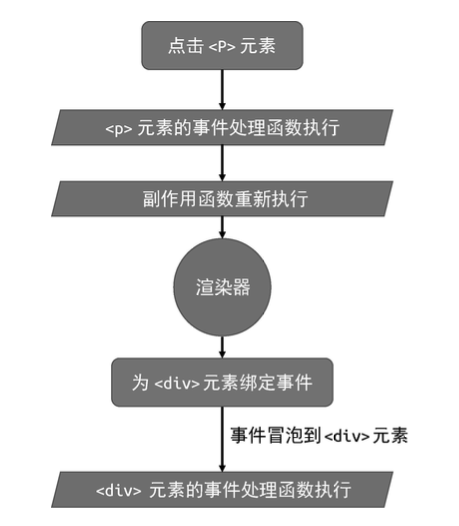

挂载(mount)：虚拟 DOM（vdom） 节点通过渲染器渲染为真实 DOM 节点过程

renderer 渲染器，不仅包含渲染，还包含其他一些功能

render 渲染函数，不仅仅需要挂载还要更新。更新时候渲染器会使用 newVNode 与上一次渲染的 oldVNode 进行比较，试图 找到并更新变更点。这个过程叫作“打补丁”(或更新)，英文通常用 patch 来表达。


```js
const renderer = createRenderer()
renderer.render(vnode, document.querySelector('#app'))
```


# 渲染器的设计


直接赋值 el.disabled = false

setAttribute 赋值 el.setAttribute('disabled', false)

setAttribute 设置的属性都会被字符串化，所以上述代码会被浏览器渲染为禁用状态


新问题
```js

<button disabled>Button</button>

// 对应的vNode为

const button = {
    type: 'button',
    props:{
        disabled: ""
    }
}


```

显然不对的。预期是disabled 为true 实际被设置成为了false

优先设置元素的 DOM Properties，但当值为空字符串 时，要手动将值矫正为 true。只有这样，才能保证代码的行为符合预 期。


由于input上的form属性， 再DOM Properties 是 el.form是只读的属性，所以只能用setAttribute方式
```js
/**!
 *  判断是否可以直接用el[key] = value 形式设置属性值的
 */
function shouldSetAsProps(el, key, value) {
// 特殊处理
  if (key === 'form' && el.tagName === 'INPUT') return false
// 兜底
 return key in el
}
```


再 DOM Properties  class 对应的名称为className，所以 key in el 找不到他，只能用setAttribute,但是测试发现用className形式设置的性能最好
所以我们在判断属性的时候先判断如果key 为class 则 el.className = nextValue || '' 否则，执行上面逻辑


## 卸载

// 初次挂载
 renderer.render(vnode, document.querySelector('#app')) 
// 新 vnode 为 null，意味着卸载之前渲染的内容
renderer.render(null, document.querySelector('#app'))


不能直接清空 `container.innerHTML = ''`
因为
1. 要调用生命周期函数
2. 直接清空，原来dom上绑定的事件处理函数依旧存在
3. 自定义指令，需要卸载之前执行钩子函数

正确的卸载方式是，根据 vnode 对象获取与其相关联的真实 DOM 元素，然后使用原生 DOM 操作方法将该 DOM 元素移除。

today 498  2023-07-07

```js
function unmount(vnode) {
    const parent = vnode.el.parentNode
    if (parent) parent.removeChild(el)

}
```


事件是属性的一种， 以on开头 。移除之前事件添加新事件。 
```js
  if (/^on/.test(key)) {
// 根据属性名称得到对应的事件名称，例如 onClick ---> click
     const name = key.slice(2).toLowerCase()
     // 移除上一次绑定的事件处理函数
    prevValue && el.removeEventListener(name, prevValue)
// 绑定事件，nextValue 为事件处理函数
    el.addEventListener(name, nextValue)
  } 
```

但是这样并不高效，无数次更新，导致无数次remove和add

改进： 
1. 新的有，老的没有 ： add
2. 新的没有，老的有 ： remove
3. 新的有，老的也有 ： 更新


```js
  let invoker = el._vei
  const name = key.slice(2).toLowerCase()
  if (nextValue) {
    if (!invoker) {
        // 如果没有 invoker，则将一个伪造的 invoker 缓存到 el._vei 中
        // vei 是 vue event invoker 的首字母缩写
        invoker = el._vei = (e) => {
             // 当伪造的事件处理函数执行时，会执行真正的事件处理函数
              invoker.value(e)
        }
        invoker.value = nextValue
        el.addEventListener(name, invoker)
    } else {
        //更新
        invoker.value = nextValue
    } else if(invoker) {
        // 新的没有，老的有
        el.removeEventListener(name, invoker)
    }
  }  
```

*问题：* 假如同时绑定了 click 和 contextmenu 事件两个事件怎么办？
此时 el._vei就必须设计成为对象，才能保存多个事件
*问题：* 同一事件多个监听方法怎么处理
el.addEventListener('click', fn1)
el.addEventListener('click', fn2)
el._vei[key] = (e) => {
   如果是数组遍历invoker.value 调用每个函数
}
*问题：* `<div><p>text</p></div>`点击p元素，给value赋值。value有值后给p注册点击事件。


8.8章节。


解决办法更新的时候记录时间
再新的有值，老的无值的情况下，记录事件执行时间
## 区分vNode类型

render函数第一次渲染，如果后面渲染热render函数传入了新的vNode 则进行打补丁操作跟新 如果传入null则执行卸载


08-01 1008字

# 简单的diff算法

children节点全是数组的时候，通过diff算法最大限度减少性能消耗

children:[ {type: 'p', children: '1'},
           {type: 'p', children: '2'},
           {type: 'p', children: '3'}]
新的children只改变文本为456。如果先卸载，再添加的话需要操作6次dom 但是实际上只需要改变文本即可，即3次dom操作即可。数组越大越提现性能消耗

大致原理 1.查找new在old中的key（同时遍历new和old数组）是否存在。存在将old的index赋值lastIndex，后面节点只要小于lastIndex 就移动到其前面。大于不处理。重新赋值lastIndex  

# 双端diff算法

简单diff会造成的问题是，把第一个元素移到最后面，会造成length -1次移动，实际只需要移动一次

双端diff算法会在old 和new数组遍历的时候四个索引值，分别是oldStartIndex oldEndIndex   newStartIndex newEndIndex

1. oldStartIndex对比  newStartIndex  两个数组的头比较
2. oldEndIndex对比  newEndIndex   尾比较
3. oldStartIndex对比  newEndIndex  老头对新尾
4. oldEndIndex对比  newStartIndex  老尾对新头


## 非理想状态，即newKey在寻找过程上面四步均不满足   
 const idxInOld = oldChildren.findIndex(node => node.key === newStartVNode.key)

 patch

 insert 以老头为锚点

 置空
 oldChildren[idxInOld] = undefined
newStartVNode = newChildren[++newStartIdx]
## 1. 添加新元素即newKey在old数组中找不到

## 2. 删除元素，即新的数组小于旧的数组


# 快速diff算法
该算法最早应用于 ivi 和 inferno 这两个框架，Vue.js 3 借鉴并扩展了它。