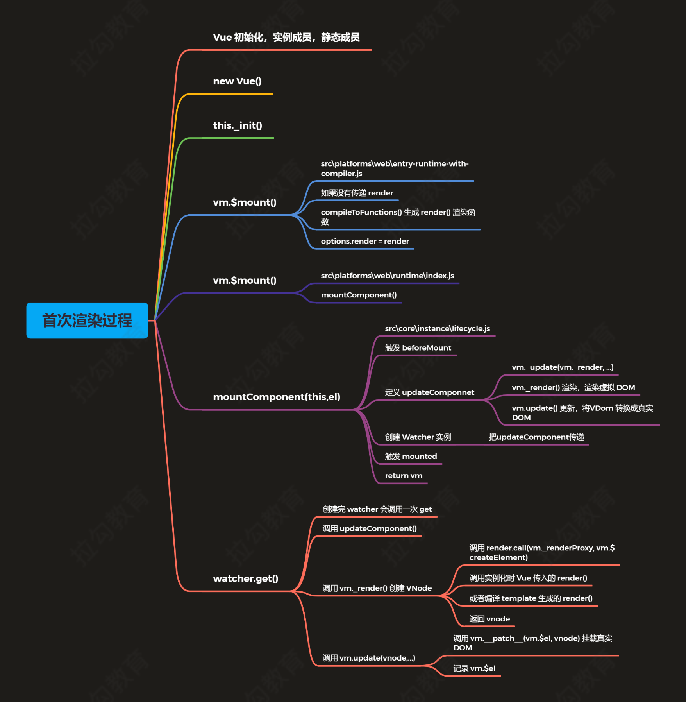
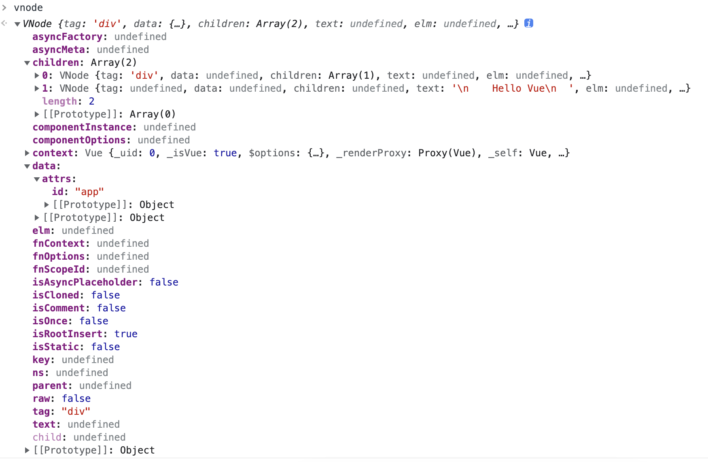

## 本章考点。

一、简答题

### 1、请简述 Vue 首次渲染的过程。



1. 首先初始化 vue 对象，初始化的时候会初始化在 initMixin 中初始化`Vue.prototype._init`方法()。

2. new Vue 创建 vue 对象 首先调得就是`_init`方法，该方法会 ① 初始化身边周期，事件相关变量，render 方法
   ② 触发`beforeCreate`钩子方法 ③`initState ` ④ `created`钩子 ⑤ 调用`vm.$mount(vm.$options.el)`

3. 调用编译脚本的 mount 方法，生成 render 函数 `const { render, staticRenderFns } = compileToFunctions()` 将 render 赋值给 options 然后调用真正的 mount 方法

4. 执行 runtime 下面的通用 mount 方法
5. 执行生命周期中（'./core/instance/lifecycle'）的`mountComponent(this, el, hydrating)`方法
   `new Watcher` 传入 `updateComponent方法。`

```js
updateComponent = () => {
  vm._update(vm._render(), hydrating);
};
```

`new watcher`的时候会自己掉一次 get 方法，get 方法实际调的就是传进去的`updateComponent`方法，所以会执行 render 方法，然后执行 update 方法。

`new watcher`前调用 beforeMount 方法，调用`_update`后`mounted`方法被调用。

这个方法做的是

### 2、请简述 Vue 响应式原理。

`initState` --> `initData`--->` observe(data, true _ asRootData_)`---> `new Observer(data) `---> 构造方法调用 `defineReactive(obj, keys[i]) `--->

```js
Object.defineProperty(obj, key, {
  enumerable: true,
  configurable: true,
  get: function reactiveGetter() {
    dep.depend();
  },
  set: function reactiveSetter() {
    dep.notify();
  },
});
```

---> `dep.depend()`实际执行 `Dep.target.addDep(this)` ---> `Dep.target` 是 `watcher` 对象，执行的是 watcher 对象里面的 `addDep` 方法 --->最终会 renderWatcher 对象 add（`dep`（变量 msg 的 dep 对象））

创建 vue 对象初始化的过程。其中 `Dep.target` 是在 `mounter` 之前执行的 `new Watcher（renderWatcher）`对象的时候调用 get 方法之前调得 `pushTarget(this)`方法创建的 `Dep.target = target`

当`msg`改变的时候会走 set 中的 `dep.notify()`---> 遍历 subs 数组调用`watcher`中的`update`方法--->`queueWatcher`---> `nextTick(flushSchedulerQueue)` ---> `watcher.before`（生命周期 beforeUpdate）`watcher.run()` ---> `this.get()`--->

```js
updateComponent = () => {
  vm._update(vm._render(), hydrating);
};
```

---> 重新执行 render 方法，调用 get 方法。 ---> 渲染结束

### 3、请简述虚拟 DOM 中 Key 的作用和好处。

### 4、请简述 Vue 中模板编译的过程。

### 5、其他方法源码

$set $nextTick 最终都是调用set 和nextTick方法
$set 源码

```js
// 如果 key 在对象中已经存在直接赋值

if (key in target && !(key in Object.prototype)) {
  target[key] = val;
  return val;
}
// 如果 ob 不存在，target 不是响应式对象直接赋值
if (!ob) {
  target[key] = val;
  return val;
}
// 把 key 设置为响应式属性
defineReactive(ob.value, key, val);
// 发送通知
ob.dep.notify();
```

$delete 源码

```js
...
// 同$set
...
delete target[key]
if (!ob) {
return
}
// 通过 ob 发送通知
  ob.dep.notify()

```

$watcher

```js
Vue.prototype.$watch = function (
  expOrFn: string | Function,
  cb: any,
  options?: Object
): Function {
// 获取 Vue 实例 this
const vm: Component = this if (isPlainObject(cb)) {
// 判断如果 cb 是对象执行 createWatcher
    return createWatcher(vm, expOrFn, cb, options)
  }
options = options || {}
// 标记为用户 watcher
options.user = true
// 创建用户 watcher 对象
const watcher = new Watcher(vm, expOrFn, cb, options) // 判断 immediate 如果为 true
if (options.immediate) {
// 立即执行一次 cb 回调，并且把当前值传入 try {
      cb.call(vm, watcher.value)
    } catch (error) {
      handleError(error, vm, `callback for immediate watcher
"${watcher.expression}"`)
} }
// 返回取消监听的方法
return function unwatchFn () {
    watcher.teardown()
  }
}

```

三种 watcher computed Watcher user watcher render watcher

initState 的时候会先

```js
export function initState(vm: Component) {
  vm._watchers = [];
  const opts = vm.$options;
  if (opts.props) initProps(vm, opts.props);
  if (opts.methods) initMethods(vm, opts.methods);
  if (opts.data) {
    initData(vm);
  } else {
    observe((vm._data = {}), true /* asRootData */);
  }

  // 先调用computed watcher
  if (opts.computed) initComputed(vm, opts.computed);
  // 然后调用user watcher
  if (opts.watch && opts.watch !== nativeWatch) {
    initWatch(vm, opts.watch);
  }
}
```

initState 后才会调用 mount 方法，才会调用 render watcher

$nextTick

```js
export function nextTick (cb?: Function, ctx?: Object) {
  let _resolve
// 把 cb 加上异常处理存入 callbacks 数组中 callbacks.push(() => {
if (cb) { try {
// 调用 cb()
        cb.call(ctx)
      } catch (e) {
        handleError(e, ctx, 'nextTick')
      }
    } else if (_resolve) {
      _resolve(ctx)
} })
  if (!pending) {
    pending = true
    timerFunc()
}
  // $flow-disable-line
if (!cb && typeof Promise !== 'undefined') { // 返回 promise 对象
  return new Promise(resolve => {
      _resolve = resolve
    })
} }


const timerFunc = () => {
    p.then(flushCallbacks)
}
```

v2.6

目录结构

src
├─compiler 编译相关
├─core Vue 核心库
├─platforms 平台相关代码
├─server SSR，服务端渲染
├─sfc .vue 文件编译为 js 对象 公共的代码（相当于 react 的 babel）
└─shared 公共的代码

Flow Rollup

先看 package.json

```js
    "dev": "rollup -w -c scripts/config.js --sourcemap --environment TARGET:web-full-dev",

    // -w watch 监听文件的变化，文件变化自动重新打包
    // --sourcemap
    // TARGET环境变量 web-full-dev   if (process.env.TARGET) {

```

后缀带.runtime 的是运行时版本，不带的是运行时+编译时版本。
运行时版本不包含编译器，即把 template 编译成为虚拟 dom

UMD ： 完整版可以通过 script 标签直接引用
CommonJs 以.common.js 结尾的版本 兼容老的打包工具 如 Browserify 或 webpack 1 等。
ES Module： 以.esm.js 结尾的版本 为现代打包工具提供的版本。 ESM 格式被设计为可以被静态分析，所以打包工具可以利用这一点来进行“tree-shaking”并 将用不到的代码排除出最终的包。

基于 vue-cli 创建的项目默认使用的是 vue.runtime.esm.js 版本，即不包含编译器的运行时 exm 标准的版本

## 首次渲染过程

### 1. 根目录 `scripts/config.js`

```js
const path = require("path");
const buble = require("rollup-plugin-buble");
const alias = require("rollup-plugin-alias");
const cjs = require("rollup-plugin-commonjs");
const replace = require("rollup-plugin-replace");
const node = require("rollup-plugin-node-resolve");
const flow = require("rollup-plugin-flow-no-whitespace");
const version = process.env.VERSION || require("../package.json").version;
const weexVersion =
  process.env.WEEX_VERSION ||
  require("../packages/weex-vue-framework/package.json").version;
const featureFlags = require("./feature-flags");

const banner =
  "/*!\n" +
  ` * Vue.js v${version}\n` +
  ` * (c) 2014-${new Date().getFullYear()} Evan You\n` +
  " * Released under the MIT License.\n" +
  " */";

const weexFactoryPlugin = {
  intro() {
    return "module.exports = function weexFactory (exports, document) {";
  },
  outro() {
    return "}";
  },
};

const aliases = require("./alias");
const resolve = (p) => {
  // 根据路径中的前半部分去alias中找别名
  const base = p.split("/")[0];
  if (aliases[base]) {
    return path.resolve(aliases[base], p.slice(base.length + 1));
  } else {
    return path.resolve(__dirname, "../", p);
  }
};

const builds = {
  // Runtime only (CommonJS). Used by bundlers e.g. Webpack & Browserify
  "web-runtime-cjs-dev": {
    entry: resolve("web/entry-runtime.js"),
    dest: resolve("dist/vue.runtime.common.dev.js"),
    format: "cjs",
    env: "development",
    banner,
  },
  "web-runtime-cjs-prod": {
    entry: resolve("web/entry-runtime.js"),
    dest: resolve("dist/vue.runtime.common.prod.js"),
    format: "cjs",
    env: "production",
    banner,
  },
  // Runtime+compiler CommonJS build (CommonJS)
  "web-full-cjs-dev": {
    entry: resolve("web/entry-runtime-with-compiler.js"),
    dest: resolve("dist/vue.common.dev.js"),
    format: "cjs",
    env: "development",
    alias: { he: "./entity-decoder" },
    banner,
  },
  "web-full-cjs-prod": {
    entry: resolve("web/entry-runtime-with-compiler.js"),
    dest: resolve("dist/vue.common.prod.js"),
    format: "cjs",
    env: "production",
    alias: { he: "./entity-decoder" },
    banner,
  },
  // Runtime only ES modules build (for bundlers)
  "web-runtime-esm": {
    entry: resolve("web/entry-runtime.js"),
    dest: resolve("dist/vue.runtime.esm.js"),
    format: "es",
    banner,
  },
  // Runtime+compiler ES modules build (for bundlers)
  "web-full-esm": {
    entry: resolve("web/entry-runtime-with-compiler.js"),
    dest: resolve("dist/vue.esm.js"),
    format: "es",
    alias: { he: "./entity-decoder" },
    banner,
  },
  // Runtime+compiler ES modules build (for direct import in browser)
  "web-full-esm-browser-dev": {
    entry: resolve("web/entry-runtime-with-compiler.js"),
    dest: resolve("dist/vue.esm.browser.js"),
    format: "es",
    transpile: false,
    env: "development",
    alias: { he: "./entity-decoder" },
    banner,
  },
  // Runtime+compiler ES modules build (for direct import in browser)
  "web-full-esm-browser-prod": {
    entry: resolve("web/entry-runtime-with-compiler.js"),
    dest: resolve("dist/vue.esm.browser.min.js"),
    format: "es",
    transpile: false,
    env: "production",
    alias: { he: "./entity-decoder" },
    banner,
  },
  // runtime-only build (Browser)
  "web-runtime-dev": {
    entry: resolve("web/entry-runtime.js"),
    dest: resolve("dist/vue.runtime.js"),
    format: "umd",
    env: "development",
    banner,
  },
  // runtime-only production build (Browser)
  "web-runtime-prod": {
    entry: resolve("web/entry-runtime.js"),
    dest: resolve("dist/vue.runtime.min.js"),
    format: "umd",
    env: "production",
    banner,
  },
  // Runtime+compiler development build (Browser)
  "web-full-dev": {
    entry: resolve("web/entry-runtime-with-compiler.js"),
    dest: resolve("dist/vue.js"),
    format: "umd",
    env: "development",
    alias: { he: "./entity-decoder" },
    banner,
  },
  // Runtime+compiler production build  (Browser)
  "web-full-prod": {
    entry: resolve("web/entry-runtime-with-compiler.js"),
    dest: resolve("dist/vue.min.js"),
    format: "umd",
    env: "production",
    alias: { he: "./entity-decoder" },
    banner,
  },
  // Web compiler (CommonJS).
  "web-compiler": {
    entry: resolve("web/entry-compiler.js"),
    dest: resolve("packages/vue-template-compiler/build.js"),
    format: "cjs",
    external: Object.keys(
      require("../packages/vue-template-compiler/package.json").dependencies
    ),
  },
  // Web compiler (UMD for in-browser use).
  "web-compiler-browser": {
    entry: resolve("web/entry-compiler.js"),
    dest: resolve("packages/vue-template-compiler/browser.js"),
    format: "umd",
    env: "development",
    moduleName: "VueTemplateCompiler",
    plugins: [node(), cjs()],
  },
  // Web server renderer (CommonJS).
  "web-server-renderer-dev": {
    entry: resolve("web/entry-server-renderer.js"),
    dest: resolve("packages/vue-server-renderer/build.dev.js"),
    format: "cjs",
    env: "development",
    external: Object.keys(
      require("../packages/vue-server-renderer/package.json").dependencies
    ),
  },
  "web-server-renderer-prod": {
    entry: resolve("web/entry-server-renderer.js"),
    dest: resolve("packages/vue-server-renderer/build.prod.js"),
    format: "cjs",
    env: "production",
    external: Object.keys(
      require("../packages/vue-server-renderer/package.json").dependencies
    ),
  },
  "web-server-renderer-basic": {
    entry: resolve("web/entry-server-basic-renderer.js"),
    dest: resolve("packages/vue-server-renderer/basic.js"),
    format: "umd",
    env: "development",
    moduleName: "renderVueComponentToString",
    plugins: [node(), cjs()],
  },
  "web-server-renderer-webpack-server-plugin": {
    entry: resolve("server/webpack-plugin/server.js"),
    dest: resolve("packages/vue-server-renderer/server-plugin.js"),
    format: "cjs",
    external: Object.keys(
      require("../packages/vue-server-renderer/package.json").dependencies
    ),
  },
  "web-server-renderer-webpack-client-plugin": {
    entry: resolve("server/webpack-plugin/client.js"),
    dest: resolve("packages/vue-server-renderer/client-plugin.js"),
    format: "cjs",
    external: Object.keys(
      require("../packages/vue-server-renderer/package.json").dependencies
    ),
  },
  // Weex runtime factory
  "weex-factory": {
    weex: true,
    entry: resolve("weex/entry-runtime-factory.js"),
    dest: resolve("packages/weex-vue-framework/factory.js"),
    format: "cjs",
    plugins: [weexFactoryPlugin],
  },
  // Weex runtime framework (CommonJS).
  "weex-framework": {
    weex: true,
    entry: resolve("weex/entry-framework.js"),
    dest: resolve("packages/weex-vue-framework/index.js"),
    format: "cjs",
  },
  // Weex compiler (CommonJS). Used by Weex's Webpack loader.
  "weex-compiler": {
    weex: true,
    entry: resolve("weex/entry-compiler.js"),
    dest: resolve("packages/weex-template-compiler/build.js"),
    format: "cjs",
    external: Object.keys(
      require("../packages/weex-template-compiler/package.json").dependencies
    ),
  },
};

function genConfig(name) {
  const opts = builds[name];
  const config = {
    input: opts.entry,
    external: opts.external,
    plugins: [flow(), alias(Object.assign({}, aliases, opts.alias))].concat(
      opts.plugins || []
    ),
    output: {
      file: opts.dest,
      format: opts.format,
      banner: opts.banner,
      name: opts.moduleName || "Vue",
    },
    onwarn: (msg, warn) => {
      if (!/Circular/.test(msg)) {
        warn(msg);
      }
    },
  };

  // built-in vars
  const vars = {
    __WEEX__: !!opts.weex,
    __WEEX_VERSION__: weexVersion,
    __VERSION__: version,
  };
  // feature flags
  Object.keys(featureFlags).forEach((key) => {
    vars[`process.env.${key}`] = featureFlags[key];
  });
  // build-specific env
  if (opts.env) {
    vars["process.env.NODE_ENV"] = JSON.stringify(opts.env);
  }
  config.plugins.push(replace(vars));

  if (opts.transpile !== false) {
    config.plugins.push(buble());
  }

  Object.defineProperty(config, "_name", {
    enumerable: false,
    value: name,
  });

  return config;
}
// 判断环境变量是否有 TARGET
// 如果有的话 使用 genConfig() 生成 rollup 配置文件
if (process.env.TARGET) {
  module.exports = genConfig(process.env.TARGET);
} else {
  exports.getBuild = genConfig;
  exports.getAllBuilds = () => Object.keys(builds).map(genConfig);
}
```

执行顺序

```js
 1. module.exports = genConfig(process.env.TARGET)
 2. const opts = builds[name]

   2.1.
    // 找到如下配置
        // Runtime+compiler development build (Browser)
      'web-full-dev': {
        entry: resolve('web/entry-runtime-with-compiler.js'),
        dest: resolve('dist/vue.js'),
        format: 'umd',
        env: 'development',
        alias: { he: './entity-decoder' },
        banner
      },


 2.2
    web: resolve('src/platforms/web'),

        const resolve = p => {
      // 根据路径中的前半部分去alias中找别名
      const base = p.split('/')[0]
      if (aliases[base]) {
        return path.resolve(aliases[base], p.slice(base.length + 1))
      } else {
        return path.resolve(__dirname, '../', p)
      }
    }

    2.2.1 执行 aliases[base]   返回    web: resolve('src/platforms/web'),


```

最终
把 `src/platforms/web/entry-runtime-with-compiler.js` 构建成 `dist/vue.js`，如果设置 `-- sourcemap `会生成 `vue.js.map`

### 2. entry 入口 src/platforms/web/entry-runtime-with-compiler.js 文件

问题 1. $mount 的时候可以 mount html 或者 body 吗

```js
new Vue({
  store,
  render: (h) => h(App),
}).$mount("#app");
```

问题 2. 如果同时配置了 render 以及 template 的话会显示什么

```js
const vm = new Vue({
  el: "#app",
  template: "<h3>Hello template</h3>",
  render(h) {
    return h("h4", "Hello render");
  },
});
```

```js
/* @flow */

import config from "core/config";
import { warn, cached } from "core/util/index";
import { mark, measure } from "core/util/perf";

import Vue from "./runtime/index";
import { query } from "./util/index";
import { compileToFunctions } from "./compiler/index";
import {
  shouldDecodeNewlines,
  shouldDecodeNewlinesForHref,
} from "./util/compat";

const idToTemplate = cached((id) => {
  const el = query(id);
  return el && el.innerHTML;
});
// 保留 Vue 实例的 $mount 方法
const mount = Vue.prototype.$mount;
Vue.prototype.$mount = function (
  el?: string | Element,
  // 非ssr情况下为 false，ssr 时候为true
  hydrating?: boolean
): Component {
  // 获取 el 对象
  el = el && query(el);

  /* istanbul ignore if */
  // el 不能是 body 或者 html
  if (el === document.body || el === document.documentElement) {
    process.env.NODE_ENV !== "production" &&
      warn(
        `Do not mount Vue to <html> or <body> - mount to normal elements instead.`
      );
    return this;
  }

  const options = this.$options;
  // resolve template/el and convert to render function
  // 把 template/el 转换成 render 函数
  if (!options.render) {
    let template = options.template;
    // 如果模板存在
    if (template) {
      if (typeof template === "string") {
        // 如果模板是 id 选择器
        if (template.charAt(0) === "#") {
          // 获取对应的 DOM 对象的 innerHTML
          template = idToTemplate(template);
          /* istanbul ignore if */
          if (process.env.NODE_ENV !== "production" && !template) {
            warn(
              `Template element not found or is empty: ${options.template}`,
              this
            );
          }
        }
      } else if (template.nodeType) {
        // 如果模板是元素，返回元素的 innerHTML
        template = template.innerHTML;
      } else {
        if (process.env.NODE_ENV !== "production") {
          warn("invalid template option:" + template, this);
        }
        // 否则返回当前实例
        return this;
      }
    } else if (el) {
      // 如果没有 template，获取el的 outerHTML 作为模板
      template = getOuterHTML(el);
    }
    if (template) {
      /* istanbul ignore if */
      if (process.env.NODE_ENV !== "production" && config.performance && mark) {
        mark("compile");
      }
      // 把 template 转换成 render 函数
      const { render, staticRenderFns } = compileToFunctions(
        template,
        {
          outputSourceRange: process.env.NODE_ENV !== "production",
          shouldDecodeNewlines,
          shouldDecodeNewlinesForHref,
          delimiters: options.delimiters,
          comments: options.comments,
        },
        this
      );
      options.render = render;
      options.staticRenderFns = staticRenderFns;

      /* istanbul ignore if */
      if (process.env.NODE_ENV !== "production" && config.performance && mark) {
        mark("compile end");
        measure(`vue ${this._name} compile`, "compile", "compile end");
      }
    }
  }
  // 调用 mount 方法，渲染 DOM
  return mount.call(this, el, hydrating);
};
Vue.compile = compileToFunctions;

export default Vue;
```

挂载 mount 方法。

1. el 不能是 body 或者 html 标签

2. render 和 template 会优先将 render mount 挂载到 DOM 上 忽略 template
   如果只有 template 的话，会将 template 转为 render 后再挂载。

`const mount = Vue.prototype.$mount`

那么 Vue 从哪里来。

根据导包路径找到 `./runtime/index` 找到 `import Vue from 'core/index'`然后找到`import Vue from './instance/index'`

### 3. Vue 构造函数

```js
import { initMixin } from "./init";
import { stateMixin } from "./state";
import { renderMixin } from "./render";
import { eventsMixin } from "./events";
import { lifecycleMixin } from "./lifecycle";
import { warn } from "../util/index";
// 此处不用 class 的原因是因为方便后续给 Vue 实例混入实例成员
function Vue(options) {
  if (process.env.NODE_ENV !== "production" && !(this instanceof Vue)) {
    warn("Vue is a constructor and should be called with the `new` keyword");
  }
  // 调用 _init() 方法
  this._init(options);
}
// 注册 vm 的 _init() 方法，初始化 vm
initMixin(Vue);
// 注册 vm 的 $data/$props/$set/$delete/$watch
stateMixin(Vue);
// 初始化事件相关方法
// $on/$once/$off/$emit
eventsMixin(Vue);
// 初始化生命周期相关的混入方法
// _update/$forceUpdate/$destroy
lifecycleMixin(Vue);
// 混入 render
// $nextTick/_render
renderMixin(Vue);

export default Vue;
```

`core/index ` 中的`_init()` 方法 $data/$props/$set/$delete/$watch

1. 初始化过程

````js

 new Vue({
 store,
 render: (h) => h(App),
 }).$mount("#app");
 ```

2. new Vue 实际会调用 core/instance/index.js

```js
function Vue(options) {
if (process.env.NODE_ENV !== "production" && !(this instanceof Vue)) {
  warn("Vue is a constructor and should be called with the `new` keyword");
}
// 调用 _init() 方法
this._init(options);
}
````

最终调用 `this._init`

3. `_init` 实在 `initMixin` 方法中定义的。最终会走到

```js
export function initMixin(Vue: Class<Component>) {
  // 给 Vue 实例增加 _init() 方法
  // 合并 options / 初始化操作
  Vue.prototype._init = function (options?: Object) {
    const vm: Component = this;
    // a uid
    vm._uid = uid++;

    let startTag, endTag;
    /* istanbul ignore if */
    if (process.env.NODE_ENV !== "production" && config.performance && mark) {
      startTag = `vue-perf-start:${vm._uid}`;
      endTag = `vue-perf-end:${vm._uid}`;
      mark(startTag);
    }

    // a flag to avoid this being observed
    // 如果是 Vue 实例不需要被 observe
    vm._isVue = true;
    // merge options
    // 合并 options
    if (options && options._isComponent) {
      // optimize internal component instantiation
      // since dynamic options merging is pretty slow, and none of the
      // internal component options needs special treatment.
      initInternalComponent(vm, options);
    } else {
      vm.$options = mergeOptions(
        resolveConstructorOptions(vm.constructor),
        options || {},
        vm
      );
    }
    /* istanbul ignore else */
    if (process.env.NODE_ENV !== "production") {
      initProxy(vm);
    } else {
      vm._renderProxy = vm;
    }
    // expose real self
    vm._self = vm;
    // vm 的生命周期相关变量初始化
    // $children/$parent/$root/$refs
    initLifecycle(vm);
    // vm 的事件监听初始化, 父组件绑定在当前组件上的事件
    initEvents(vm);
    // vm 的编译render初始化
    // $slots/$scopedSlots/_c/$createElement/$attrs/$listeners
    initRender(vm);
    // beforeCreate 生命钩子的回调
    callHook(vm, "beforeCreate");
    // 把 inject 的成员注入到 vm 上
    initInjections(vm); // resolve injections before data/props
    // 初始化 vm 的 _props/methods/_data/computed/watch
    initState(vm);
    // 初始化 provide
    initProvide(vm); // resolve provide after data/props
    // created 生命钩子的回调
    callHook(vm, "created");

    /* istanbul ignore if */
    if (process.env.NODE_ENV !== "production" && config.performance && mark) {
      vm._name = formatComponentName(vm, false);
      mark(endTag);
      measure(`vue ${vm._name} init`, startTag, endTag);
    }
    // 调用 $mount() 挂载
    if (vm.$options.el) {
      vm.$mount(vm.$options.el);
    }
  };
}
```

在`_init` 中会调用 `beforeCreate` 和 `created` 两个生命周期的钩子
最终走到`  vm.$mount(vm.$options.el)`而$mount 方法则正是在入口脚本文件中写的即 `entry-runtime-with-compiler`中。

4. `entry-runtime-with-compiler`中

改源码首先判断有没有$options.render 有没有，如果有的话直接进入下一步真正的 mount 方法
如果没有就给 options 赋值 render 方法

大致的逻辑如下

```js
if (!options.render) {
  template = getOuterHTML(el);
  const { render, staticRenderFns } = compileToFunctions(
    template,
    {
      outputSourceRange: process.env.NODE_ENV !== "production",
      shouldDecodeNewlines,
      shouldDecodeNewlinesForHref,
      delimiters: options.delimiters,
      comments: options.comments,
    },
    this
  );

  options.render = render;
  options.staticRenderFns = staticRenderFns;
}
return mount.call(this, el, hybrid);
```

4. `mount.call(this, el, hybrid);  `调用`./runtime/index'`的公共的 mount 方法

```js
import { mountComponent } from "core/instance/lifecycle";

// public mount method
Vue.prototype.$mount = function (
  el?: string | Element,
  hydrating?: boolean
): Component {
  el = el && inBrowser ? query(el) : undefined;
  return mountComponent(this, el, hydrating);
};
```

5.  `mountComponent` 真正组件 mount 在这个方法中进行的

```js
export function mountComponent(
  vm: Component,
  el: ?Element,
  hydrating?: boolean
): Component {
  vm.$el = el;
  // 1. 如果没有render方法的话直接抛出异常，
  // 传参正常：runtime版本vue不带编译功能，要么完整版本要么编译好了再来调用。
  // 传参不正常： template or render没有定义
  if (!vm.$options.render) {
    // 创建空文本节点
    vm.$options.render = createEmptyVNode;
    if (process.env.NODE_ENV !== "production") {
      /* istanbul ignore if */
      if (
        (vm.$options.template && vm.$options.template.charAt(0) !== "#") ||
        vm.$options.el ||
        el
      ) {
        warn(
          "You are using the runtime-only build of Vue where the template " +
            "compiler is not available. Either pre-compile the templates into " +
            "render functions, or use the compiler-included build.",
          vm
        );
      } else {
        warn(
          "Failed to mount component: template or render function not defined.",
          vm
        );
      }
    }
  }
  // 2. 触发beforeMount钩子
  callHook(vm, "beforeMount");

  let updateComponent;

  // 6.Watcher对象创建的时候会直接调用 updateComponent方法即调用render方法  调用_update方法
  updateComponent = () => {
    vm._update(vm._render(), hydrating);
  };

  //  3. 最后一个参数isRenderWatcher   创建render watcher，另外两个watcher一个是组件中的data 一个是正常的watch方法。
  new Watcher(
    vm,
    updateComponent,
    noop,
    {
      before() {
        if (vm._isMounted && !vm._isDestroyed) {
          callHook(vm, "beforeUpdate");
        }
      },
    },
    true /* isRenderWatcher */
  );
  hydrating = false;

  // 到这里组件加载完成  触发mounted钩子
  if (vm.$vnode == null) {
    vm._isMounted = true;
    callHook(vm, "mounted");
  }
  return vm;
}
```

```js
// 4. Watcher构造方法主要作用就是在new的时候自己调了一次 this.get()方法
export default class Watcher {
  constructor(
    vm: Component,
    expOrFn: string | Function,
    cb: Function,
    options?: ?Object,
    isRenderWatcher?: boolean
  ) {
    ...
    this.getter = expOrFn;
    // 没有lazy属性
    this.value = this.lazy ? undefined : this.get();
  }

    get() {
    pushTarget(this)
    let value
    const vm = this.vm
    try {
      // 5. 调用传进来的  expOrFn方法  this.getter = expOrFn;
      value = this.getter.call(vm, vm)
    } catch (e) {
      if (this.user) {
        handleError(e, vm, `getter for watcher "${this.expression}"`)
      } else {
        throw e
      }
    } finally {
      // "touch" every property so they are all tracked as
      // dependencies for deep watching
      if (this.deep) {
        traverse(value)
      }
      popTarget()
      this.cleanupDeps()
    }
    return value
  }
}
```

6. render 方法和 update 方法
   在创建 Vue 对象前即 Vue 初始化的时候 实例化成员，静态成员调用的 定义的 prototype 上`_render` 方法

作用就是创建 vNode 对象

```js
Vue.prototype._render = function (): VNode {
  const vm: Component = this;
  const { render, _parentVnode } = vm.$options;

  let vnode;
  try {
    // There's no need to maintain a stack because all render fns are called
    // separately from one another. Nested component's render fns are called
    // when parent component is patched.
    currentRenderingInstance = vm;
    vnode = render.call(vm._renderProxy, vm.$createElement);
  } catch (e) {
    handleError(e, vm, `render`);
    vnode = vm._vnode;
  } finally {
    currentRenderingInstance = null;
  }
  // if the returned array contains only a single node, allow it
  if (Array.isArray(vnode) && vnode.length === 1) {
    vnode = vnode[0];
  }
  // set parent
  vnode.parent = _parentVnode;
  return vnode;
};
```

`_render`方法的关键代码就是  
` vnode = render.call(vm._renderProxy, vm.$createElement);`

render 是前面`entry-runtime-with-compiler`文件通过传入 template 生成的编译好了的代码。

```js
const vm = new Vue({
  el: "#app",
  data: {
    msg: "Hello Vue",
  },
})(
  // 最终的render方法是如下
  function anonymous() {
    with (this) {
      return _c("div", { attrs: { id: "app" } }, [
        _m(0),
        _v("\n    " + _s(msg) + "\n  "),
      ]);
    }
  }
);

new Vue({
  el: "#app",
  template: `
      <div>
        <h1>{{ message }}</h1>
        <p>This is a paragraph with some {{ info }}.</p>
      </div>
    `,
  data: {
    message: "Hello, Vue!",
    info: "additional information",
  },
});
// 最终的render方法如下
(function anonymous() {
  with (this) {
    return _c("div", [
      _c("h1", [_v(_s(message))]),
      _v(" "),
      _c("p", [_v("This is a paragraph with some " + _s(info) + ".")]),
    ]);
  }
});

搜索vue源码找到对应关系;
vm._c = (a, b, c, d) => createElement(vm, a, b, c, d, false);

target._s = toString;
target._v = createTextVNode;
target._m = renderStatic;
```

render 方法调用后生成的 vnode 对象如下



最后到 update 的 **patch** 方法

```js
export function lifecycleMixin(Vue: Class<Component>) {
  // _update 方法的作用是把 VNode 渲染成真实的 DOM
  // 首次渲染会调用，数据更新会调用
  Vue.prototype._update = function (vnode: VNode, hydrating?: boolean) {
    const vm: Component = this;
    const prevEl = vm.$el;
    const prevVnode = vm._vnode;
    const restoreActiveInstance = setActiveInstance(vm);
    vm._vnode = vnode;
    // Vue.prototype.__patch__ is injected in entry points
    // based on the rendering backend used.
    if (!prevVnode) {
      // initial render
      vm.$el = vm.__patch__(vm.$el, vnode, hydrating, false /* removeOnly */);
    } else {
      // updates
      vm.$el = vm.__patch__(prevVnode, vnode);
    }
    restoreActiveInstance();
    // update __vue__ reference
    if (prevEl) {
      prevEl.__vue__ = null;
    }
    if (vm.$el) {
      vm.$el.__vue__ = vm;
    }
    // if parent is an HOC, update its $el as well
    if (vm.$vnode && vm.$parent && vm.$vnode === vm.$parent._vnode) {
      vm.$parent.$el = vm.$el;
    }
    // updated hook is called by the scheduler to ensure that children are
    // updated in a parent's updated hook.
  };
}
```

`__patch__ `实际上是`createPatchFunction`方法 ---> 最终执行 `createElm`

createPatchFunction

```js
export function createPatchFunction(backend) {
  let i, j;
  const cbs = {};

  // modules 节点的属性/事件/样式的操作
  // nodeOps 节点操作
  const { modules, nodeOps } = backend;

  for (i = 0; i < hooks.length; ++i) {
    // cbs['update'] = []
    cbs[hooks[i]] = [];
    for (j = 0; j < modules.length; ++j) {
      if (isDef(modules[j][hooks[i]])) {
        // cbs['update'] = [updateAttrs, updateClass, update...]
        cbs[hooks[i]].push(modules[j][hooks[i]]);
      }
    }
  }

  function emptyNodeAt(elm) {}

  function createRmCb(childElm, listeners) {}

  function removeNode(el) {}

  function isUnknownElement(vnode, inVPre) {}

  let creatingElmInVPre = 0;

  function createElm(
    vnode,
    insertedVnodeQueue,
    parentElm,
    refElm,
    nested,
    ownerArray,
    index
  ) {
    if (isDef(vnode.elm) && isDef(ownerArray)) {
      // This vnode was used in a previous render!
      // now it's used as a new node, overwriting its elm would cause
      // potential patch errors down the road when it's used as an insertion
      // reference node. Instead, we clone the node on-demand before creating
      // associated DOM element for it.
      vnode = ownerArray[index] = cloneVNode(vnode);
    }

    vnode.isRootInsert = !nested; // for transition enter check
    if (createComponent(vnode, insertedVnodeQueue, parentElm, refElm)) {
      return;
    }

    const data = vnode.data;
    const children = vnode.children;
    const tag = vnode.tag;
    if (isDef(tag)) {
      if (process.env.NODE_ENV !== "production") {
        if (data && data.pre) {
          creatingElmInVPre++;
        }
        if (isUnknownElement(vnode, creatingElmInVPre)) {
          warn(
            "Unknown custom element: <" +
              tag +
              "> - did you " +
              "register the component correctly? For recursive components, " +
              'make sure to provide the "name" option.',
            vnode.context
          );
        }
      }

      vnode.elm = vnode.ns
        ? nodeOps.createElementNS(vnode.ns, tag)
        : nodeOps.createElement(tag, vnode);
      setScope(vnode);

      /* istanbul ignore if */
      if (__WEEX__) {
        // in Weex, the default insertion order is parent-first.
        // List items can be optimized to use children-first insertion
        // with append="tree".
        const appendAsTree = isDef(data) && isTrue(data.appendAsTree);
        if (!appendAsTree) {
          if (isDef(data)) {
            invokeCreateHooks(vnode, insertedVnodeQueue);
          }
          insert(parentElm, vnode.elm, refElm);
        }
        createChildren(vnode, children, insertedVnodeQueue);
        if (appendAsTree) {
          if (isDef(data)) {
            invokeCreateHooks(vnode, insertedVnodeQueue);
          }
          insert(parentElm, vnode.elm, refElm);
        }
      } else {
        createChildren(vnode, children, insertedVnodeQueue);
        if (isDef(data)) {
          invokeCreateHooks(vnode, insertedVnodeQueue);
        }
        insert(parentElm, vnode.elm, refElm);
      }

      if (process.env.NODE_ENV !== "production" && data && data.pre) {
        creatingElmInVPre--;
      }
    } else if (isTrue(vnode.isComment)) {
      vnode.elm = nodeOps.createComment(vnode.text);
      insert(parentElm, vnode.elm, refElm);
    } else {
      vnode.elm = nodeOps.createTextNode(vnode.text);
      insert(parentElm, vnode.elm, refElm);
    }
  }

  function createComponent(vnode, insertedVnodeQueue, parentElm, refElm) {
    let i = vnode.data;
    if (isDef(i)) {
      const isReactivated = isDef(vnode.componentInstance) && i.keepAlive;
      if (isDef((i = i.hook)) && isDef((i = i.init))) {
        // 调用 init() 方法，创建和挂载组件实例
        // init() 的过程中创建好了组件的真实 DOM,挂载到了 vnode.elm 上
        i(vnode, false /* hydrating */);
      }
      // after calling the init hook, if the vnode is a child component
      // it should've created a child instance and mounted it. the child
      // component also has set the placeholder vnode's elm.
      // in that case we can just return the element and be done.
      if (isDef(vnode.componentInstance)) {
        // 调用钩子函数（VNode的钩子函数初始化属性/事件/样式等，组件的钩子函数）
        initComponent(vnode, insertedVnodeQueue);
        // 把组件对应的 DOM 插入到父元素中
        insert(parentElm, vnode.elm, refElm);
        if (isTrue(isReactivated)) {
          reactivateComponent(vnode, insertedVnodeQueue, parentElm, refElm);
        }
        return true;
      }
    }
  }

  function initComponent(vnode, insertedVnodeQueue) {
    if (isDef(vnode.data.pendingInsert)) {
      insertedVnodeQueue.push.apply(
        insertedVnodeQueue,
        vnode.data.pendingInsert
      );
      vnode.data.pendingInsert = null;
    }
    vnode.elm = vnode.componentInstance.$el;
    if (isPatchable(vnode)) {
      // 调用钩子函数
      invokeCreateHooks(vnode, insertedVnodeQueue);
      // 设置局部作用于样式
      setScope(vnode);
    } else {
      // empty component root.
      // skip all element-related modules except for ref (#3455)
      registerRef(vnode);
      // make sure to invoke the insert hook
      insertedVnodeQueue.push(vnode);
    }
  }

  function reactivateComponent(vnode, insertedVnodeQueue, parentElm, refElm) {
    let i;
    // hack for #4339: a reactivated component with inner transition
    // does not trigger because the inner node's created hooks are not called
    // again. It's not ideal to involve module-specific logic in here but
    // there doesn't seem to be a better way to do it.
    let innerNode = vnode;
    while (innerNode.componentInstance) {
      innerNode = innerNode.componentInstance._vnode;
      if (isDef((i = innerNode.data)) && isDef((i = i.transition))) {
        for (i = 0; i < cbs.activate.length; ++i) {
          cbs.activate[i](emptyNode, innerNode);
        }
        insertedVnodeQueue.push(innerNode);
        break;
      }
    }
    // unlike a newly created component,
    // a reactivated keep-alive component doesn't insert itself
    insert(parentElm, vnode.elm, refElm);
  }

  function insert(parent, elm, ref) {
    if (isDef(parent)) {
      if (isDef(ref)) {
        if (nodeOps.parentNode(ref) === parent) {
          nodeOps.insertBefore(parent, elm, ref);
        }
      } else {
        nodeOps.appendChild(parent, elm);
      }
    }
  }

  function createChildren(vnode, children, insertedVnodeQueue) {}

  function isPatchable(vnode) {}
  function invokeCreateHooks(vnode, insertedVnodeQueue) {}
  function setScope(vnode) {}
  function invokeDestroyHook(vnode) {}
  function removeVnodes(vnodes, startIdx, endIdx) {}
  function removeAndInvokeRemoveHook(vnode, rm) {}
  // diff 算法
  // 更新新旧节点的子节点
  function updateChildren(
    parentElm,
    oldCh,
    newCh,
    insertedVnodeQueue,
    removeOnly
  ) {
    let oldStartIdx = 0;
    let newStartIdx = 0;
    let oldEndIdx = oldCh.length - 1;
    let oldStartVnode = oldCh[0];
    let oldEndVnode = oldCh[oldEndIdx];
    let newEndIdx = newCh.length - 1;
    let newStartVnode = newCh[0];
    let newEndVnode = newCh[newEndIdx];
    let oldKeyToIdx, idxInOld, vnodeToMove, refElm;

    // removeOnly is a special flag used only by <transition-group>
    // to ensure removed elements stay in correct relative positions
    // during leaving transitions
    const canMove = !removeOnly;

    if (process.env.NODE_ENV !== "production") {
      checkDuplicateKeys(newCh);
    }
    // diff 算法
    // 当新节点和旧节点都没有遍历完成
    while (oldStartIdx <= oldEndIdx && newStartIdx <= newEndIdx) {
      if (isUndef(oldStartVnode)) {
        oldStartVnode = oldCh[++oldStartIdx]; // Vnode has been moved left
      } else if (isUndef(oldEndVnode)) {
        oldEndVnode = oldCh[--oldEndIdx];
      } else if (sameVnode(oldStartVnode, newStartVnode)) {
        // oldStartVnode 和 newStartVnode 相同(sameVnode)
        // 直接将该 VNode 节点进行 patchVnode
        patchVnode(
          oldStartVnode,
          newStartVnode,
          insertedVnodeQueue,
          newCh,
          newStartIdx
        );
        // 获取下一组开始节点
        oldStartVnode = oldCh[++oldStartIdx];
        newStartVnode = newCh[++newStartIdx];
      } else if (sameVnode(oldEndVnode, newEndVnode)) {
        // 直接将该 VNode 节点进行 patchVnode
        patchVnode(
          oldEndVnode,
          newEndVnode,
          insertedVnodeQueue,
          newCh,
          newEndIdx
        );
        // 获取下一组结束节点
        oldEndVnode = oldCh[--oldEndIdx];
        newEndVnode = newCh[--newEndIdx];
      } else if (sameVnode(oldStartVnode, newEndVnode)) {
        // Vnode moved right
        // oldStartVnode 和 newEndVnode 相同(sameVnode)
        // 进行 patchVnode，把 oldStartVnode 移动到最后
        patchVnode(
          oldStartVnode,
          newEndVnode,
          insertedVnodeQueue,
          newCh,
          newEndIdx
        );
        canMove &&
          nodeOps.insertBefore(
            parentElm,
            oldStartVnode.elm,
            nodeOps.nextSibling(oldEndVnode.elm)
          );
        // 移动游标，获取下一组节点
        oldStartVnode = oldCh[++oldStartIdx];
        newEndVnode = newCh[--newEndIdx];
      } else if (sameVnode(oldEndVnode, newStartVnode)) {
        // Vnode moved left
        // oldEndVnode 和 newStartVnode 相同(sameVnode)
        // 进行 patchVnode，把 oldEndVnode 移动到最前面
        patchVnode(
          oldEndVnode,
          newStartVnode,
          insertedVnodeQueue,
          newCh,
          newStartIdx
        );
        canMove &&
          nodeOps.insertBefore(parentElm, oldEndVnode.elm, oldStartVnode.elm);
        oldEndVnode = oldCh[--oldEndIdx];
        newStartVnode = newCh[++newStartIdx];
      } else {
        // 以上四种情况都不满足
        // newStartNode 依次和旧的节点比较

        // 从新的节点开头获取一个，去老节点中查找相同节点
        // 先找新开始节点的key和老节点相同的索引，如果没找到再通过sameVnode找
        //  createKeyToOldIdx方法是找到key的map map[key] = index 的结构
        //  如果新节点newStartVnode没有key 那么遍历老节点通过sameVnode方法查找相同节点并返回索引
        if (isUndef(oldKeyToIdx))
          oldKeyToIdx = createKeyToOldIdx(oldCh, oldStartIdx, oldEndIdx);
        idxInOld = isDef(newStartVnode.key)
          ? oldKeyToIdx[newStartVnode.key]
          : findIdxInOld(newStartVnode, oldCh, oldStartIdx, oldEndIdx);
        // 以上两种方法都没有找到
        if (isUndef(idxInOld)) {
          // New element
          // 创建节点并插入到最前面
          createElm(
            newStartVnode,
            insertedVnodeQueue,
            parentElm,
            oldStartVnode.elm,
            false,
            newCh,
            newStartIdx
          );
        } else {
          // 获取要移动的老节点
          vnodeToMove = oldCh[idxInOld];
          // 如果使用 newStartNode 找到相同的老节点
          if (sameVnode(vnodeToMove, newStartVnode)) {
            // 执行 patchVnode，并且将找到的旧节点移动到最前面
            patchVnode(
              vnodeToMove,
              newStartVnode,
              insertedVnodeQueue,
              newCh,
              newStartIdx
            );
            oldCh[idxInOld] = undefined;
            canMove &&
              nodeOps.insertBefore(
                parentElm,
                vnodeToMove.elm,
                oldStartVnode.elm
              );
          } else {
            // 因为是通过相同的key找的元素，或者是直接找相同元素。走到这里只有可能key相同 元素不同。
            // 如果key相同，但是是不同的元素，创建新元素
            // same key but different element. treat as new element
            createElm(
              newStartVnode,
              insertedVnodeQueue,
              parentElm,
              oldStartVnode.elm,
              false,
              newCh,
              newStartIdx
            );
          }
        }
        newStartVnode = newCh[++newStartIdx];
      }
    }
    // 当结束时 oldStartIdx > oldEndIdx，旧节点遍历完，但是新节点还没有
    if (oldStartIdx > oldEndIdx) {
      // 说明新节点比老节点多，把剩下的新节点插入到老的节点后面
      refElm = isUndef(newCh[newEndIdx + 1]) ? null : newCh[newEndIdx + 1].elm;
      addVnodes(
        parentElm,
        refElm,
        newCh,
        newStartIdx,
        newEndIdx,
        insertedVnodeQueue
      );
    } else if (newStartIdx > newEndIdx) {
      // 当结束时 newStartIdx > newEndIdx，新节点遍历完，但是旧节点还没有
      removeVnodes(oldCh, oldStartIdx, oldEndIdx);
    }
  }

  function checkDuplicateKeys(children) {}

  function findIdxInOld(node, oldCh, start, end) {}

  function patchVnode(
    oldVnode,
    vnode,
    insertedVnodeQueue,
    ownerArray,
    index,
    removeOnly
  ) {
    if (oldVnode === vnode) {
      return;
    }

    if (isDef(vnode.elm) && isDef(ownerArray)) {
      // clone reused vnode
      vnode = ownerArray[index] = cloneVNode(vnode);
    }

    const elm = (vnode.elm = oldVnode.elm);

    if (isTrue(oldVnode.isAsyncPlaceholder)) {
      if (isDef(vnode.asyncFactory.resolved)) {
        hydrate(oldVnode.elm, vnode, insertedVnodeQueue);
      } else {
        vnode.isAsyncPlaceholder = true;
      }
      return;
    }

    // reuse element for static trees.
    // note we only do this if the vnode is cloned -
    // if the new node is not cloned it means the render functions have been
    // reset by the hot-reload-api and we need to do a proper re-render.
    // 如果新旧 VNode 都是静态的，那么只需要替换componentInstance
    if (
      isTrue(vnode.isStatic) &&
      isTrue(oldVnode.isStatic) &&
      vnode.key === oldVnode.key &&
      (isTrue(vnode.isCloned) || isTrue(vnode.isOnce))
    ) {
      vnode.componentInstance = oldVnode.componentInstance;
      return;
    }

    let i;
    const data = vnode.data;
    if (isDef(data) && isDef((i = data.hook)) && isDef((i = i.prepatch))) {
      i(oldVnode, vnode);
    }

    const oldCh = oldVnode.children;
    const ch = vnode.children;
    if (isDef(data) && isPatchable(vnode)) {
      // 调用 cbs 中的钩子函数，操作节点的属性/样式/事件....
      for (i = 0; i < cbs.update.length; ++i) cbs.update[i](oldVnode, vnode);
      // 用户的自定义钩子
      if (isDef((i = data.hook)) && isDef((i = i.update))) i(oldVnode, vnode);
    }

    // 新节点没有文本
    if (isUndef(vnode.text)) {
      // 老节点和老节点都有有子节点
      // 对子节点进行 diff 操作，调用 updateChildren
      if (isDef(oldCh) && isDef(ch)) {
        if (oldCh !== ch)
          updateChildren(elm, oldCh, ch, insertedVnodeQueue, removeOnly);
      } else if (isDef(ch)) {
        // 新的有子节点，老的没有子节点
        if (process.env.NODE_ENV !== "production") {
          checkDuplicateKeys(ch);
        }
        // 先清空老节点 DOM 的文本内容，然后为当前 DOM 节点加入子节点
        if (isDef(oldVnode.text)) nodeOps.setTextContent(elm, "");
        addVnodes(elm, null, ch, 0, ch.length - 1, insertedVnodeQueue);
      } else if (isDef(oldCh)) {
        // 老节点有子节点，新的没有子节点
        // 删除老节点中的子节点
        removeVnodes(oldCh, 0, oldCh.length - 1);
      } else if (isDef(oldVnode.text)) {
        // 老节点有文本，新节点没有文本
        // 清空老节点的文本内容
        nodeOps.setTextContent(elm, "");
      }
    } else if (oldVnode.text !== vnode.text) {
      // 新老节点都有文本节点
      // 修改文本
      nodeOps.setTextContent(elm, vnode.text);
    }
    if (isDef(data)) {
      if (isDef((i = data.hook)) && isDef((i = i.postpatch)))
        i(oldVnode, vnode);
    }
  }

  function invokeInsertHook(vnode, queue, initial) {}

  let hydrationBailed = false;
  // list of modules that can skip create hook during hydration because they
  // are already rendered on the client or has no need for initialization
  // Note: style is excluded because it relies on initial clone for future
  // deep updates (#7063).
  const isRenderedModule = makeMap("attrs,class,staticClass,staticStyle,key");

  // Note: this is a browser-only function so we can assume elms are DOM nodes.
  function hydrate(elm, vnode, insertedVnodeQueue, inVPre) {}
  function assertNodeMatch(node, vnode, inVPre) {}
  // 函数柯里化，让一个函数返回一个函数
  // createPatchFunction({ nodeOps, modules }) 传入平台相关的两个参数

  // core中的createPatchFunction (backend), const { modules, nodeOps } = backend
  // core中方法和平台无关，传入两个参数后，可以在上面的函数中使用这两个参数
  return function patch(oldVnode, vnode, hydrating, removeOnly) {
    // 新的 VNode 不存在
    if (isUndef(vnode)) {
      // 老的 VNode 存在，执行 Destroy 钩子函数
      if (isDef(oldVnode)) invokeDestroyHook(oldVnode);
      return;
    }

    let isInitialPatch = false;
    const insertedVnodeQueue = [];

    // 老的 VNode 不存在
    if (isUndef(oldVnode)) {
      // empty mount (likely as component), create new root element
      isInitialPatch = true;
      // 创建新的 VNode
      createElm(vnode, insertedVnodeQueue);
    } else {
      // 新的和老的 VNode 都存在，更新
      const isRealElement = isDef(oldVnode.nodeType);
      // 判断参数1是否是真实 DOM，不是真实 DOM
      if (!isRealElement && sameVnode(oldVnode, vnode)) {
        // 更新操作，diff 算法
        // patch existing root node
        patchVnode(oldVnode, vnode, insertedVnodeQueue, null, null, removeOnly);
      } else {
        // 第一个参数是真实 DOM，创建 VNode
        // 初始化
        if (isRealElement) {
          // mounting to a real element
          // check if this is server-rendered content and if we can perform
          // a successful hydration.
          if (oldVnode.nodeType === 1 && oldVnode.hasAttribute(SSR_ATTR)) {
            oldVnode.removeAttribute(SSR_ATTR);
            hydrating = true;
          }
          if (isTrue(hydrating)) {
            if (hydrate(oldVnode, vnode, insertedVnodeQueue)) {
              invokeInsertHook(vnode, insertedVnodeQueue, true);
              return oldVnode;
            } else if (process.env.NODE_ENV !== "production") {
              warn(
                "The client-side rendered virtual DOM tree is not matching " +
                  "server-rendered content. This is likely caused by incorrect " +
                  "HTML markup, for example nesting block-level elements inside " +
                  "<p>, or missing <tbody>. Bailing hydration and performing " +
                  "full client-side render."
              );
            }
          }
          // either not server-rendered, or hydration failed.
          // create an empty node and replace it
          oldVnode = emptyNodeAt(oldVnode);
        }

        // replacing existing element
        const oldElm = oldVnode.elm;
        const parentElm = nodeOps.parentNode(oldElm);

        // create new node
        // 创建 DOM 节点
        createElm(
          vnode,
          insertedVnodeQueue,
          // extremely rare edge case: do not insert if old element is in a
          // leaving transition. Only happens when combining transition +
          // keep-alive + HOCs. (#4590)
          oldElm._leaveCb ? null : parentElm,
          nodeOps.nextSibling(oldElm)
        );

        // update parent placeholder node element, recursively
        if (isDef(vnode.parent)) {
          let ancestor = vnode.parent;
          const patchable = isPatchable(vnode);
          while (ancestor) {
            for (let i = 0; i < cbs.destroy.length; ++i) {
              cbs.destroy[i](ancestor);
            }
            ancestor.elm = vnode.elm;
            if (patchable) {
              for (let i = 0; i < cbs.create.length; ++i) {
                cbs.create[i](emptyNode, ancestor);
              }
              // #6513
              // invoke insert hooks that may have been merged by create hooks.
              // e.g. for directives that uses the "inserted" hook.
              const insert = ancestor.data.hook.insert;
              if (insert.merged) {
                // start at index 1 to avoid re-invoking component mounted hook
                for (let i = 1; i < insert.fns.length; i++) {
                  insert.fns[i]();
                }
              }
            } else {
              registerRef(ancestor);
            }
            ancestor = ancestor.parent;
          }
        }

        // destroy old node
        if (isDef(parentElm)) {
          removeVnodes([oldVnode], 0, 0);
        } else if (isDef(oldVnode.tag)) {
          invokeDestroyHook(oldVnode);
        }
      }
    }

    invokeInsertHook(vnode, insertedVnodeQueue, isInitialPatch);
    return vnode.elm;
  };
}
```

- patch

1. 新节点没有文本
   1.1. 都有子节点 diff 操作，调用 updateChildre
   1.2. 新的有子节点，老的没有子节点 add
   1.3. 老的有子节点 remove
   1.4. 老的有文本 文本置空

2. 新的有文本
   2.1 新老文本不一致 替换文本

- updateChildren diff 算法
  while (oldStartIdx <= oldEndIdx && newStartIdx <= newEndIdx) 循环遍历

let oldStartVnode = oldCh[0]
let oldEndVnode = oldCh[oldEndIdx]
let newStartVnode = newCh[0]
let newEndVnode = newCh[newEndIdx]

1.  oldStartVnode 和 newStartVnode 相同 执行 patchVnode 新老 start++
2.  oldEndVnode 和 newEndVnode 相同 执行 patchVnode 新老 end--
3.  oldStartVnode 和 newEndVnode 相同 执行 patchVnode oldStartVnode 移动到最后 新 start++ 老 end--
4.  oldEndVnode 和 newStartVnode 相同 patchVnode move 最新 更改索引
5.  newStartVnode 去老节点中找相同 key 对应的索引， 如果 newStartVnode 没有 key 就找相同的 vnode 返回索引
    5.1. 上述查找索引没有 直接 createElm 到最前面
    5.2. 有索引，根据索引 vnode
    5.2.1. 和 newStartVnode 相同 执行 patchVnode move 找到的老节点移动到最前面
    5.2.2. key 相同，不同的元素 直接 createElm 创建

循环结束

1. oldStartIdx > oldEndIdx 即老的遍历完了，新的还没遍历完 把剩下的新节点插入到老的节点后面
2. newStartIdx > newEndIdx 新的遍历完了，老的没有，直接删除

- patchVnode

1. 新节点没有文本
   1.1 新老都有有子节点 。对子节点进行 diff 操作，调用 updateChildren
   1.2 新的有子节点，老的没有子节点。 先清空老节点 DOM 的文本内容，然后为当前 DOM 节点加入子节点
   1.3 老节点有子节点，新的没有子节点 删除老节点中的子节点
   1.4 老节点有文本，新节点没有文本 清空老节点的文本内容
2. 新老文本不同，更新文本内容

结束

## 响应式处理的入口

`__init()`会调用 beforeCreate 然后调用 initState 方法 -->`initState(vm)` --> `initData(vm)`--> `observe(data, true /* asRootData */)`

```js

function initData (vm: Component) {
let data = vm.$options.data
// 初始化 _data，组件中 data 是函数，调用函数返回结果 // 否则直接返回 data
data = vm._data = typeof data === 'function'
    ? getData(data, vm)
: data || {} ......
// proxy data on instance
// 获取 data 中的所有属性
const keys = Object.keys(data) // 获取 props / methods
const props = vm.$options.props
const methods = vm.$options.methods
let i = keys.length
// 判断 data 上的成员是否和 props/methods 重名 ......
// observe data
// 数据的响应式处理
observe(data, true /* asRootData */)
}
```

### 2. observe 方法

```js
export function observe(value: any, asRootData: ?boolean): Observer | void {
  // 判断 value 是否是对象
  if (!isObject(value) || value instanceof VNode) {
    return;
  }
  let ob: Observer | void;
  // 如果 value 有 __ob__(observer对象) 属性 结束
  if (hasOwn(value, "__ob__") && value.__ob__ instanceof Observer) {
    ob = value.__ob__;
  } else if (
    shouldObserve &&
    !isServerRendering() &&
    (Array.isArray(value) || isPlainObject(value)) &&
    Object.isExtensible(value) &&
    !value._isVue
  ) {
    // 创建一个 Observer 对象
    ob = new Observer(value);
  }
  if (asRootData && ob) {
    ob.vmCount++;
  }
  return ob;
}
```

`### 3. Observer` 对对象做响应化处理 对数组做响应化处理

```js
export class Observer {
  // 观测对象
  value: any;
  // 依赖对象
  dep: Dep;
  // 实例计数器
  vmCount: number; // number of vms that have this object as root $data

  constructor(value: any) {
    this.value = value;
    this.dep = new Dep();
    // 初始化实例的 vmCount 为0
    this.vmCount = 0;
    // 将实例挂载到观测对象的 __ob__ 属性，设置为不可枚举
    def(value, "__ob__", this);
    // 数组的响应式处理
    if (Array.isArray(value)) {
      if (hasProto) {
        protoAugment(value, arrayMethods);
      } else {
        copyAugment(value, arrayMethods, arrayKeys);
      }
      // 为数组中的每一个对象创建一个 observer 实例
      this.observeArray(value);
    } else {
      // 对象的响应化处理
      // 遍历对象中的每一个属性，转换成 setter/getter
      this.walk(value);
    }
  }

  /**
   * Walk through all properties and convert them into
   * getter/setters. This method should only be called when
   * value type is Object.
   */
  walk(obj: Object) {
    // 获取观察对象的每一个属性
    const keys = Object.keys(obj);
    // 遍历每一个属性，设置为响应式数据
    for (let i = 0; i < keys.length; i++) {
      defineReactive(obj, keys[i]);
    }
  }

  /**
   * Observe a list of Array items.
   */
  observeArray(items: Array<any>) {
    for (let i = 0, l = items.length; i < l; i++) {
      observe(items[i]);
    }
  }
}
```

walk(obj)
遍历 obj 的所有属性，为每一个属性调用 defineReactive() 方法，设置 getter/setter

### 4. defineReactive

defineReactive(obj, key, val, customSetter, shallow)
为一个对象定义一个响应式的属性，
每一个属性对应一个 dep 对象
如果该属性的值是对象，继续调用 observe
如果给属性赋新值，继续调用 observe
如果数据更新发送通知

```js
// 为一个对象定义一个响应式的属性
/**
 * Define a reactive property on an Object.
 */
export function defineReactive(
  obj: Object,
  key: string,
  val: any,
  customSetter?: ?Function,
  shallow?: boolean
) {
  // 创建依赖对象实例
  const dep = new Dep();
  // 获取 obj 的属性描述符对象
  const property = Object.getOwnPropertyDescriptor(obj, key);
  if (property && property.configurable === false) {
    return;
  }
  // 提供预定义的存取器函数
  // cater for pre-defined getter/setters
  const getter = property && property.get;
  const setter = property && property.set;
  if ((!getter || setter) && arguments.length === 2) {
    val = obj[key];
  }
  // 判断是否递归观察子对象，并将子对象属性都转换成 getter/setter，返回子观察对象
  let childOb = !shallow && observe(val);
  Object.defineProperty(obj, key, {
    enumerable: true,
    configurable: true,
    get: function reactiveGetter() {
      // 如果预定义的 getter 存在则 value 等于getter 调用的返回值
      // 否则直接赋予属性值
      const value = getter ? getter.call(obj) : val;
      // 如果存在当前依赖目标，即 watcher 对象，则建立依赖
      if (Dep.target) {
        dep.depend();
        // 如果子观察目标存在，建立子对象的依赖关系
        if (childOb) {
          childOb.dep.depend();
          // 如果属性是数组，则特殊处理收集数组对象依赖
          if (Array.isArray(value)) {
            dependArray(value);
          }
        }
      }
      // 返回属性值
      return value;
    },
    set: function reactiveSetter(newVal) {
      // 如果预定义的 getter 存在则 value 等于getter 调用的返回值
      // 否则直接赋予属性值
      const value = getter ? getter.call(obj) : val;
      // 如果新值等于旧值或者新值旧值为NaN则不执行
      /* eslint-disable no-self-compare */
      if (newVal === value || (newVal !== newVal && value !== value)) {
        return;
      }
      /* eslint-enable no-self-compare */
      if (process.env.NODE_ENV !== "production" && customSetter) {
        customSetter();
      }
      // 如果没有 setter 直接返回
      // #7981: for accessor properties without setter
      if (getter && !setter) return;
      // 如果预定义setter存在则调用，否则直接更新新值
      if (setter) {
        setter.call(obj, newVal);
      } else {
        val = newVal;
      }
      // 如果新值是对象，观察子对象并返回 子的 observer 对象
      childOb = !shallow && observe(newVal);
      // 派发更新(发布更改通知)
      dep.notify();
    },
  });
}
```

`Dep.target` 是初始化的 `render watcher`
dep.depend()

dep 中

```js
  // 将观察对象和 watcher 建立依赖
  depend () {
    if (Dep.target) {
      // 如果 target 存在，把 dep 对象添加到 watcher 的依赖中
      Dep.target.addDep(this)
    }
  }

```

watcher 中

```js
// Dep.target调用的 所有this是render watcher
// renderWatcher.newDepIds中保存了msg对应dep对应的id
// this.newDeps 中保存了msg对应的dep对象
    addDep(dep: Dep) {
    const id = dep.id
    if (!this.newDepIds.has(id)) {
      this.newDepIds.add(id)
      this.newDeps.push(dep)
      if (!this.depIds.has(id)) {
        // msg对应的dep添加renderWatch对象
        dep.addSub(this)
      }
    }
  }

```

dep 中

```js
  // 这里的this就是msg对应的dep了添加的事 Dep.target对应的watcher 对象
  addSub (sub: Watcher) {
    this.subs.push(sub)
  }

```

当`msg`改变的时候会走 set 中的 `dep.notify()`---> 遍历 subs 数组调用`watcher`中的`update`方法--->`queueWatcher`---> `nextTick(flushSchedulerQueue)` ---> `watcher.before`（生命周期 beforeUpdate）`watcher.run()` ---> `this.get()`--->
dep

```js
  // 发布通知
  notify () {
    // stabilize the subscriber list first
    const subs = this.subs.slice()
    if (process.env.NODE_ENV !== 'production' && !config.async) {
      // subs aren't sorted in scheduler if not running async
      // we need to sort them now to make sure they fire in correct
      // order
      subs.sort((a, b) => a.id - b.id)
    }
    // 调用每个订阅者的update方法实现更新
    for (let i = 0, l = subs.length; i < l; i++) {
      subs[i].update()
    }
  }
```

watcher

```js
  update() {
    /* istanbul ignore else */
    if (this.lazy) {
      this.dirty = true
    } else if (this.sync) {
      this.run()
    } else {
      queueWatcher(this)
    }
  }
```

flushSchedulerQueue

```js
// new Watcher(vm, updateComponent, noop, {
//   before() {
//     if (vm._isMounted && !vm._isDestroyed) {
//       callHook(vm, 'beforeUpdate')
//     }
//   }
// }, true /* isRenderWatcher */)
function flushSchedulerQueue() {
  currentFlushTimestamp = getNow();
  flushing = true;
  let watcher, id;
  queue.sort((a, b) => a.id - b.id);

  // do not cache length because more watchers might be pushed
  // as we run existing watchers
  for (index = 0; index < queue.length; index++) {
    watcher = queue[index];
    //beforeUpdate
    if (watcher.before) {
      watcher.before();
    }
    id = watcher.id;
    has[id] = null;
    //
    watcher.run();
  }

  // keep copies of post queues before resetting state
  const activatedQueue = activatedChildren.slice();
  const updatedQueue = queue.slice();

  resetSchedulerState();

  // call component updated and activated hooks
  callActivatedHooks(activatedQueue);
  callUpdatedHooks(updatedQueue);
}
```

run 中调了 get 方法

```js
run() {
    if (this.active) {
      const value = this.get()
      if (
        value !== this.value ||
        // Deep watchers and watchers on Object/Arrays should fire even
        // when the value is the same, because the value may
        // have mutated.
        isObject(value) ||
        this.deep
      ) {
        // set new value
        const oldValue = this.value
        this.value = value
        if (this.user) {
          try {
            this.cb.call(this.vm, value, oldValue)
          } catch (e) {
            handleError(e, this.vm, `callback for watcher "${this.expression}"`)
          }
        } else {
          this.cb.call(this.vm, value, oldValue)
        }
      }
    }
  }

```

ger 方法会先执行 render 然后执行 update 方法

```js
updateComponent = () => {
  vm._update(vm._render(), hydrating);
};
```

---> 重新执行 render 方法，调用 get 方法。 ---> 渲染结束

当更新的时候会调用

## 虚拟 DOM

h(tag, data, children) h --> createElement(tag, data, children,normalizeChildren)

h 函数返回 VNode 对象
tag data

AST 用于编译阶段，进行代码的静态分析和优化，生成高效的运行时代码。 在运行时就不需要再次检查或更新这些节点。
虚拟 DOM 用于运行时，作为一个高效更新真实 DOM 的中间表示，利用其结构来最小化 DOM 操作。

## 解释

确实，当你提到 `Dep.target` 是在组件的渲染过程中通过 `pushTarget` 设置的，这里涉及到 Vue 的更新机制的一个重要方面：即使是单个数据属性（如 `msg`）的更新，也会触发整个组件的重新渲染。这是因为 Vue 的渲染 `Watcher` 是以组件为单位的，而不是以数据属性为单位。下面是详细的解释：

渲染 Watcher 和组件级更新

1. **Watcher 实例化**：对于每个组件，Vue 实例化一个 `Watcher` 对象来观察和响应该组件的依赖变化。这个 `Watcher` 的作用是评估和重新渲染整个组件的渲染函数。

2. **依赖收集**：在组件的渲染过程中，所有被访问的响应式数据属性（如 `msg`）都会将这个组件的 `Watcher` 添加到它们各自的 `Dep` 实例中。这意味着，无论是哪个属性发生变化，都会通知同一个 `Watcher`。

3. **数据更新**：当 `msg` 更新时，它的 `Dep` 实例调用 `notify()` 方法，通知所有依赖（即组件的 `Watcher`），导致 `Watcher` 的 `update()` 方法被调用。
4. 组件重新渲染：Watcher 会重新执行组件的渲染函数，生成新的虚拟 DOM，并进行 diff 操作，最终只更新必要的 DOM 元素。尽管整个组件的渲染函数被执行，但实际上只有与变化的数据相关的 DOM 部分会被更新。

为什么是组件级别的更新？

- **效率考虑**：虽然看起来每次更新整个组件可能效率不高，但实际上，由于 Vue 的虚拟 DOM 和高效的 diff 算法，这种方式在大多数情况下是非常高效的。只有真正需要更新的部分才会触及 DOM，这是一个相对昂贵的操作。

- **简化数据流**：这种设计简化了数据流和依赖跟踪的复杂性。开发者不需要手动指定哪些部分应该在哪些数据变化时更新，Vue 的响应式系统和组件级 `Watcher` 自动处理这些依赖关系。
