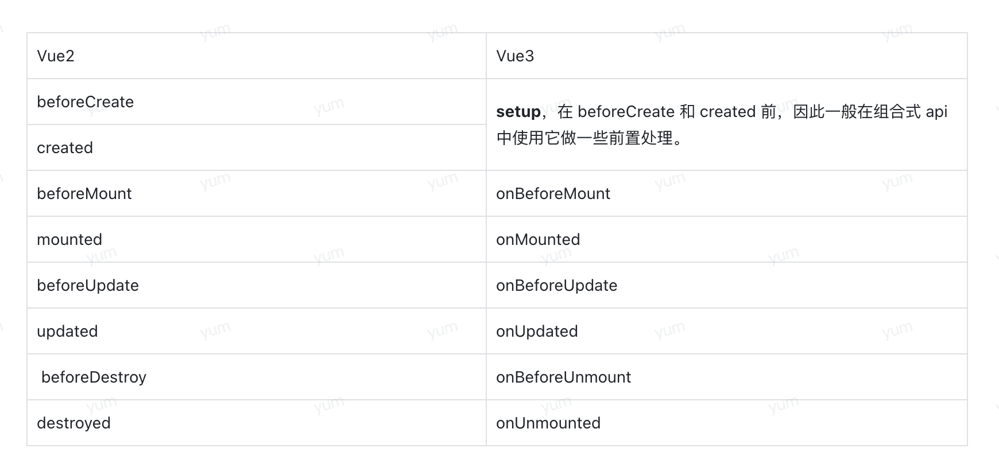

# vue 用法

## vue2

### mixin

1. data 中对象合并， 方法都会调用，先 mixin 后引用 mixin 类的方法
2. methods, components, directives,合并的时候方法重复，调用组件覆盖 mixin 中的同名方法。

由于 mixin 的命名重名，依赖交叉不透明，导致问题比好处多，已不建议使用。

### 动画特效

#### 过渡动画

```js
// 没有指定name 默认是 v- 开头如 v-enter-active

<Transition>

</Transition>


// 指定name为fade name样式必须以 fade- 开头即 fade-enter-active
<Transition name = "fade">

</Transition>


```

```css
// 进入阶段
.v-enter-active {
  transition: opacity 0.5s ease;
  // 进入前
  .v-enter-from {
    opacity: 0;
  }
  // 进入后
  .v-enter-to {
    opacity: 1;
  }
}
// 进入离开阶段
.v-leave-active {
  transition: opacity 0.5s ease;
  // 离开前
  .v-leave-from {
    opacity: 1;
  }
  // 离开后
  .v-leave-to {
    opacity: 0;
  }
}
```

优化后即

```css
.v-enter-active,
.v-leave-active {
  transition: opacity 0.5s ease;
}

.v-enter-from,
.v-leave-to {
  opacity: 0;
}
```

在上面样式中除了加入 transition 动画外也能用 animation 动画

```css
.bounce-enter-active {
  animation: bounce-in 0.5s;
}
.bounce-leave-active {
  animation: bounce-in 0.5s reverse;
}
@keyframes bounce-in {
  0% {
    transform: scale(0);
  }
  50% {
    transform: scale(1.25);
  }
  100% {
    transform: scale(1);
  }
}
```

### 插槽

```vue
<template>
  <div class="slot-demo">
    <slot name="demo">this is demo slot.</slot>
    <slot text="this is a slot demo , " :msg="msg"></slot>
  </div>
</template>

<script>
export default {
  name: "SlotDemo",
  data() {
    return {
      msg: "this is scoped slot content.",
    };
  },
};
</script>
```

```js
<template>
  <slot-demo>
    <template v-slot:demo>this is custom slot.</template>
    <template v-slot="scope">
      <p>{{ scope.text }}{{ scope.msg }}</p>
    </template>
  </slot-demo>
</template>

```

### 插件

可以为对象或方法，对象必须有 install 方法，方法就是 install 方法。

使用 vue.use(插件名)

## Vue3

reactive shallowReactive isRef toRef readonly

watchEffected

生命周期变化


setup beforeCreate create

errorCaptured 捕获页面错误

renderTracked VDOM 更新 可以打印时间判断那个字段更新导致很慢的。
renderTriggered 视图重新渲染的时候触发 re-render，在 beforeUpdate 之前执行

顺序
renderTriggered --> beforeUpdate---> renderTracked ---> updated

computed 用法

```js
const count = ref(1);
const plusOne = computed(() => count.value + 1);

// 或者用get set方法

const plusOne = computed({
  get: () => count.value + 1,
  set: (val) => {
    count.value = val - 1;
  },
});

plusOne.value = 1;
console.log(count.value); // 0
```

reactive 和 shallowReactive

teleport 对应 react 中的 portal
