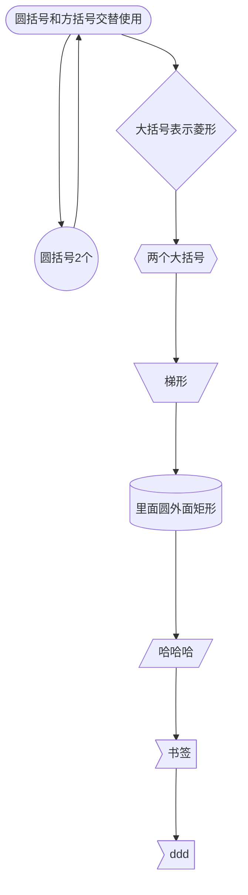

- 节点形状
    + []方括号表示矩形
    + ()表示圆角
    + {}: 表示菱形
    + /\\: 正方斜杠表示不规则矩形，就是矩形方向和图形一致

>
> - ([]): 圆角矩形  体育场形状- () :  圆角矩形 radius 5px作用- 圆形: (())- 圆柱体: [()]- 菱形: {}- 平行四边形: [//]或 [\\]- \>书签]: >]

```mermaid
graph TD
圆角([圆括号和方括号交替使用]) ---> 圆形((圆括号2个))--> 圆角 --> Action{大括号表示菱形} --> store{{两个大括号}}--->单独的[\梯形/] ---> 圆柱[(里面圆外面矩形)] ---->平行四边形[/哈哈哈/] --->
id1>书签]---> dsd>ddd]

```